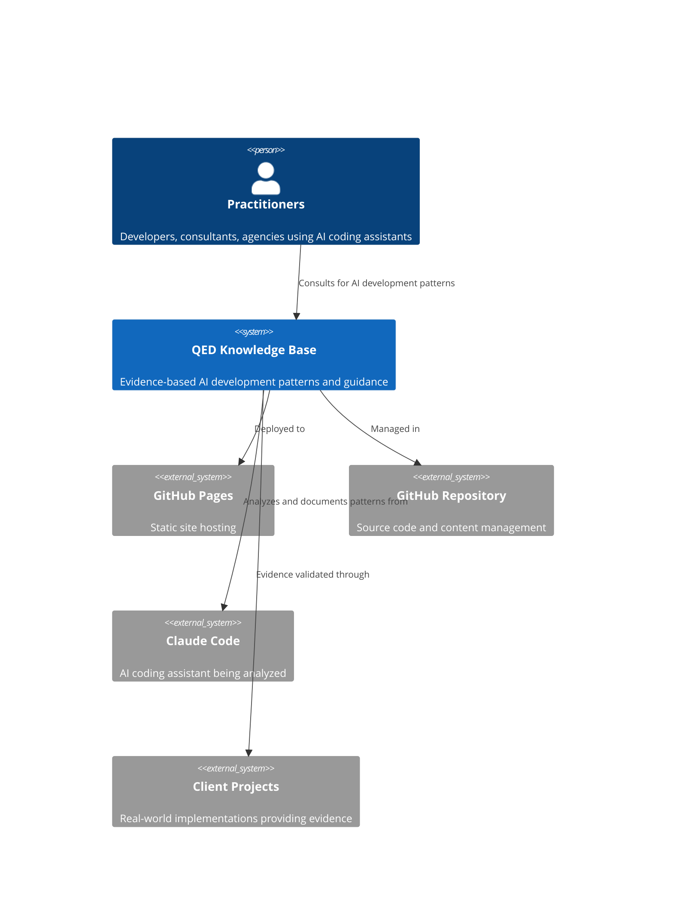
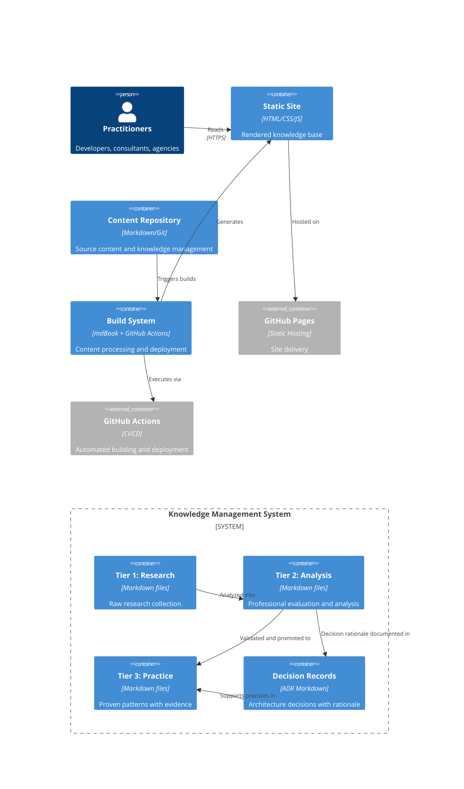
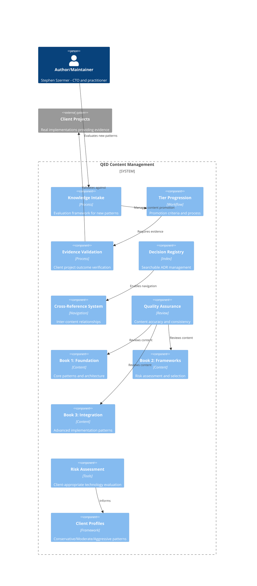
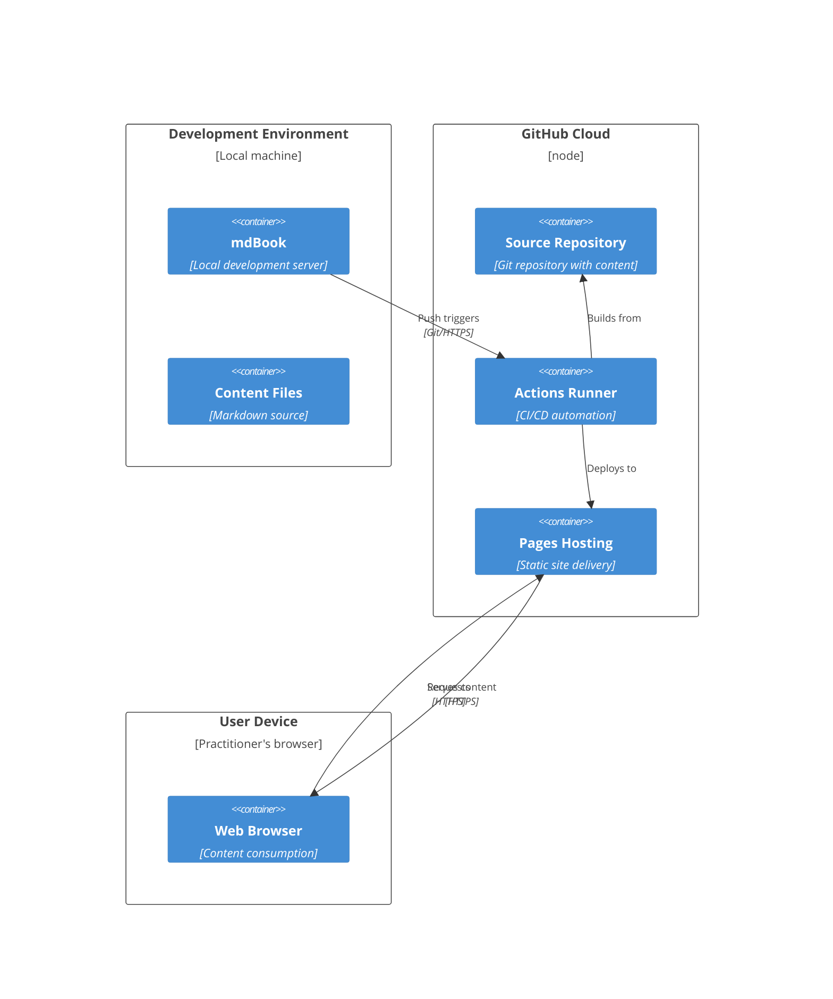

# QED System Architecture (C4 Model)

## System Context (Level 1)

**Purpose**: QED serves as a practitioner-focused knowledge base for AI-assisted development, providing evidence-based patterns validated through real client project implementations.

**Key Interactions**:
- Practitioners consult QED for proven AI development patterns
- Evidence is gathered from successful client project implementations
- Content is managed through GitHub and deployed via GitHub Pages
- Analysis focuses on practical tools like Claude Code and similar AI assistants

## Container Diagram (Level 2)

**Architecture Principles**:
- **Static-first**: No server-side dependencies, maximum reliability
- **Git-based workflow**: Version control for all content and decisions
- **Evidence-driven**: Promotion between tiers requires validation
- **Transparent decision-making**: All framework choices documented with rationale

## Component Diagram (Level 3) - Content Management System

**Key Components**:
- **Knowledge Intake Framework**: Systematic evaluation of new AI development patterns
- **Four-Tier System**: Research → Analysis → Decision → Practice progression
- **Evidence Validation**: All practices must be proven through client project outcomes
- **Risk-Based Frameworks**: Client profile mapping for appropriate technology adoption

## Deployment Diagram (Level 4)

**Deployment Characteristics**:
- **Zero server dependencies**: Pure static site deployment
- **Automated pipeline**: Git push triggers build and deployment
- **Global CDN**: GitHub Pages provides worldwide content delivery
- **HTTPS by default**: Secure content delivery for practitioners

## Architecture Decisions

### Core Design Decisions

1. **Static Site Generation** (mdBook)
   - **Rationale**: Maximum reliability, no server dependencies, fast loading
   - **Trade-offs**: Limited dynamic features vs. operational simplicity
   - **Status**: Accepted (see [ADR-2025-09-01](decisions/2025-09-01-claude-code-framework-selection.md) for framework selection approach)

2. **Four-Tier Knowledge Management**
   - **Rationale**: Evidence-based progression from research to proven practice
   - **Trade-offs**: Content creation overhead vs. practitioner trust and quality
   - **Status**: Core architectural principle

3. **GitHub-Based Workflow** 
   - **Rationale**: Version control, automated deployment, practitioner-familiar tools
   - **Trade-offs**: GitHub dependency vs. workflow efficiency
   - **Status**: Accepted and implemented

4. **Evidence-First Approach**
   - **Rationale**: Practitioner credibility requires documented client outcomes
   - **Trade-offs**: Slower content creation vs. higher quality and trust
   - **Status**: Fundamental QED principle

### Technology Stack Decisions

- **mdBook**: Static site generator optimized for technical documentation
- **Mermaid**: Architecture diagrams integrated into documentation
- **GitHub Pages**: Reliable, fast, zero-configuration hosting
- **GitHub Actions**: Automated build and deployment pipeline
- **Markdown**: Universal format for technical content creation

### Quality Attributes

- **Reliability**: Static deployment ensures maximum uptime
- **Performance**: Fast loading through CDN and minimal dependencies
- **Maintainability**: Clear separation of content tiers and decision documentation
- **Usability**: Practitioner-focused navigation and search capabilities
- **Security**: HTTPS by default, no server-side attack surface

## Future Architecture Considerations

### Potential Enhancements
- **Search Integration**: Enhanced search capabilities beyond basic text search
- **Interactive Elements**: Dynamic filtering and content personalization
- **Community Features**: Contribution workflows and feedback mechanisms
- **Analytics Integration**: Usage tracking for content optimization

### Architectural Constraints
- Must maintain static-first approach for reliability
- All enhancements must preserve evidence-based quality standards
- Cannot introduce dependencies that compromise practitioner access
- Must remain cost-effective for independent practitioner maintenance

---

**Architecture Document Version**: 1.0  
**Last Updated**: September 8, 2025  
**Review Cycle**: Quarterly or with major architectural changes