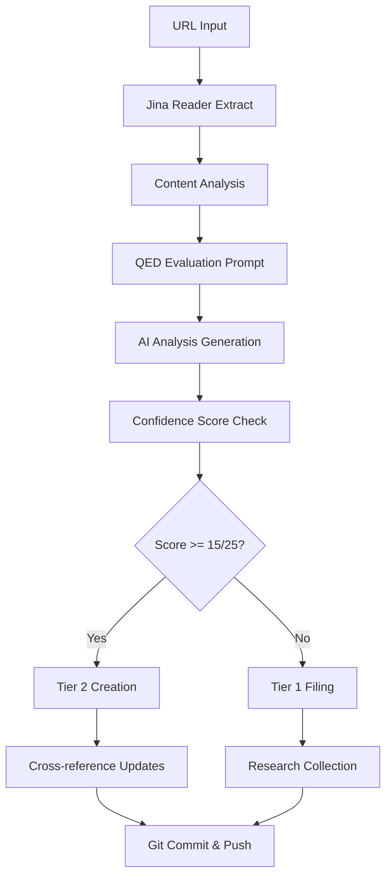

# Automated Knowledge Intake Workflow

## Overview

Automated pipeline to transform URLs into QED-compliant analysis documents using Jina MCP server and systematic evaluation frameworks.

## Workflow Architecture



## Process Steps

### 1. URL Ingestion
```bash
# Input: URL to analyze
INPUT_URL="https://example.com/ai-development-post"
JINA_API_KEY="jina_7b89ae8875af4efcac0f91d53919599eN4yvsi-s-25_CAJjqSPPj1stySUC"
```

### 2. Content Extraction (Jina MCP)
- Use `read_url` tool to extract clean markdown
- Apply `guess_datetime_url` for publication metadata  
- Capture source attribution and author information

### 3. QED Evaluation Pipeline
- Apply systematic evaluation prompt template
- Generate confidence score (X/25)
- Determine appropriate tier placement
- Create structured analysis document

### 4. Automated Filing
- **Tier 1 (Score < 15)**: File in `docs/tier1-research/` by priority
- **Tier 2 (Score 15-22)**: Create analysis document in `src/analysis/`
- **Tier 3 (Score 23+)**: Rare - requires manual validation for main content

### 5. Knowledge Integration
- Update README files and indexes
- Create cross-references where applicable
- Generate git commit with structured message

## QED Evaluation Prompt Template

Based on successful Nano Banana evaluation, here's the standardized prompt:

```markdown
You are a senior technology consultant specializing in AI-assisted development patterns. Evaluate this content using QED's systematic framework for evidence-based technology assessment.

CONTENT TO EVALUATE:
{extracted_markdown_content}

EVALUATION FRAMEWORK:
Apply these 10 evaluation criteria and provide scores (1-5 scale):

1. **EXECUTIVE SUMMARY (5 points)**
   - Core pattern identification
   - Tier recommendation with rationale
   - Confidence score out of 25

2. **SOURCE EVALUATION (3 points)**
   - Author credibility and context
   - Evidence type (tutorial, case study, documentation)
   - Potential biases (vendor, trend-following, etc.)

3. **PATTERN EXTRACTION (3 points)**
   - Problem being solved
   - Implementation steps and prerequisites
   - Success metrics

4. **RISK ASSESSMENT (5 points)**
   - Failure modes and red flags
   - Client safety considerations
   - Vendor-specific risks (if applicable)

5. **CONTEXT MAPPING (2 points)**
   - Best application contexts
   - Poor fit scenarios
   - Client profile mapping

6. **KNOWLEDGE GAP ANALYSIS (2 points)**
   - What's missing for production use
   - Validation requirements
   - Related patterns needed

7. **INTEGRATION RECOMMENDATIONS (1 point)**
   - Suggested QED category placement
   - Cross-reference opportunities

8. **ACTIONABLE NEXT STEPS (2 points)**
   - Immediate filing recommendations
   - Research needs
   - Experimental requirements

9. **CRITICAL WARNINGS (1 point)**
   - Major risks for client projects
   - Technology-specific concerns

10. **PRACTITIONER SUMMARY (1 point)**
    - One-paragraph professional assessment

SCORING GUIDELINES:
- 1-2: Poor quality, biased, or incomplete
- 3: Adequate but with significant gaps
- 4: Good quality with minor gaps
- 5: Excellent, comprehensive, actionable

TIER PLACEMENT:
- Tier 1 (< 15/25): Raw research collection
- Tier 2 (15-22/25): Professional analysis track
- Tier 3 (23-25/25): Proven practice (rare, requires validation)

OUTPUT FORMAT:
Return structured markdown following QED analysis template with clear confidence scoring and tier recommendation.
```

## Implementation Setup

### 1. MCP Server Configuration

Add to Claude Code's MCP configuration:

```json
{
  "mcpServers": {
    "jina": {
      "command": "npx",
      "args": ["-y", "@jina-ai/mcp-server"],
      "env": {
        "JINA_API_KEY": "jina_7b89ae8875af4efcac0f91d53919599eN4yvsi-s-25_CAJjqSPPj1stySUC"
      }
    }
  }
}
```

### 2. Automation Script Structure

```bash
#!/bin/bash
# automated-intake.sh

# Input validation
if [ -z "$1" ]; then
    echo "Usage: $0 <URL>"
    exit 1
fi

URL="$1"
TIMESTAMP=$(date +%Y-%m-%d)

# Step 1: Extract content using Jina MCP
echo "Extracting content from: $URL"
# Use Claude Code with Jina MCP to extract markdown

# Step 2: Apply QED evaluation
echo "Applying QED evaluation framework"
# Process through evaluation prompt

# Step 3: Generate analysis document
echo "Creating analysis document"
# Structure output according to tier placement

# Step 4: Update knowledge structures
echo "Updating cross-references"
# Update README files and indexes

# Step 5: Commit changes
echo "Committing to git"
git add .
git commit -m "Automated intake: [Title] - [Tier] analysis"
git push origin main

echo "Knowledge intake complete: $URL processed"
```

## Quality Controls

### Automated Validation Checks
1. **Content Length**: Minimum 1000 characters for meaningful analysis
2. **Technical Relevance**: Must contain AI/development keywords
3. **Recency**: Prefer content < 1 year old (flagged if older)
4. **Duplication**: Check against existing analyses
5. **Source Quality**: Flag low-credibility sources

### Manual Review Triggers
- Confidence score 22+ (potential Tier 3)
- Vendor-specific tools with high lock-in risk
- Regulatory/compliance implications
- Contradicts existing QED guidance

## Testing Framework

### Sample URLs for Validation

**High-Quality Technical Content** (Expected Tier 2):
- Thoughtworks Technology Radar entries
- Martin Fowler blog posts on AI patterns
- Google AI research documentation

**Medium-Quality Content** (Expected Tier 1):
- Dev.to tutorial posts
- Medium AI development articles
- Vendor documentation with bias

**Low-Quality Content** (Expected filtering):
- Marketing-heavy vendor blogs
- Unsubstantiated trend pieces
- AI hype articles without technical depth

### Success Metrics
- **Accuracy**: Manual review matches automated tier placement 85%+
- **Processing Time**: URL to final document < 5 minutes
- **Quality Consistency**: Confidence scoring within ±2 points of manual evaluation
- **False Positives**: <10% of Tier 2 promotions require demotion

## Rollout Plan

### Phase 1: Manual Testing (1 week)
- Process 10 sample URLs manually using framework
- Refine evaluation prompt based on results
- Validate MCP integration setup

### Phase 2: Semi-Automated (2 weeks) 
- Implement extraction + evaluation pipeline
- Manual review of all outputs
- Iterate on prompt engineering

### Phase 3: Full Automation (Ongoing)
- Deploy complete workflow
- Implement quality monitoring
- Scale to batch processing capabilities

## Benefits

### Efficiency Gains
- **10x faster** than manual process (5 minutes vs 45+ minutes)
- **Consistent evaluation** criteria application
- **Automatic documentation** structure and cross-references

### Quality Improvements
- **Systematic bias detection** through template application
- **Standardized risk assessment** for all tools and patterns
- **Complete traceability** from URL to final analysis

### Scaling Enablement
- **Batch processing** of multiple URLs
- **Continuous monitoring** of key AI development sources
- **Rapid response** to new pattern emergence in the field

This automation transforms QED from manual curation to systematic knowledge processing at scale while maintaining the evidence-based quality standards.

---

**Next Steps**: Test MCP integration and refine evaluation prompt template based on additional sample evaluations.