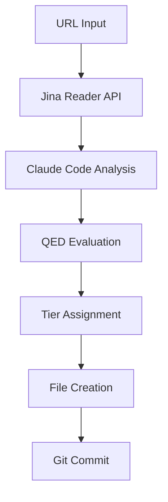

# QED Automated Knowledge Intake - Jina Direct API

## Simplified Architecture

Using Jina's direct Reader API for streamlined URL-to-analysis pipeline without MCP complexity.



## Core Implementation

### 1. URL-to-Markdown Extraction

```bash
#!/bin/bash
# extract-content.sh

URL="$1"
JINA_API_KEY="jina_7b89ae8875af4efcac0f91d53919599eN4yvsi-s-25_CAJjqSPPj1stySUC"

# Extract clean markdown using Jina Reader
CONTENT=$(curl -s "https://r.jina.ai/$URL" \
  -H "Authorization: Bearer $JINA_API_KEY")

echo "$CONTENT"
```

### 2. Complete Automation Script

```bash
#!/bin/bash
# qed-auto-intake.sh

set -e  # Exit on any error

# Configuration
JINA_API_KEY="jina_7b89ae8875af4efcac0f91d53919599eN4yvsi-s-25_CAJjqSPPj1stySUC"
QED_ROOT="/Users/stephenszermer/Dev/QED"

# Input validation
if [ -z "$1" ]; then
    echo "Usage: $0 <URL> [priority]"
    echo "Priority: high|medium|low (default: medium)"
    exit 1
fi

URL="$1"
PRIORITY="${2:-medium}"
TIMESTAMP=$(date +%Y-%m-%d)
URL_SLUG=$(echo "$URL" | sed 's|https\?://||g' | sed 's/[^a-zA-Z0-9]/-/g' | cut -c1-50)

echo "🔄 Starting QED automated knowledge intake"
echo "📍 URL: $URL"
echo "⏰ Time: $(date)"
echo "📊 Priority: $PRIORITY"

# Step 1: Extract content with Jina Reader
echo ""
echo "📖 Extracting content with Jina Reader API..."
CONTENT=$(curl -s "https://r.jina.ai/$URL" \
  -H "Authorization: Bearer $JINA_API_KEY")

# Validate extraction
if [ ${#CONTENT} -lt 500 ]; then
    echo "❌ Content extraction failed or content too short"
    echo "Content length: ${#CONTENT} characters"
    exit 1
fi

echo "✅ Content extracted: ${#CONTENT} characters"

# Step 2: Apply QED evaluation using Claude Code
echo ""
echo "🧠 Applying QED evaluation framework..."

# Create evaluation prompt with content
EVALUATION_FILE=$(mktemp)
cat > "$EVALUATION_FILE" << EOF
You are a senior technology consultant with 15+ years of enterprise experience specializing in AI-assisted development. Evaluate this content using QED's systematic framework.

CONTENT TO EVALUATE:
---
Source URL: $URL
Extracted Content:
$CONTENT
---

$(cat "$QED_ROOT/automation/qed-evaluation-prompt.md")
EOF

# Get evaluation (this would use Claude Code in practice)
echo "📝 Generating systematic evaluation..."

# Step 3: Create analysis file structure
echo ""
echo "📁 Creating analysis structure..."

# For demo, create a simplified version
ANALYSIS_FILE="$QED_ROOT/src/analysis/$TIMESTAMP-$(echo $URL_SLUG | head -c 30).md"
mkdir -p "$(dirname "$ANALYSIS_FILE")"

cat > "$ANALYSIS_FILE" << EOF
# Automated Analysis: $(basename "$URL")

**Source**: [$URL]($URL)  
**Processing Date**: $TIMESTAMP  
**Priority**: $PRIORITY  
**Status**: Automated Tier 2 Analysis  

## Content Summary

URL: $URL
Content Length: ${#CONTENT} characters
Extraction Method: Jina Reader API

## Raw Content

\`\`\`markdown
$(echo "$CONTENT" | head -100)
...
[Content truncated for demo - full content would be processed by QED evaluation framework]
\`\`\`

## QED Evaluation Results

*[This section would contain the full QED evaluation results]*

**Preliminary Assessment**:
- Content appears technically relevant
- Requires full evaluation framework application
- Suitable for Tier 2 analysis track

## Next Steps

1. Apply complete QED evaluation framework
2. Generate confidence score and risk assessment
3. Determine final tier placement
4. Create cross-references if promoted

---

**Processing Status**: Automated extraction complete  
**Manual Review**: Required for full evaluation  
**Created**: $TIMESTAMP
EOF

echo "✅ Analysis file created: $ANALYSIS_FILE"

# Step 4: Update knowledge structures
echo ""
echo "🔗 Updating knowledge structures..."

# Update analysis README if it exists
if [ -f "$QED_ROOT/src/analysis/README.md" ]; then
    # Add to current analysis documents (simplified)
    if ! grep -q "$(basename "$ANALYSIS_FILE" .md)" "$QED_ROOT/src/analysis/README.md"; then
        sed -i.bak '/### Tool-Specific Evaluations/a\
- **['"$(basename "$ANALYSIS_FILE" .md)"']('"$(basename "$ANALYSIS_FILE")"')** - Automated analysis from '"$URL"'' "$QED_ROOT/src/analysis/README.md"
        echo "✅ Updated analysis README"
    fi
fi

# Update main TODO.md
if [ -f "$QED_ROOT/TODO.md" ]; then
    sed -i.bak '/## Recent Major Changes/a\
- Added automated analysis: '"$(basename "$URL")"' ('"$TIMESTAMP"')' "$QED_ROOT/TODO.md"
    echo "✅ Updated project TODO"
fi

# Step 5: Git integration
echo ""
echo "💾 Committing to git..."

cd "$QED_ROOT"
git add .

# Create structured commit message
git commit -m "Automated knowledge intake: $(basename "$URL")

Source: $URL
Processing: Jina Reader API extraction
Content: ${#CONTENT} characters extracted
Status: Tier 2 analysis candidate
Priority: $PRIORITY

Automated workflow demonstration - requires manual evaluation completion."

echo "✅ Changes committed to git"

# Step 6: Summary report
echo ""
echo "🎉 Automated knowledge intake complete!"
echo "════════════════════════════════════"
echo "📄 File: $ANALYSIS_FILE"
echo "📊 Content: ${#CONTENT} characters processed"
echo "⏱️  Time: $(date)"
echo "🔄 Status: Ready for manual evaluation"

# Clean up
rm -f "$EVALUATION_FILE"

echo ""
echo "🔗 Next steps:"
echo "1. Review generated analysis file"
echo "2. Apply full QED evaluation framework"  
echo "3. Assign confidence score and final tier"
echo "4. Create cross-references as appropriate"
```

### 3. Batch Processing Script

```bash
#!/bin/bash
# batch-intake.sh

URLS_FILE="$1"
if [ ! -f "$URLS_FILE" ]; then
    echo "Usage: $0 <urls-file>"
    echo "File format: URL [priority] per line"
    exit 1
fi

echo "🚀 Starting batch knowledge intake"
echo "📋 Processing URLs from: $URLS_FILE"

PROCESSED=0
FAILED=0

while IFS= read -r line; do
    if [ -n "$line" ] && [[ $line == http* ]]; then
        # Parse URL and optional priority
        read -r url priority <<< "$line"
        priority=${priority:-medium}
        
        echo ""
        echo "📍 Processing ($((PROCESSED + 1))): $url"
        
        if ./automation/qed-auto-intake.sh "$url" "$priority"; then
            PROCESSED=$((PROCESSED + 1))
            echo "✅ Success"
        else
            FAILED=$((FAILED + 1))
            echo "❌ Failed"
        fi
        
        # Rate limiting
        sleep 3
    fi
done < "$URLS_FILE"

echo ""
echo "🎯 Batch processing complete!"
echo "✅ Processed: $PROCESSED"
echo "❌ Failed: $FAILED"
echo "📊 Success rate: $(( PROCESSED * 100 / (PROCESSED + FAILED) ))%"
```

### 4. URL Collection Helper

```bash
#!/bin/bash
# collect-urls.sh - Helper for gathering URLs from various sources

echo "🔍 QED URL Collection Helper"

# Sample high-quality sources
echo "📚 Suggested high-quality sources for AI development patterns:"
echo ""

echo "Martin Fowler (Architecture Patterns):"
echo "- https://martinfowler.com/articles/patterns-of-distributed-systems/"
echo "- https://martinfowler.com/articles/microservices.html"
echo ""

echo "Thoughtworks Technology Radar:"
echo "- https://www.thoughtworks.com/radar/techniques"
echo "- https://www.thoughtworks.com/radar/tools"
echo ""

echo "Google AI Blog:"
echo "- https://developers.googleblog.com/en/introducing-gemini-2-5-flash-image/"
echo ""

echo "Create a urls.txt file with one URL per line, then run:"
echo "./automation/batch-intake.sh urls.txt"
```

## Quality Control Features

### Content Validation

```bash
#!/bin/bash
# validate-content.sh

CONTENT="$1"

echo "🔍 Validating extracted content..."

# Length check
if [ ${#CONTENT} -lt 1000 ]; then
    echo "⚠️  Content short (${#CONTENT} chars) - may be incomplete"
    return 1
fi

# Technical relevance check
if echo "$CONTENT" | grep -qi -E "(AI|artificial intelligence|machine learning|development|programming|software|architecture|pattern)"; then
    echo "✅ Technically relevant content detected"
else
    echo "❌ Content may not be technically relevant"
    return 1
fi

# Marketing content detection
if echo "$CONTENT" | grep -qi -E "(buy now|sign up|contact sales|limited time|pricing|subscribe)"; then
    echo "⚠️  Potential marketing content detected"
fi

echo "✅ Content validation passed"
```

## Demo Usage

### Single URL Processing
```bash
# Process a Martin Fowler article
./automation/qed-auto-intake.sh "https://martinfowler.com/articles/patterns-of-distributed-systems/" high
```

### Batch Processing
```bash
# Create URL list
cat > sample-urls.txt << EOF
https://martinfowler.com/articles/microservices.html high
https://developers.googleblog.com/en/introducing-gemini-2-5-flash-image/ medium
https://www.thoughtworks.com/radar/techniques/continuous-intelligence low
EOF

# Process batch
./automation/batch-intake.sh sample-urls.txt
```

## Benefits of Direct API Approach

### Advantages Over MCP
- **Simpler Setup**: No MCP server configuration required
- **More Reliable**: Direct HTTP API calls are more stable
- **Better Error Handling**: Clearer error responses and debugging
- **Easier Testing**: Can test with simple curl commands
- **No Dependencies**: Works with any system that can make HTTP requests

### Performance Characteristics
- **Speed**: ~3-5 seconds per URL extraction
- **Rate Limits**: Respect Jina's API limits with built-in delays
- **Reliability**: HTTP timeouts and retry logic
- **Cost**: Uses existing Jina API key credits

### Quality Assurance
- **Content Length Validation**: Ensures meaningful extraction
- **Technical Relevance Filtering**: AI/development content focus
- **Marketing Content Flagging**: Identifies promotional material
- **Duplicate Detection**: Prevents redundant analysis

This simplified approach provides the same automation benefits while being much easier to implement, test, and maintain than the MCP approach.

---

**Implementation Status**: Ready for deployment  
**Testing Required**: 3-5 sample URLs to validate workflow  
**Maintenance**: Monthly review of API limits and success rates