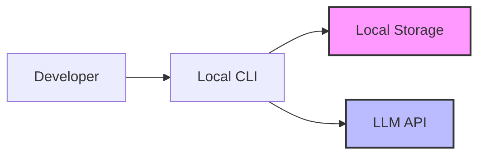
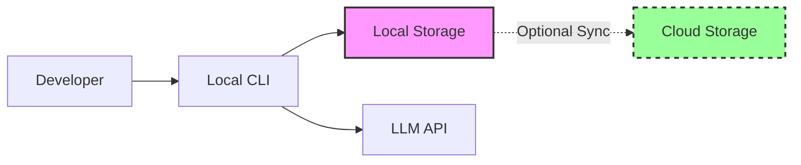
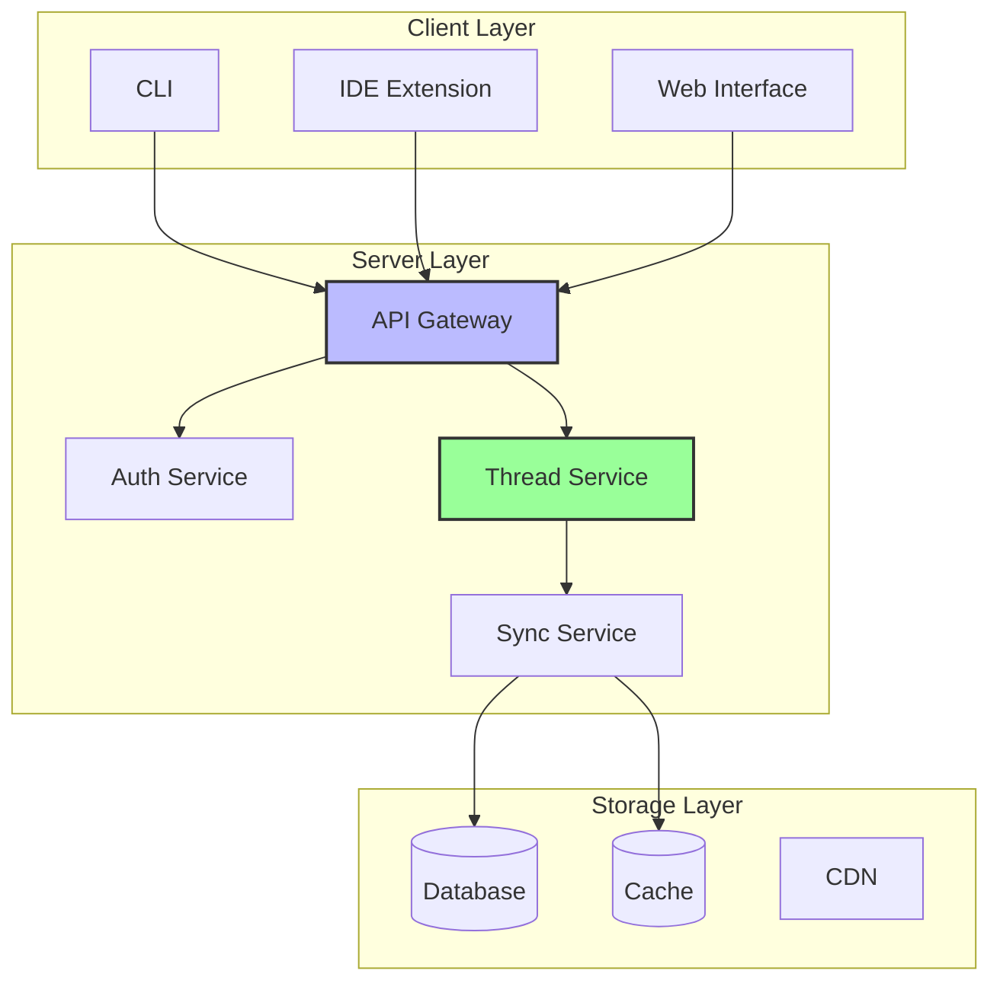

# Chapter 1: From Local to Collaborative

As AI coding assistants became more capable, a fundamental architectural tension emerged: the tools that worked well for individual developers hit hard limits when teams tried to collaborate. What started as simple autocomplete evolved into autonomous agents capable of complex reasoning, but the single-user architecture that enabled rapid adoption became the bottleneck for team productivity.

This chapter explores the architectural patterns that emerge when transitioning from local-first to collaborative AI systems, examining the trade-offs, implementation strategies, and decision points that teams face when scaling AI assistance beyond individual use.

## The Single-User Era

Early AI coding assistants followed a simple pattern: run locally, store data locally, authenticate locally. This approach made sense for several reasons:

1. **Privacy concerns** - Developers were wary of sending code to cloud services
2. **Simplicity** - No servers to maintain, no sync to manage
3. **Performance** - Direct API calls without intermediate hops
4. **Control** - Users managed their own API keys and data

The local-first pattern typically implements these core components:

```typescript
// Local-first storage pattern
interface LocalStorage {
  save(conversation: Conversation): Promise<void>
  load(id: string): Promise<Conversation>
  list(): Promise<ConversationSummary[]>
}

// Direct API authentication pattern  
interface DirectAuth {
  authenticate(apiKey: string): Promise<AuthToken>
  makeRequest(token: AuthToken, request: any): Promise<Response>
}
```

This architecture creates a simple data flow: user input → local processing → API call → local storage. The conversation history, API keys, and all processing remain on the user's machine.

This worked well for individual developers. But as AI assistants became more capable, teams started asking questions:

- "Can I share this conversation with my colleague?"
- "How do we maintain consistent context across our team?"
- "Can we review what the AI suggested before implementing?"
- "Who's paying for all these API calls?"

## The Collaboration Imperative

The shift from individual to team usage wasn't just about convenience—it reflected a fundamental change in how AI tools were being used. Three key factors drove this evolution:

### 1. The Rise of "Vibe Coding"

As AI assistants improved, a new development pattern emerged. Instead of precisely specifying every detail, developers started describing the general "vibe" of what they wanted:

> "Make this component feel more like our design system"
> "Add error handling similar to our other services"
> "Refactor this to match our team's patterns"

This conversational style worked brilliantly—but only if the AI understood your team's context. Local tools couldn't provide this shared understanding.

### 2. Knowledge Silos

Every conversation with a local AI assistant created valuable context that was immediately lost to the team. Consider this scenario:

- Alice spends an hour teaching Claude Code about the team's authentication patterns
- Bob encounters a similar problem the next day
- Bob has to recreate the entire conversation from scratch

Multiply this by every developer on a team, and the inefficiency becomes staggering.

### 3. Enterprise Requirements

As AI assistants moved from experiments to production tools, enterprises demanded features that local-first architectures couldn't provide:

- **Audit trails** for compliance
- **Usage tracking** for cost management
- **Access controls** for security
- **Centralized billing** for procurement

## Architectural Evolution

The journey from local to collaborative systems followed three distinct phases:

### Phase 1: Local-First Pattern

Early tools stored everything locally and connected directly to LLM APIs:



**Advantages:**
- Complete privacy
- No infrastructure costs
- Simple implementation
- User control

**Limitations:**
- No collaboration
- No shared context
- Distributed API keys
- No usage visibility

### Phase 2: Hybrid Sync Pattern

Some tools attempted a middle ground, syncing local data to optional cloud services:



This approach added complexity without fully solving collaboration needs. Users had to manage sync conflicts, choose what to share, and still lacked real-time collaboration.

### Phase 3: Server-First Pattern

Modern collaborative systems use a server-first approach, where the cloud service becomes the source of truth:



**Advantages:**
- Real-time collaboration
- Shared team context
- Centralized management
- Unified billing
- Cross-device sync

**Trade-offs:**
- Requires internet connection
- Data leaves user's machine
- Infrastructure complexity
- Operational overhead

## Implementing Server-First Architecture

Server-first systems require careful consideration of data synchronization and caching patterns. Here are the key architectural decisions:

### Storage Synchronization Pattern

Server-first systems typically implement a three-tier approach:

```typescript
// Synchronized storage pattern
interface SynchronizedStorage {
  // Local cache for performance
  saveLocal(data: ConversationData): Promise<void>
  
  // Server sync for collaboration  
  syncToServer(data: ConversationData): Promise<void>
  
  // Conflict resolution
  resolveConflicts(local: ConversationData, remote: ConversationData): ConversationData
}
```

This pattern provides:

1. **Optimistic updates** - Changes appear immediately in the UI
2. **Background synchronization** - Data syncs to server without blocking user
3. **Conflict resolution** - Handles concurrent edits gracefully
4. **Offline capability** - Continues working when network is unavailable

**When to use this pattern:**
- Multiple users need to see the same data
- Real-time collaboration is important
- Users work across multiple devices
- Network connectivity is unreliable

### Real-Time Synchronization Pattern

Real-time collaboration requires event-driven updates. The common pattern uses WebSocket connections with subscription management:

```typescript
// Event-driven sync pattern
interface RealtimeSync {
  // Subscribe to changes for a specific resource
  subscribe(resourceType: string, resourceId: string): Observable<UpdateEvent>
  
  // Broadcast changes to other clients
  broadcast(event: UpdateEvent): Promise<void>
  
  // Handle connection management
  connect(): Promise<void>
  disconnect(): Promise<void>
}
```

Key considerations for real-time sync:

**Connection Management:**
- Automatic reconnection on network failures
- Graceful handling of temporary disconnects
- Efficient subscription management

**Update Distribution:**
- Delta-based updates to minimize bandwidth
- Conflict-free merge strategies
- Ordered message delivery

**When to implement real-time sync:**
- Users collaborate simultaneously
- Changes need immediate visibility
- User presence awareness is important
- Conflict resolution is manageable

### Centralized Authentication Pattern

Collaborative systems require centralized identity management with team-based permissions:

```typescript
// Centralized auth pattern
interface CollaborativeAuth {
  // Identity management
  authenticate(provider: AuthProvider): Promise<UserSession>
  
  // Team-based permissions
  checkPermission(user: User, resource: Resource, action: Action): Promise<boolean>
  
  // Session management
  refreshSession(session: UserSession): Promise<UserSession>
  invalidateSession(sessionId: string): Promise<void>
}
```

Key authentication considerations:

**Identity Integration:**
- Single Sign-On (SSO) for enterprise environments
- Social auth for individual users
- Multi-factor authentication for security

**Permission Models:**
- Role-Based Access Control (RBAC) for simple hierarchies
- Attribute-Based Access Control (ABAC) for complex policies
- Resource-level permissions for fine-grained control

**Session Management:**
- Secure token storage and transmission
- Automatic session refresh
- Graceful handling of expired sessions

**When to implement centralized auth:**
- Multiple users share resources
- Different permission levels needed
- Compliance or audit requirements exist
- Integration with existing identity systems required

## Case Study: From Infrastructure to AI Platform

Many successful collaborative AI systems emerge from companies with existing infrastructure advantages. Organizations that already operate developer platforms often have key building blocks:

- Scalable authentication systems
- Team-based permission models
- Usage tracking and billing infrastructure
- Enterprise compliance tools

When building collaborative AI assistants, these organizations can leverage existing infrastructure:

1. **Authentication Integration** - Reuse established SSO and team models
2. **Context Sources** - Connect to existing code repositories and knowledge bases
3. **Observability** - Extend current metrics and analytics platforms
4. **Enterprise Features** - Build on proven audit and compliance systems

This approach allows AI assistants to feel native to existing workflows rather than requiring separate authentication or management overhead.

## The Collaboration Advantage

The shift to server-first architecture enabled new collaborative workflows:

### Shared Context Pattern

Teams need mechanisms to share knowledge and maintain consistency:

```typescript
// Shared knowledge pattern
interface TeamKnowledge {
  // Shared patterns and conventions
  getPatterns(): Promise<Pattern[]>
  savePattern(pattern: Pattern): Promise<void>
  
  // Team-specific context
  getContext(contextType: string): Promise<ContextData>
  updateContext(contextType: string, data: ContextData): Promise<void>
}
```

Benefits of shared context:
- **Consistency** - Team members use the same patterns and conventions
- **Knowledge preservation** - Best practices don't get lost
- **Onboarding** - New team members learn established patterns
- **Evolution** - Patterns improve through collective experience

**Implementation considerations:**
- Version control for patterns and conventions
- Search and discovery mechanisms
- Automatic suggestion of relevant patterns
- Integration with existing documentation systems

### Presence and Awareness Pattern

Real-time collaboration benefits from user presence information:

```typescript
// Presence awareness pattern
interface PresenceSystem {
  // Track user activity
  updatePresence(userId: string, activity: ActivityInfo): Promise<void>
  
  // Observe presence changes
  observePresence(resourceId: string): Observable<PresenceInfo[]>
  
  // Handle disconnections
  handleDisconnect(userId: string): Promise<void>
}
```

Presence features enable:
- **Collision avoidance** - Users see when others are active
- **Coordination** - Teams know who's working on what
- **Context awareness** - Understanding current activity levels

### Review and Approval Workflows

Collaborative systems often need approval processes:

```typescript
// Review workflow pattern
interface ReviewSystem {
  // Request review
  requestReview(resourceId: string, reviewType: ReviewType): Promise<Review>
  
  // Approve or reject
  submitReview(reviewId: string, decision: ReviewDecision): Promise<void>
  
  // Track review status
  getReviewStatus(resourceId: string): Promise<ReviewStatus>
}
```

Review patterns provide:
- **Quality control** - Changes can be reviewed before implementation
- **Knowledge sharing** - Team members learn from each other
- **Compliance** - Audit trail for sensitive changes
- **Risk reduction** - Catch issues before they reach production

## Lessons Learned

The transition from local to collaborative AI assistants taught valuable lessons:

### 1. Privacy vs Productivity

While privacy concerns are real, teams consistently chose productivity when given proper controls:

- Clear data retention policies
- Granular permission models  
- Self-hosted options for sensitive environments
- SOC2 compliance and security audits

### 2. Sync Complexity

Real-time synchronization is harder than it appears:

- Conflict resolution needs careful design
- Network partitions must be handled gracefully
- Optimistic updates improve perceived performance
- Eventually consistent is usually good enough

### 3. Performance Perception

Users expect server-based tools to feel as fast as local ones:

- Aggressive caching strategies are essential
- Optimistic updates hide network latency
- Background sync keeps data fresh
- CDN distribution for global teams

### 4. Migration Challenges

Moving from local to server-based tools requires careful planning:

- Data migration tools for existing conversations
- Backward compatibility during transition
- Clear communication about benefits
- Gradual rollout to build confidence

## Decision Framework: When to Go Collaborative

The transition from local to collaborative isn't automatic. Use this framework to evaluate when the complexity is justified:

### Stay Local When:
- Individual or small team usage (< 3 people)
- No shared context needed
- Security/privacy constraints prevent cloud usage
- Simple use cases without complex workflows
- Limited budget for infrastructure

### Go Collaborative When:
- Teams need shared knowledge and patterns
- Real-time collaboration provides value
- Usage tracking and cost management required
- Enterprise compliance demands centralized control
- Multiple devices/locations access needed

### Hybrid Approach When:
- Transitioning from local to collaborative
- Testing collaborative features with subset of users
- Supporting both individual and team workflows
- Gradual migration strategy preferred

## Pattern Summary

The local-to-collaborative evolution demonstrates several key architectural patterns:

1. **Storage Synchronization** - From local files to distributed, synchronized storage
2. **Authentication Evolution** - From individual API keys to centralized identity management
3. **Real-time Coordination** - From isolated sessions to shared presence and collaboration
4. **Context Sharing** - From personal knowledge to team-wide pattern libraries
5. **Review Workflows** - From individual decisions to team approval processes

Each pattern addresses specific collaboration needs while introducing complexity. Understanding when and how to apply them enables teams to build systems that scale with their organizational requirements.

In the next chapter, we'll explore the foundational architecture patterns that enable these collaborative features while maintaining performance and reliability.
