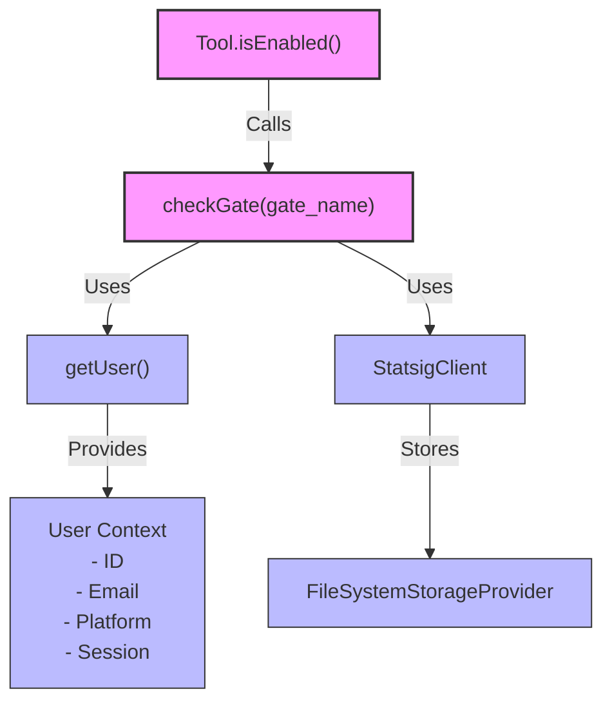
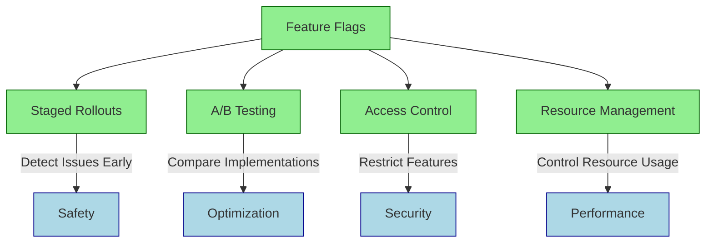
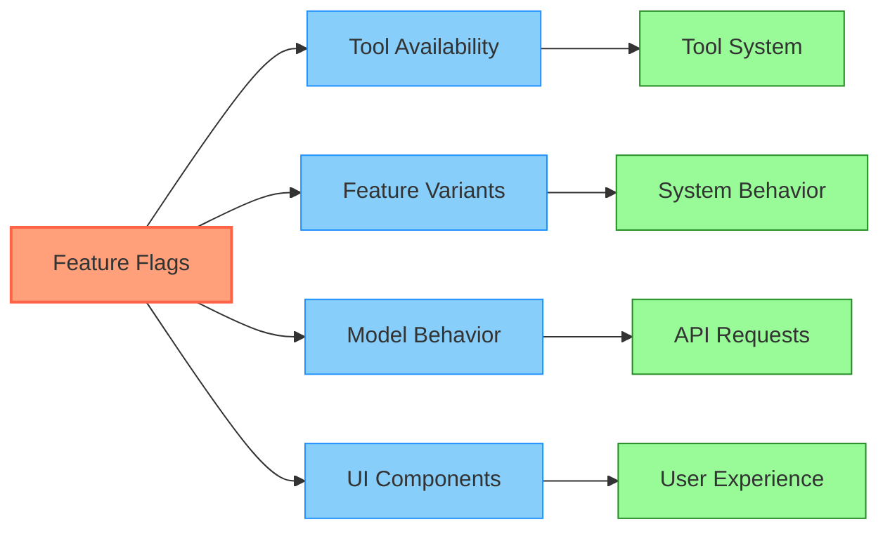

# Feature Flag Integration

The codebase demonstrates a robust pattern for controlling feature availability using a feature flag system. This approach allows for gradual rollouts and experimental features.

## Implementation Pattern



The feature flag system follows this pattern:

1. **Flag Definition**: The `isEnabled()` method in each tool controls availability:

```typescript
async isEnabled() {
  // Tool-specific activation logic
  return Boolean(process.env.SOME_FLAG) && (await checkGate('gate_name'));
}
```

2. **Statsig Client**: The system uses Statsig for feature flags with these core functions:

```typescript
export const checkGate = memoize(async (gateName: string): Promise<boolean> => {
  // Gate checking logic - currently simplified
  return true;
  // Full implementation would initialize client and check actual flag value
})
```

3. **User Context**: Flag evaluation includes user context from `utils/user.ts`:

```typescript
export const getUser = memoize(async (): Promise<StatsigUser> => {
  const userID = getOrCreateUserID()
  // Collects user information including email, platform, session
  // ...
})
```

4. **Persistence**: Flag states are cached using a custom storage provider:

```typescript
export class FileSystemStorageProvider implements StorageProvider {
  // Stores Statsig data in ~/.claude/statsig/
  // ...
}
```

5. **Gate Pattern**: Many tools follow a pattern seen in ThinkTool:

```typescript
isEnabled: async () =>
  Boolean(process.env.THINK_TOOL) && (await checkGate('tengu_think_tool')),
```

## Benefits for Agentic Systems



Feature flags provide several practical benefits for agentic systems:

- **Staged Rollouts**: Gradually release features to detect issues before wide deployment
- **A/B Testing**: Compare different implementations of the same feature
- **Access Control**: Restrict experimental features to specific users or environments
- **Resource Management**: Selectively enable resource-intensive features

## Feature Flag Standards

For implementing feature flags in your own agentic system, consider [OpenFeature](https://openfeature.dev/), which provides a standardized API with implementations across multiple languages.

## Usage in the Codebase



Throughout the codebase, feature flags control:

- **Tool availability** (through each tool's `isEnabled()` method)
- **Feature variants** (via experiment configuration)
- **Model behavior** (through beta headers and capabilities)
- **UI components** (conditionally rendering based on flag state)

This creates a flexible system where capabilities can be adjusted without code changes, making it ideal for evolving agentic systems.