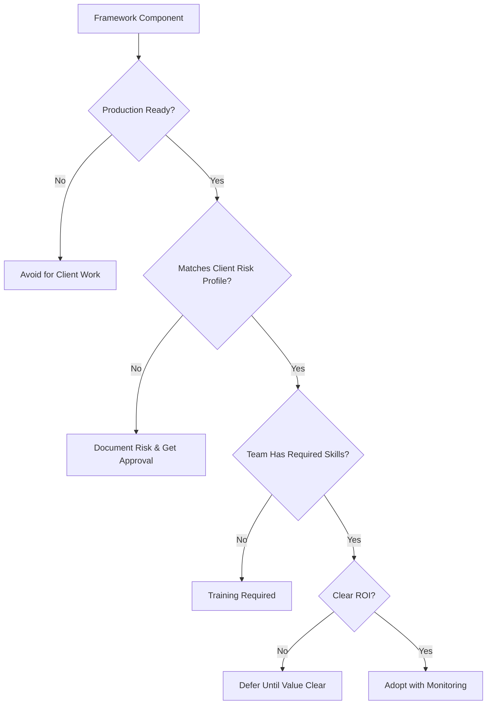

# Framework Selection Guidelines

Practical guidance for choosing AI development patterns and frameworks based on project requirements, client constraints, and team capabilities.

## Selection Process

### 1. Project Assessment

**Client Requirements:**
- Risk tolerance (conservative/moderate/aggressive)
- Security and compliance needs
- Budget and timeline constraints
- Technical sophistication level
- Documentation and audit requirements

**Project Characteristics:**
- Greenfield vs. existing codebase
- Team size and experience
- Technology stack complexity
- Integration requirements
- Maintenance expectations

**Success Criteria:**
- Quality standards
- Performance requirements
- Scalability needs
- Time-to-market priorities
- Long-term support plans

### 2. Framework Evaluation Matrix

Use this decision tree for each framework component:

### 3. Recommended Adoption Paths

## Path 1: Conservative Client Projects

**Phase 1 - Foundation (Week 1-2)**
- Implement CLAUDE.md documentation standard
- Define coding standards and style guides
- Set up basic testing hooks
- Establish small diff workflow

**Phase 2 - Quality Gates (Week 3-4)**
- Add definition of done criteria
- Implement validation hooks
- Create review process documentation
- Set up issue tracking integration

**Phase 3 - Efficiency (Month 2)**
- Evaluate custom tool development
- Consider parallel worktree workflows
- Assess MCP integration value
- Document lessons learned

**Success Metrics:**
- Code quality maintained or improved
- Development velocity increased 15-25%
- Client satisfaction with transparency
- Zero security incidents

## Path 2: Moderate Risk Projects

**Phase 1 - Proven Patterns (Week 1-2)**
- All conservative foundation elements
- Command library development
- Feature flag integration
- Terminal orchestration setup

**Phase 2 - Advanced Integration (Week 3-6)**
- MCP server evaluation and implementation
- Persistent memory systems
- Structured task management
- Performance monitoring

**Phase 3 - Optimization (Month 2-3)**
- Custom tool ecosystem
- Advanced validation patterns
- Team workflow optimization
- Client communication automation

**Success Metrics:**
- 30-50% development velocity increase
- Reduced bug reports in production
- Improved team satisfaction
- Positive client feedback on delivery

## Path 3: Aggressive Innovation

**Phase 1 - Rapid Setup (Week 1)**
- Full framework stack deployment
- Multi-agent experimentation
- Scaffold-based prototyping
- Advanced tool integration

**Phase 2 - Iteration (Week 2-4)**
- Role simulation testing
- Swarm parallelism evaluation
- Full automation experiments
- Performance optimization

**Phase 3 - Production Hardening (Month 2)**
- Quality gate implementation
- Error handling improvement
- Documentation generation
- Maintenance process definition

**Success Metrics:**
- Dramatic velocity improvements (50%+)
- Successful prototype-to-production transitions
- Innovation pipeline establishment
- Team upskilling achievement

## Common Framework Combinations

### The Minimalist Stack
**Components:**
- CLAUDE.md documentation
- Issue system integration
- Small diff workflow
- Basic testing hooks

**Best For:**
- Small teams
- Conservative clients
- Existing codebases
- Tight budgets

**ROI Timeline:** 2-4 weeks

### The Balanced Stack
**Components:**
- Documentation + standards
- Command libraries
- MCP integrations
- Parallel workflows
- Validation hooks

**Best For:**
- Medium teams
- Moderate risk tolerance
- New project development
- Quality-focused clients

**ROI Timeline:** 4-8 weeks

### The Innovation Stack
**Components:**
- Full framework ecosystem
- Multi-agent coordination
- Custom tool development
- Advanced automation
- Continuous optimization

**Best For:**
- Large teams
- High-innovation environments
- Internal product development
- Research projects

**ROI Timeline:** 8-12 weeks

## Framework Vendor Evaluation

### Open Source Frameworks

**Evaluation Criteria:**
- GitHub activity and contributor count
- Documentation quality and completeness
- Issue response times and resolution rates
- Community size and engagement
- License compatibility

**Red Flags:**
- Single maintainer projects
- Stale documentation
- Unresolved critical issues
- Minimal test coverage
- Breaking changes without migration paths

### Commercial Solutions

**Evaluation Criteria:**
- Company stability and funding
- Support quality and SLA commitments
- Security certification and compliance
- Integration ecosystem maturity
- Pricing model sustainability

**Red Flags:**
- Vendor lock-in without export capabilities
- Unclear security practices
- Limited customization options
- Poor customer references
- Unsustainable pricing models

## Implementation Best Practices

### Gradual Adoption
- Start with single project/team
- Document lessons learned
- Iterate based on feedback
- Scale successful patterns
- Retire unsuccessful experiments

### Risk Mitigation
- Maintain fallback procedures
- Monitor quality metrics continuously
- Regular client communication
- Document all AI-generated code
- Establish review checkpoints

### Team Enablement
- Provide framework training
- Create internal documentation
- Establish support channels
- Share success stories
- Address skill gaps proactively

### Client Engagement
- Transparent communication about AI usage
- Regular demo sessions
- Clear value proposition
- Risk mitigation explanations
- Success metric reporting

## Selection Checklist

**Technical Evaluation:**
- [ ] Framework stability assessment
- [ ] Security and compliance review
- [ ] Integration capability analysis
- [ ] Performance impact evaluation
- [ ] Maintenance overhead calculation

**Business Evaluation:**
- [ ] ROI projection and timeline
- [ ] Client risk profile matching
- [ ] Team capability assessment
- [ ] Training requirement analysis
- [ ] Support model evaluation

**Implementation Planning:**
- [ ] Adoption roadmap definition
- [ ] Success metrics identification
- [ ] Risk mitigation planning
- [ ] Rollback procedure documentation
- [ ] Client communication strategy

## Conclusion

Framework selection requires balancing innovation with reliability. Start conservative, measure everything, and evolve based on evidence. The goal is sustainable productivity improvement, not just adoption of the latest trends.

Success comes from matching framework complexity to project needs and team capabilities, not from using the most advanced available tools.