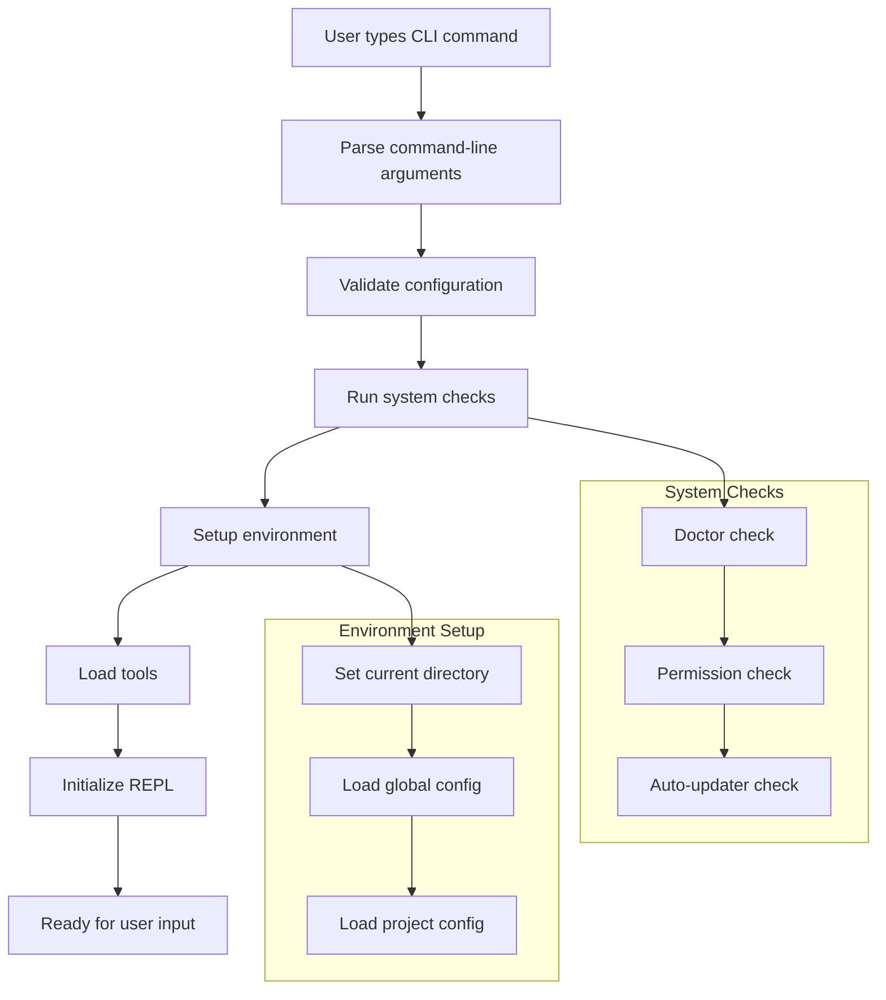
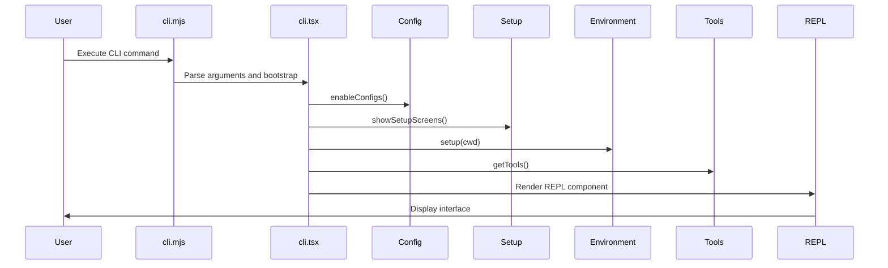
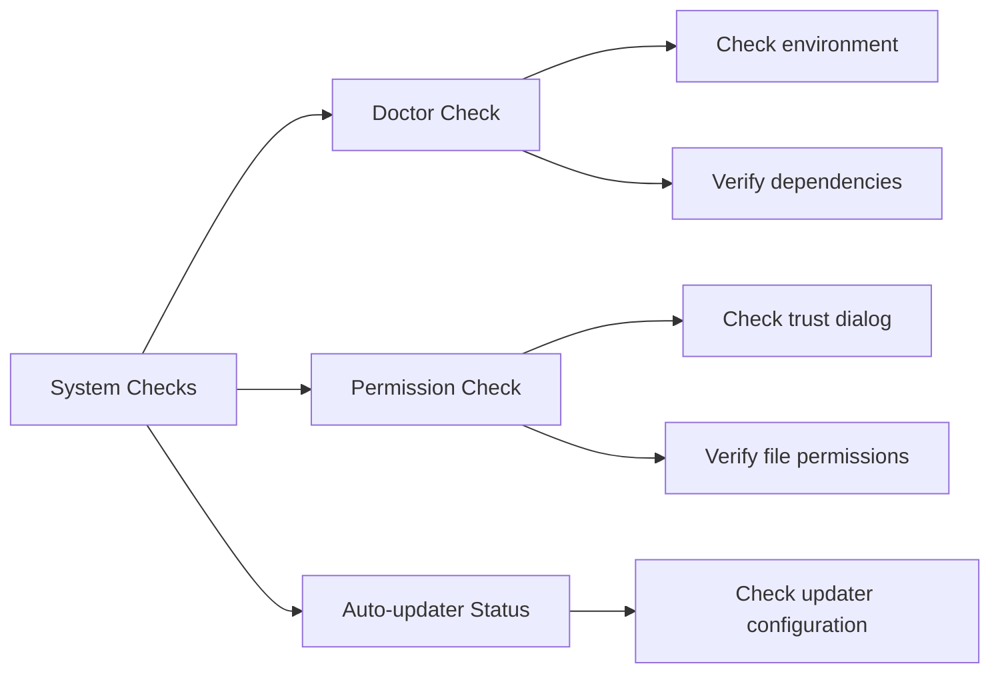
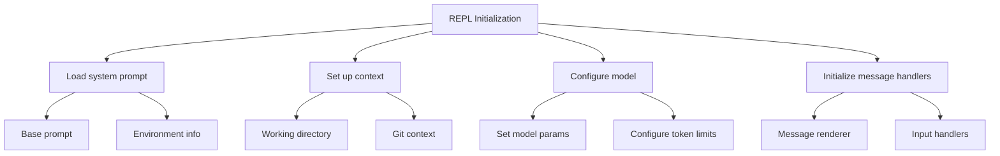

# Initialization Process

This section explores the initialization process of anon-kode from the moment a user types the CLI command until the application is ready to accept input. We'll examine the startup flow, configuration loading, and how the REPL environment is established.

## Startup Flow Overview

When a user launches anon-kode through the CLI, a sequence of initialization steps occurs:



## Entry Points and Bootstrapping

The initialization process begins in two main files:

1. **CLI Entry Point**: `/anon-kode/cli.mjs`
   - Serves as the main entry point for the CLI command
   - Handles basic argument parsing
   - Delegates to the main application logic

2. **Application Bootstrap**: `/anon-kode/src/entrypoints/cli.tsx`
   - Contains the `main()` function that bootstraps the application
   - Orchestrates the initialization process
   - Sets up the React rendering context

Let's look at the actual code that powers this initialization:

### Entry Point in cli.mjs

The entry point in `cli.mjs` sets up the core runtime environment and forwards to the main application logic:

```javascript
#!/usr/bin/env node
import 'source-map-support/register.js'
import './src/entrypoints/cli.js'
```

This minimal bootstrapping code loads source map support for better debugging and then imports the main application entry point.

### Main Application Bootstrap in cli.tsx

The main function in `cli.tsx` handles the core initialization process:

```javascript
async function main(): Promise<void> {
  // Validate configs are valid and enable configuration system
  enableConfigs()

  program
    .name('kode')
    .description(`${PRODUCT_NAME} - starts an interactive session by default...`)
    // Various command line options defined here
    .option('-c, --cwd <cwd>', 'set working directory')
    .option('-d, --debug', 'enable debug mode')
    // ... other options
    
  program.parse(process.argv)
  const options = program.opts()
  
  // Set up working directory and environment
  const cwd = options.cwd ? path.resolve(options.cwd) : process.cwd()
  process.chdir(cwd)
  
  // Load configurations and check permissions
  await showSetupScreens(dangerouslySkipPermissions, print)
  await setup(cwd, dangerouslySkipPermissions)
  
  // Load tools
  const [tools, mcpClients] = await Promise.all([
    getTools(enableArchitect ?? getCurrentProjectConfig().enableArchitectTool),
    getClients(),
  ])
  
  // Render the REPL interface
  render(
    <REPL
      commands={commands}
      debug={debug}
      initialPrompt={inputPrompt}
      messageLogName={dateToFilename(new Date())}
      shouldShowPromptInput={true}
      verbose={verbose}
      tools={tools}
      dangerouslySkipPermissions={dangerouslySkipPermissions}
      mcpClients={mcpClients}
      isDefaultModel={isDefaultModel}
    />,
    renderContext,
  )
}

main().catch(error => {
  console.error(error)
  process.exit(1)
})
```



## Configuration Validation and Loading

One of the first steps in initialization is validating and loading configuration:

1. **Enable Configuration**:
   ```javascript
   // Validate configs are valid and enable configuration system
   enableConfigs()
   ```
   This function ensures that the configuration files exist, are valid JSON, and initializes the configuration system.

2. **Load Global Configuration**:
   ```javascript
   const config = getConfig(GLOBAL_CLAUDE_FILE, DEFAULT_GLOBAL_CONFIG)
   ```
   This loads the user's global configuration file, applying default values where necessary.

3. **Project Configuration**:
   ```javascript
   getCurrentProjectConfig()
   ```
   This retrieves project-specific settings based on the current working directory.

The configuration system uses a hierarchical approach:

```javascript
// Default configuration structure
const DEFAULT_GLOBAL_CONFIG = {
  largeModel: undefined,
  smallModel: undefined,
  largeModelApiKey: undefined,
  smallModelApiKey: undefined,
  largeModelBaseURL: undefined,
  smallModelBaseURL: undefined,
  googleApiKey: undefined,
  googleProjectId: undefined,
  geminiModels: undefined,
  largeModelCustomProvider: undefined,
  smallModelCustomProvider: undefined,
  largeModelMaxTokens: undefined,
  smallModelMaxTokens: undefined,
  largeModelReasoningEffort: undefined,
  smallModelReasoningEffort: undefined,
  autoUpdaterStatus: undefined,
  costThreshold: 5,
  lastKnownExternalIP: undefined,
  localPort: undefined,
  trustedExecutables: [],
  // Project-specific configurations
  projects: {},
} as GlobalClaudeConfig
```

## System Checks

Before the main application starts, several system checks are performed:



1. **Doctor Check**: The `Doctor` component performs health checks:
   ```javascript
   async function runDoctor(): Promise<void> {
     await new Promise<void>(resolve => {
       render(<Doctor onDone={() => resolve()} />)
     })
   }
   ```
   The Doctor component verifies:
   - Node.js version compatibility
   - Required executables (git, etc.)
   - Proper environment setup
   - Workspace permissions

2. **Permission Checks**:
   ```javascript
   // Check if trust dialog has been accepted
   const hasTrustDialogAccepted = checkHasTrustDialogAccepted()
   if (!hasTrustDialogAccepted) {
     await showTrustDialog()
   }
   
   // Grant file system permissions 
   await grantReadPermissionForOriginalDir()
   ```
   This ensures the user has accepted the trust dialog and granted necessary filesystem permissions.

3. **Auto-updater Status**:
   ```javascript
   const autoUpdaterStatus = globalConfig.autoUpdaterStatus ?? 'not_configured'
   if (autoUpdaterStatus === 'not_configured') {
     // Initialize auto-updater
   }
   ```
   This checks and initializes the auto-update functionality.

## Tool Loading

Tools are loaded based on configuration and feature flags:

```javascript
async function getTools(enableArchitectTool: boolean = false): Promise<Tool[]> {
  const tools: Tool[] = [
    new FileReadTool(),
    new GlobTool(),
    new GrepTool(),
    new lsTool(),
    new BashTool(),
    new FileEditTool(),
    new FileWriteTool(),
    new NotebookReadTool(),
    new NotebookEditTool(),
    new MemoryReadTool(),
    new MemoryWriteTool(),
    new AgentTool(),
    new ThinkTool(),
  ]
  
  // Conditionally add tools based on feature flags
  if (enableArchitectTool) {
    tools.push(new ArchitectTool())
  }
  
  return tools
}
```

This makes various tools available to the assistant:
- File manipulation tools (FileReadTool, FileEditTool, FileWriteTool)
- Search tools (GlobTool, GrepTool, lsTool)
- Agent tools (AgentTool, ArchitectTool)
- Execution tools (BashTool)
- Notebook tools (NotebookReadTool, NotebookEditTool)
- Memory tools (MemoryReadTool, MemoryWriteTool)
- Thinking tool (ThinkTool)

## REPL Initialization

The final step is initializing the REPL (Read-Eval-Print Loop) interface:



The REPL component (`/anon-kode/src/screens/REPL.tsx`) manages the interactive session with the AI. Let's look at its key initialization code:

```javascript
// Inside REPL component
useEffect(() => {
  async function init() {
    // Load system prompt, context, model and token limits
    const [systemPrompt, context, model, maxThinkingTokens] = await Promise.all([
      getSystemPrompt(),
      getContext(),
      getSlowAndCapableModel(),
      getMaxThinkingTokens(
        getGlobalConfig().largeModelMaxTokens,
        history.length > 0
      ),
    ])
    
    // Set up message handlers and conversation state
    setMessageHandlers({
      onNewMessage: handleNewMessage,
      onUserMessage: handleUserMessage,
      // ... other handlers
    })
    
    // Initialize model parameters
    setModelParams({
      systemPrompt,
      context,
      model,
      maxThinkingTokens,
      // ... other parameters
    })
    
    // Ready for user input
    setIsModelReady(true)
  }
  
  init()
}, [])
```

The REPL component handles:
1. Rendering the user interface 
2. Managing the message flow between user and AI
3. Processing user input and commands
4. Executing tools on behalf of the AI
5. Maintaining conversation history

## Context Loading

The context gathering process builds information for the AI:

```javascript
async function getContext(): Promise<Record<string, unknown>> {
  // Gather directory context
  const directoryStructure = await getDirectoryStructure()
  
  // Load git status if available
  const gitContext = await getGitContext()
  
  // Load user-specific context from KODING.md if present
  const userContext = await loadUserContext()
  
  return {
    directoryStructure,
    gitStatus: gitContext,
    userDefinedContext: userContext,
    // Other context elements
  }
}
```

This context includes:
- Directory structure information
- Git repository status and history
- User-defined context from KODING.md
- Environment variables and system information

## Command Registration

Commands are registered during initialization:

```javascript
const commands: Record<string, Command> = {
  help: helpCommand,
  model: modelCommand,
  config: configCommand,
  cost: costCommand,
  doctor: doctorCommand,
  clear: clearCommand,
  logout: logoutCommand,
  login: loginCommand,
  resume: resumeCommand,
  compact: compactCommand,
  bug: bugCommand,
  init: initCommand,
  release_notes: releaseNotesCommand,
  // ... more commands
}
```

Each command implements a standard interface:

```typescript
interface Command {
  name: string
  description: string
  execute: (args: string[], messages: Message[]) => Promise<CommandResult>
  // ... other properties
}
```

## Complete Initialization Sequence

The complete sequence from CLI invocation to ready state includes:

1. User invokes the CLI command
2. CLI entry point loads
3. Command line arguments are parsed
4. Configuration is validated and loaded
5. System checks run (Doctor, permissions)
6. Environment is set up (working directory, configs)
7. Tools are loaded based on configuration
8. Commands are registered
9. REPL interface is initialized
10. System prompt and context are loaded
11. Model is configured
12. Message handlers are set up
13. UI is rendered
14. System is ready for user input

## Practical Implications

The initialization process creates a consistent environment while adapting to user configuration:

1. **Modularity**: Components are loaded conditionally based on configuration
2. **Configurability**: Global and project-specific settings enable customization
3. **Health Verification**: System checks ensure proper environment setup
4. **Context Building**: Automatic context gathering provides relevant information to the AI
5. **Tool Availability**: Tools are loaded based on configuration and feature flags

This architecture allows anon-kode to start with the right configuration, context, and capabilities for each user's environment while maintaining a consistent experience.