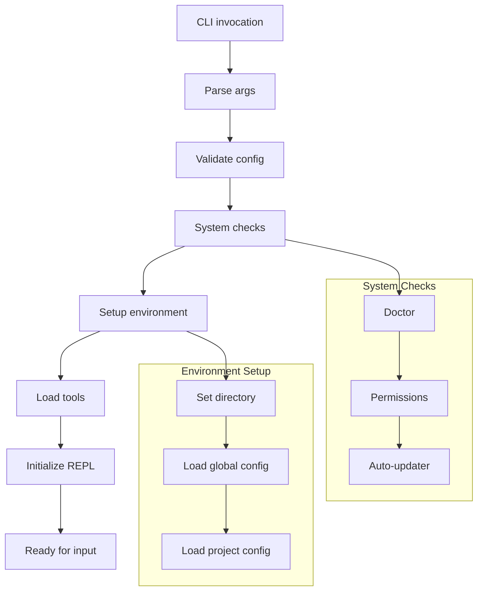
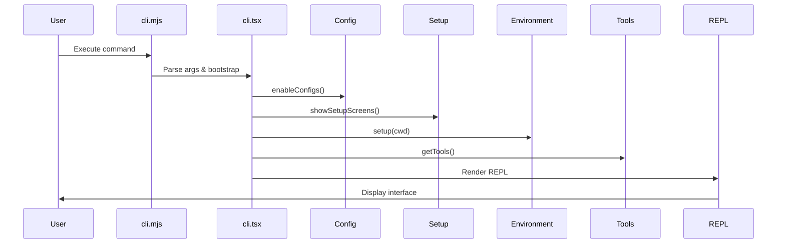
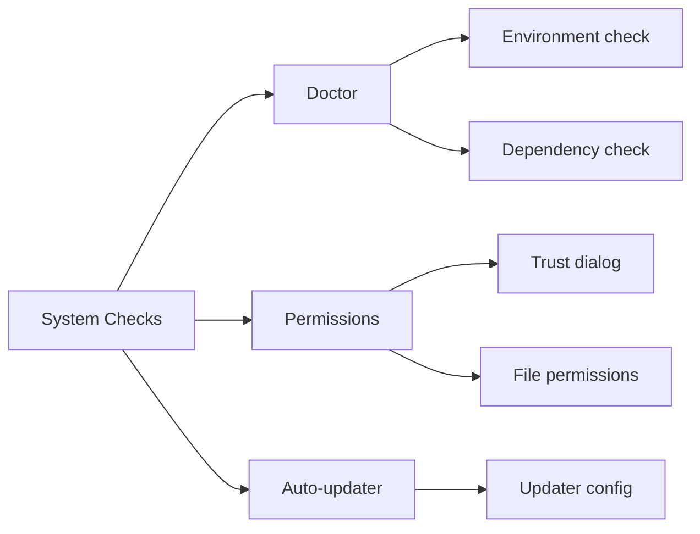
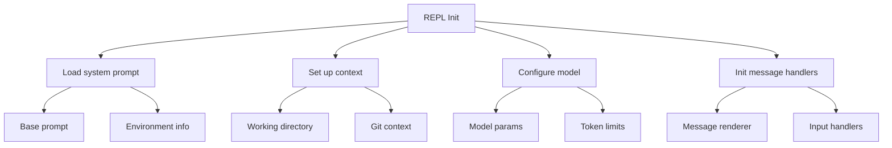

# Initialization Process

This section explores anon-kode's initialization process from CLI invocation to application readiness.

## Startup Flow

When a user runs anon-kode, this sequence triggers:



## Entry Points

The initialization starts in two key files:

1. **CLI Entry**: `/anon-kode/cli.mjs`
   - Main CLI entry point
   - Basic arg parsing
   - Delegates to application logic

2. **App Bootstrap**: `/anon-kode/src/entrypoints/cli.tsx`
   - Contains `main()` function
   - Orchestrates initialization
   - Sets up React rendering

### Entry Point (cli.mjs)

```javascript
#!/usr/bin/env node
import 'source-map-support/register.js'
import './src/entrypoints/cli.js'
```

### Main Bootstrap (cli.tsx)

```javascript
async function main(): Promise<void> {
  // Validate configs
  enableConfigs()

  program
    .name('kode')
    .description(`${PRODUCT_NAME} - starts an interactive session by default...`)
    // Various command line options defined here
    .option('-c, --cwd <cwd>', 'set working directory')
    .option('-d, --debug', 'enable debug mode')
    // ... other options
    
  program.parse(process.argv)
  const options = program.opts()
  
  // Set up environment
  const cwd = options.cwd ? path.resolve(options.cwd) : process.cwd()
  process.chdir(cwd)
  
  // Load configurations and check permissions
  await showSetupScreens(dangerouslySkipPermissions, print)
  await setup(cwd, dangerouslySkipPermissions)
  
  // Load tools
  const [tools, mcpClients] = await Promise.all([
    getTools(enableArchitect ?? getCurrentProjectConfig().enableArchitectTool),
    getClients(),
  ])
  
  // Render REPL interface
  render(
    <REPL
      commands={commands}
      debug={debug}
      initialPrompt={inputPrompt}
      messageLogName={dateToFilename(new Date())}
      shouldShowPromptInput={true}
      verbose={verbose}
      tools={tools}
      dangerouslySkipPermissions={dangerouslySkipPermissions}
      mcpClients={mcpClients}
      isDefaultModel={isDefaultModel}
    />,
    renderContext,
  )
}

main().catch(error => {
  console.error(error)
  process.exit(1)
})
```



## Configuration Loading

Early in the process, configs are validated and loaded:

1. **Enable Configuration**:
   ```javascript
   enableConfigs()
   ```
   Ensures config files exist, are valid JSON, and initializes the config system.

2. **Load Global Config**:
   ```javascript
   const config = getConfig(GLOBAL_CLAUDE_FILE, DEFAULT_GLOBAL_CONFIG)
   ```
   Loads user's global config with defaults where needed.

3. **Load Project Config**:
   ```javascript
   getCurrentProjectConfig()
   ```
   Gets project-specific settings for the current directory.

The config system uses a hierarchical structure:

```javascript
// Default configuration
const DEFAULT_GLOBAL_CONFIG = {
  largeModel: undefined,
  smallModel: undefined,
  largeModelApiKey: undefined,
  smallModelApiKey: undefined,
  largeModelBaseURL: undefined,
  smallModelBaseURL: undefined,
  googleApiKey: undefined,
  googleProjectId: undefined,
  geminiModels: undefined,
  largeModelCustomProvider: undefined,
  smallModelCustomProvider: undefined,
  largeModelMaxTokens: undefined,
  smallModelMaxTokens: undefined,
  largeModelReasoningEffort: undefined,
  smallModelReasoningEffort: undefined,
  autoUpdaterStatus: undefined,
  costThreshold: 5,
  lastKnownExternalIP: undefined,
  localPort: undefined,
  trustedExecutables: [],
  // Project configs
  projects: {},
} as GlobalClaudeConfig
```

## System Checks

Before the app starts, several checks run:



1. **Doctor Check**:
   ```javascript
   async function runDoctor(): Promise<void> {
     await new Promise<void>(resolve => {
       render(<Doctor onDone={() => resolve()} />)
     })
   }
   ```
   The Doctor component checks:
   - Node.js version
   - Required executables
   - Environment setup
   - Workspace permissions

2. **Permission Checks**:
   ```javascript
   // Check trust dialog
   const hasTrustDialogAccepted = checkHasTrustDialogAccepted()
   if (!hasTrustDialogAccepted) {
     await showTrustDialog()
   }
   
   // Grant filesystem permissions 
   await grantReadPermissionForOriginalDir()
   ```
   Ensures user accepted trust dialog and granted needed permissions.

3. **Auto-updater Check**:
   ```javascript
   const autoUpdaterStatus = globalConfig.autoUpdaterStatus ?? 'not_configured'
   if (autoUpdaterStatus === 'not_configured') {
     // Initialize auto-updater
   }
   ```
   Checks and initializes auto-update functionality.

## Tool Loading

Tools load based on config and feature flags:

```javascript
async function getTools(enableArchitectTool: boolean = false): Promise<Tool[]> {
  const tools: Tool[] = [
    new FileReadTool(),
    new GlobTool(),
    new GrepTool(),
    new lsTool(),
    new BashTool(),
    new FileEditTool(),
    new FileWriteTool(),
    new NotebookReadTool(),
    new NotebookEditTool(),
    new MemoryReadTool(),
    new MemoryWriteTool(),
    new AgentTool(),
    new ThinkTool(),
  ]
  
  // Add conditional tools
  if (enableArchitectTool) {
    tools.push(new ArchitectTool())
  }
  
  return tools
}
```

This makes various tools available:
- File tools (Read, Edit, Write)
- Search tools (Glob, Grep, ls)
- Agent tools (Agent, Architect)
- Execution tools (Bash)
- Notebook tools (Read, Edit)
- Memory tools (Read, Write)
- Thinking tool (Think)

## REPL Initialization

The final step initializes the REPL interface:



The REPL component handles interactive sessions:

```javascript
// Inside REPL component
useEffect(() => {
  async function init() {
    // Load prompt, context, model and token limits
    const [systemPrompt, context, model, maxThinkingTokens] = await Promise.all([
      getSystemPrompt(),
      getContext(),
      getSlowAndCapableModel(),
      getMaxThinkingTokens(
        getGlobalConfig().largeModelMaxTokens,
        history.length > 0
      ),
    ])
    
    // Set up message handlers
    setMessageHandlers({
      onNewMessage: handleNewMessage,
      onUserMessage: handleUserMessage,
      // ... other handlers
    })
    
    // Initialize model params
    setModelParams({
      systemPrompt,
      context,
      model,
      maxThinkingTokens,
      // ... other parameters
    })
    
    // Ready for input
    setIsModelReady(true)
  }
  
  init()
}, [])
```

The REPL component manages:
1. User interface rendering
2. Message flow between user and AI
3. User input and command processing
4. Tool execution
5. Conversation history

## Context Loading

The context gathering process builds AI information:

```javascript
async function getContext(): Promise<Record<string, unknown>> {
  // Directory context
  const directoryStructure = await getDirectoryStructure()
  
  // Git status
  const gitContext = await getGitContext()
  
  // User context from KODING.md
  const userContext = await loadUserContext()
  
  return {
    directoryStructure,
    gitStatus: gitContext,
    userDefinedContext: userContext,
    // Other context
  }
}
```

This includes:
- Directory structure
- Git repo status and history
- User-defined context from KODING.md
- Environment info

## Command Registration

Commands register during initialization:

```javascript
const commands: Record<string, Command> = {
  help: helpCommand,
  model: modelCommand,
  config: configCommand,
  cost: costCommand,
  doctor: doctorCommand,
  clear: clearCommand,
  logout: logoutCommand,
  login: loginCommand,
  resume: resumeCommand,
  compact: compactCommand,
  bug: bugCommand,
  init: initCommand,
  release_notes: releaseNotesCommand,
  // ... more commands
}
```

Each command implements a standard interface:

```typescript
interface Command {
  name: string
  description: string
  execute: (args: string[], messages: Message[]) => Promise<CommandResult>
  // ... other properties
}
```

## Complete Initialization Flow

The full sequence:

1. User runs CLI command
2. CLI entry point loads
3. Args parse
4. Config validates and loads
5. System checks run
6. Environment sets up
7. Tools load
8. Commands register
9. REPL initializes
10. System prompt and context load
11. Model configures
12. Message handlers set up
13. UI renders
14. System ready for input

## Practical Implications

This initialization creates consistency while adapting to user config:

1. **Modularity**: Components load conditionally based on config
2. **Configurability**: Global and project-specific settings
3. **Health Checks**: System verification ensures proper setup
4. **Context Building**: Automatic context gathering provides relevant info
5. **Tool Availability**: Tools load based on config and feature flags