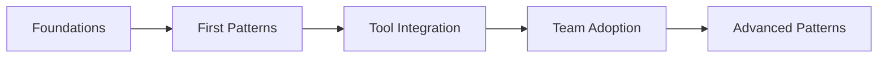

# Getting Started with AI Development Patterns

A structured learning path for developers new to AI-assisted development.

## Prerequisites
- Basic programming knowledge
- Familiarity with version control (Git)
- Access to an AI coding assistant (Claude Code, GitHub Copilot, etc.)

## Learning Path Overview

## Week 1: Foundations

### Day 1-2: Philosophy and Mindset
📖 **Read**: [Philosophy and Mindset](../overview-and-philosophy.md)
- Understand AI as a collaborator, not replacement
- Learn about context management
- Grasp the importance of clear communication

**Exercise**: Write 5 different prompts for the same task, observe differences

### Day 3-4: Core Concepts
📖 **Read**: [Introduction](../introduction.md)
- Understand the three-tier knowledge system
- Learn risk profiles (Green/Yellow/Red)
- Review the taxonomy structure

**Exercise**: Categorize 3 recent coding tasks by risk level

### Day 5: First Implementation
📖 **Read**: [System Prompts and Model Settings](../patterns/implementation/system-prompts-and-model-settings.md)
- Configure your first system prompt
- Understand model parameters
- Set up development environment

**Exercise**: Create a custom prompt for your specific domain

## Week 2: First Patterns

### Day 1-2: Basic Execution Flow
📖 **Read**: [Execution Flow in Detail](../patterns/implementation/execution-flow-in-detail.md)
- Understand request-response cycles
- Learn about streaming responses
- Handle errors gracefully

**Exercise**: Implement a simple tool that uses AI for code review

### Day 3-4: Framework Selection
📖 **Read**: [Framework Selection Guide](../patterns/implementation/framework-selection-guide.md)
- Evaluate different AI frameworks
- Understand trade-offs
- Make informed choices

**Exercise**: Compare 2 frameworks for your use case

### Day 5: Practical Examples
📖 **Read**: [Real World Examples](../patterns/implementation/real-world-examples.md)
- Study successful implementations
- Learn from common mistakes
- Identify patterns relevant to your work

**Exercise**: Adapt one example to your project

## Week 3: Tool Integration

### Day 1-2: Architecture Basics
📖 **Read**: [Core Architecture](../patterns/architecture/core-architecture.md)
- Understand the three-layer architecture
- Learn about plugin systems
- Grasp reactive patterns

**Exercise**: Diagram your current architecture and identify AI integration points

### Day 3-4: Tool Systems
📖 **Read**: [Tool System Deep Dive](../patterns/architecture/tool-system-deep-dive.md)
- Learn tool interface patterns
- Understand permission models
- Implement custom tools

**Exercise**: Create a custom tool for your workflow

### Day 5: Parallel Execution
📖 **Read**: [Parallel Tool Execution](../patterns/operations/parallel-tool-execution.md)
- Optimize for performance
- Handle concurrent operations
- Manage resource usage

**Exercise**: Convert sequential operations to parallel

## Week 4: Team Adoption

### Day 1-2: Collaboration Patterns
📖 **Read**: [Comments and Collaboration](../patterns/team/comments.md)
- Set up team workflows
- Establish conventions
- Share knowledge effectively

**Exercise**: Document and share one successful pattern with your team

### Day 3-4: Security Considerations
📖 **Read**: [The Permission System](../patterns/security/the-permission-system.md)
- Implement access controls
- Understand security risks
- Set up audit logging

**Exercise**: Add permission checks to your tools

### Day 5: Lessons Learned
📖 **Read**: [Lessons Learned](../patterns/operations/lessons-learned-and-implementation-challenges.md)
- Learn from others' experiences
- Avoid common pitfalls
- Plan for challenges

**Exercise**: Create a risk mitigation plan

## Milestone Checklist

### Foundation Complete ✅
- [ ] Configured AI assistant with custom prompts
- [ ] Implemented at least one pattern successfully
- [ ] Measured productivity improvement
- [ ] Documented learnings

### Integration Complete ✅
- [ ] Integrated AI into existing workflow
- [ ] Created custom tools
- [ ] Optimized for performance
- [ ] Established security measures

### Team Ready ✅
- [ ] Shared patterns with team
- [ ] Established team conventions
- [ ] Set up collaborative workflows
- [ ] Created documentation

## Next Steps

### For Individuals
→ Explore [Advanced Patterns](../patterns/architecture/multi-agent-orchestration.md)
→ Experiment with [High-Risk Patterns](../by-risk/high-risk/index.md) in safe environments

### For Teams
→ Follow [Enterprise Adoption Journey](./enterprise-adoption.md)
→ Implement [Team Workflows](../patterns/team/team-workflows.md)

### For Agencies
→ Study [Agency Playbook](./agency-playbook.md)
→ Focus on [Client Communication](../patterns/team/enterprise-integration.md)

## Quick Reference Card

### Daily Practices
1. **Start with low-risk patterns** (Green)
2. **Document what works** and what doesn't
3. **Measure impact** with simple metrics
4. **Share learnings** with peers
5. **Iterate quickly** based on feedback

### Warning Signs
- 🚫 Implementing high-risk patterns without experience
- 🚫 Skipping security considerations
- 🚫 Not measuring impact
- 🚫 Working in isolation
- 🚫 Ignoring failure modes

### Success Indicators
- ✅ Consistent productivity gains
- ✅ Reduced bug rates
- ✅ Team adoption growing
- ✅ Clear documentation
- ✅ Positive feedback loops

## Resources

### Essential Tools
- [Pattern Template](../PATTERN_TEMPLATE.md) - For documenting your patterns
- [Risk Assessment](../patterns/quality/risk-assessment.md) - For evaluating new patterns
- [Taxonomy Guide](../qed-taxonomy.md) - For categorizing patterns

### Community
- Share your patterns with the QED community
- Learn from others' implementations
- Contribute improvements back

Remember: **Start small, prove value, scale gradually**