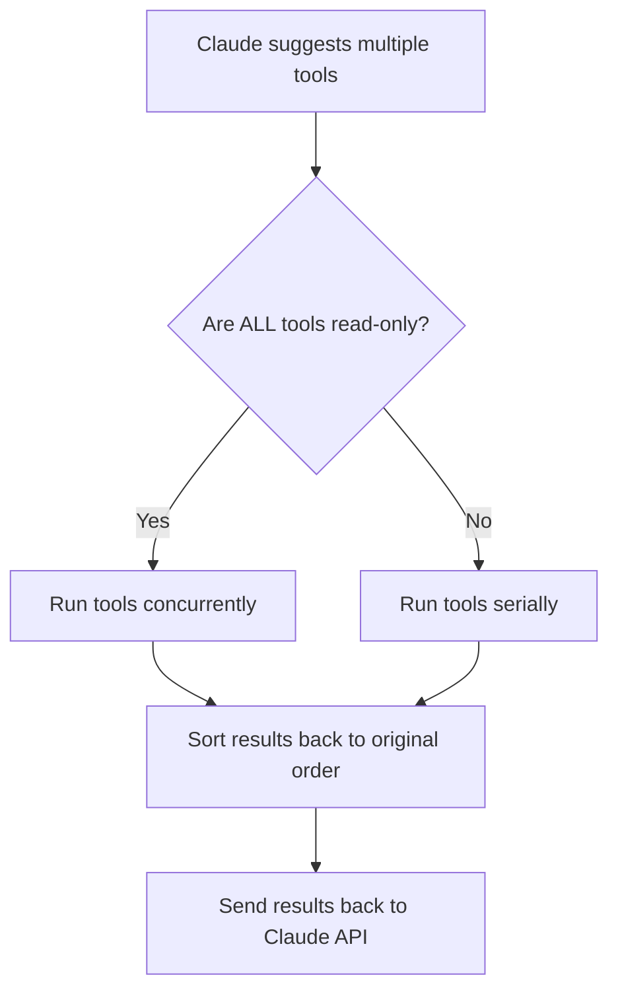

# Parallel Tool Execution

One of Claude Code's key performance innovations is running tools concurrently. When Claude needs to search through multiple files or perform several read operations, it executes them simultaneously rather than waiting for each to finish before starting the next.

## Smart Scheduling Strategy

The architecture uses a simple but effective rule to determine execution strategy:



This approach balances performance with safety:
- **Read operations** run in parallel (file reads, searches) with no risk of conflicts
- **Write operations** execute sequentially (file edits, bash commands) to avoid race conditions

## Tool Categories

Claude Code divides tools into two categories that determine their execution behavior:

### Read-Only Tools (Parallel-Safe)

These tools only read data and never modify state, making them safe to run simultaneously:

- `GlobTool` - Finds files matching patterns like "src/**/*.ts"
- `GrepTool` - Searches file contents for text patterns 
- `View` - Reads file content
- `LS` - Lists directory contents
- `ReadNotebook` - Extracts cells from Jupyter notebooks

### Non-Read-Only Tools (Sequential Only)

These tools modify state and must run one after another:

- `Edit` - Makes targeted changes to files
- `Replace` - Overwrites entire files
- `Bash` - Executes terminal commands
- `NotebookEditCell` - Modifies Jupyter notebook cells

## Parallel Execution Under the Hood

The concurrent execution is powered by JavaScript async generators. Let's break down the implementation into manageable pieces:

### 1. The Core Generator Utility

The system manages multiple async generators through a central coordination function:

```typescript
export async function* all<T>(
  generators: Array<AsyncGenerator<T>>,
  options: { signal?: AbortSignal; maxConcurrency?: number } = {}
): AsyncGenerator<T & { generatorIndex: number }> {
  const { signal, maxConcurrency = 10 } = options;
  
  // Track active generators
  const remaining = new Set(generators.map((_, i) => i));
  
  // Map tracks generator state
  const genStates = new Map<number, {
    generator: AsyncGenerator<T>,
    nextPromise: Promise<IteratorResult<T>>,
    done: boolean
  }>();
  
  // More implementation details...
}
```

### 2. Initializing the Generator Pool

The system starts with a batch of generators up to the concurrency limit:

```typescript
// Initialize first batch (respect max concurrency)
const initialBatchSize = Math.min(generators.length, maxConcurrency);
for (let i = 0; i < initialBatchSize; i++) {
  genStates.set(i, {
    generator: generators[i],
    nextPromise: generators[i].next(),
    done: false
  });
}
```

### 3. Racing for Results

The system uses Promise.race to process whichever generator completes next:

```typescript
// Process generators until all complete
while (remaining.size > 0) {
  // Check for cancellation
  if (signal?.aborted) {
    throw new Error('Operation aborted');
  }
  
  // Wait for next result from any generator
  const entries = Array.from(genStates.entries());
  const { index, result } = await Promise.race(
    entries.map(async ([index, state]) => {
      const result = await state.nextPromise;
      return { index, result };
    })
  );
  
  // Process result...
}
```

### 4. Processing Results and Cycling Generators

When a result arrives, the system yields it and queues the next one:

```typescript
if (result.done) {
  // This generator is finished
  remaining.delete(index);
  genStates.delete(index);
  
  // Start another generator if available
  const nextIndex = generators.findIndex((_, i) => 
    i >= initialBatchSize && !genStates.has(i));
  
  if (nextIndex >= 0) {
    genStates.set(nextIndex, {
      generator: generators[nextIndex],
      nextPromise: generators[nextIndex].next(),
      done: false
    });
  }
} else {
  // Yield this result with its origin
  yield { ...result.value, generatorIndex: index };
  
  // Queue next value from this generator
  const state = genStates.get(index)!;
  state.nextPromise = state.generator.next();
}
```

## Executing Tools with Smart Scheduling

The execution strategy adapts based on the tools' characteristics:

```typescript
async function executeTools(toolUses: ToolUseRequest[]) {
  // Check if all tools are read-only
  const allReadOnly = toolUses.every(toolUse => {
    const tool = findToolByName(toolUse.name);
    return tool?.isReadOnly();
  });
  
  if (allReadOnly) {
    // Run concurrently for read-only tools
    return runConcurrently(toolUses);
  } else {
    // Run sequentially for any write operations
    return runSequentially(toolUses);
  }
}
```

### Concurrent Execution Path

For read-only operations, the system runs everything in parallel:

```typescript
async function runConcurrently(toolUses) {
  // Convert tool requests to generators
  const generators = toolUses.map(toolUse => {
    const tool = findToolByName(toolUse.name)!;
    return tool.call(toolUse.parameters);
  });
  
  // Collect results with origin tracking
  const results = [];
  for await (const result of all(generators)) {
    results.push({
      ...result,
      toolIndex: result.generatorIndex
    });
  }
  
  // Sort to match original request order
  return results.sort((a, b) => a.toolIndex - b.toolIndex);
}
```

### Sequential Execution Path

For operations that modify state, the system runs them one at a time:

```typescript
async function runSequentially(toolUses) {
  const results = [];
  for (const toolUse of toolUses) {
    const tool = findToolByName(toolUse.name)!;
    const generator = tool.call(toolUse.parameters);
    
    // Get all results from this tool before continuing
    for await (const result of generator) {
      results.push(result);
    }
  }
  return results;
}
```

## Performance Benefits

This pattern delivers major performance gains with minimal complexity. Notable advantages include:

1. **Controlled Concurrency** - Runs up to 10 tools simultaneously (configurable)
2. **Progressive Results** - Data streams back as available without waiting for everything
3. **Order Preservation** - Results include origin information for correct sequencing
4. **Cancellation Support** - AbortSignal propagates to all operations for clean termination
5. **Resource Management** - Limits concurrent operations to prevent system overload

For large codebases, this approach can turn minutes of waiting into seconds of processing. The real power comes when combining multiple read operations:

```typescript
// Example of multiple tools running simultaneously
const filePatterns = await globTool("src/**/*.ts");
const apiUsageFiles = await grepTool("fetch\\(|axios|request\\(");
const translationFiles = await grepTool("i18n\\.|translate\\(");

// All three operations execute in parallel
// Rather than one after another
```

This pattern is essential for building responsive AI agents. File I/O is typically a major bottleneck for responsiveness - making these operations concurrent transforms the user experience from painfully slow to genuinely interactive.