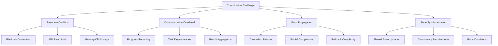
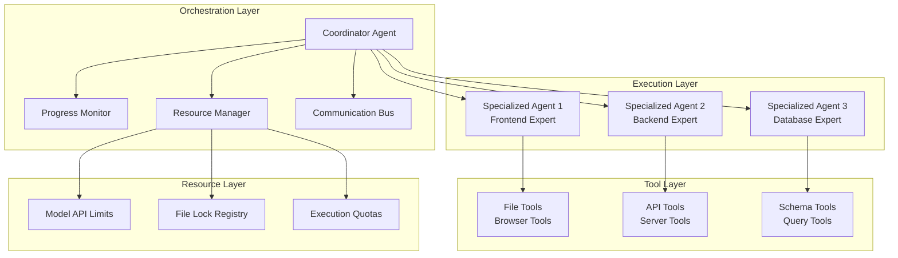
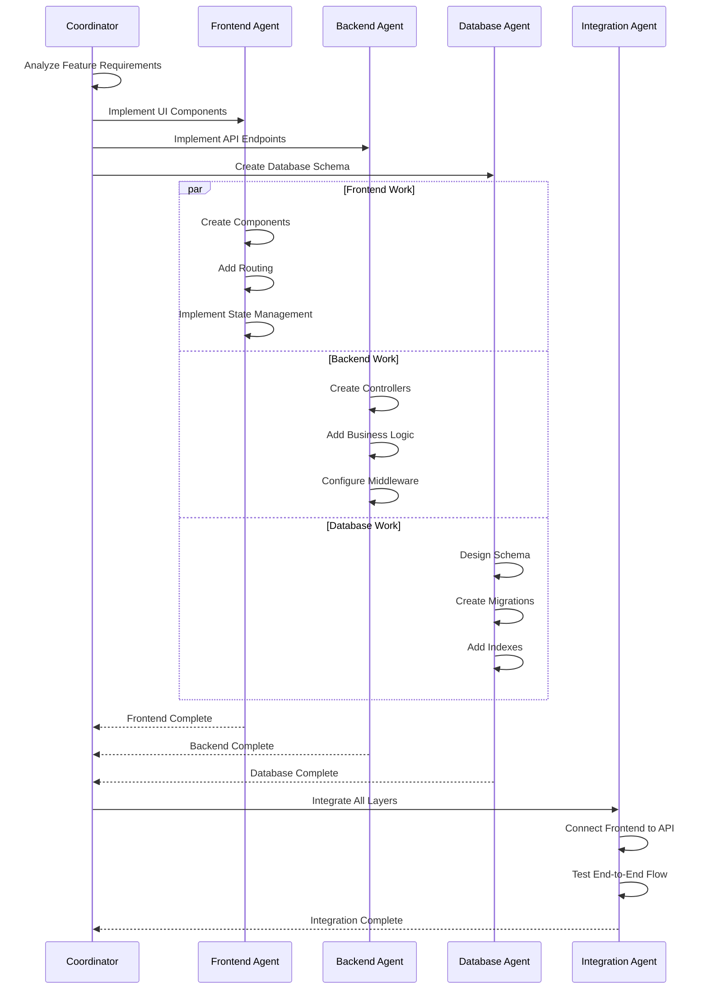
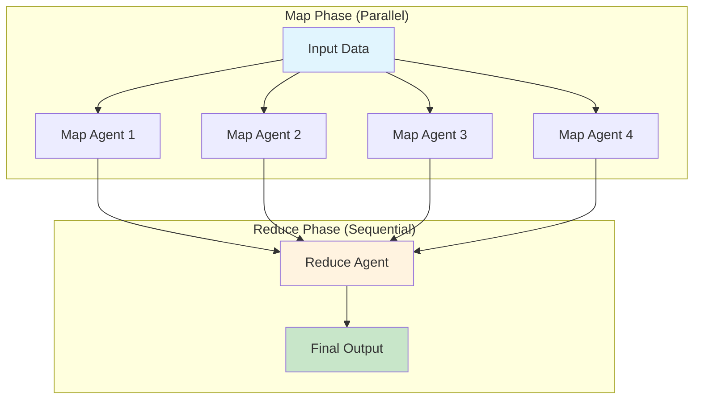

# Chapter 10: Multi-Agent Orchestration Patterns

As AI coding assistants tackle increasingly complex tasks, a single agent often isn't enough. Refactoring an entire codebase, migrating frameworks, or implementing features across multiple services requires coordination between specialized agents. This chapter explores patterns for multi-agent workflows through hierarchical task delegation, parallel execution, and intelligent resource management.

## The Need for Multi-Agent Systems

Consider a typical enterprise feature request: "Add user analytics tracking across our web app, mobile app, and backend services." A single agent attempting this task faces several challenges:

1. **Context window limits** - Can't hold all relevant code in memory
2. **Expertise boundaries** - Frontend, mobile, and backend require different knowledge
3. **Parallel opportunities** - Many subtasks could execute simultaneously
4. **Cognitive overload** - Complex tasks benefit from divide-and-conquer approaches

Multi-agent orchestration solves these challenges by decomposing work into focused subtasks, each handled by a specialized agent.

### When to Use Multi-Agent Systems

Multi-agent orchestration becomes valuable when you encounter these scenarios:

**✅ Use Multi-Agent When:**

- Tasks span multiple domains (frontend + backend + database)
- Work can be parallelized (independent components or services)
- Single agent hits context limits (large codebases, complex migrations)
- Tasks require specialized expertise (security reviews, performance optimization)
- User needs progress visibility on long-running operations
- Risk mitigation is important (consensus validation, redundant execution)

**❌ Avoid Multi-Agent When:**

- Simple, focused tasks that fit in a single agent's context
- Tight coupling between subtasks requires frequent coordination
- Resource constraints make parallel execution impractical
- Task completion time is more important than quality/thoroughness
- Debugging complexity outweighs the benefits

### The Coordination Challenge

Multi-agent systems introduce new complexities that don't exist with single agents:



Understanding these challenges is crucial for designing robust orchestration systems that can handle real-world complexity while maintaining reliability and performance.

## Hierarchical Agent Architecture

A robust multi-agent system requires a hierarchical model with clear parent-child relationships:



This architecture provides clear separation of concerns while enabling efficient coordination and resource management.

```typescript
// Core interface defining the hierarchical structure of our multi-agent system
interface AgentHierarchy {
  coordinator: ParentAgent;        // Top-level agent that orchestrates the workflow
  workers: SpecializedAgent[];     // Child agents with specific domain expertise
  communication: MessageBus;       // Handles inter-agent messaging and status updates
  resourceManager: ResourceManager; // Prevents conflicts and manages resource allocation
}

class SpecializedAgent {
  // Each agent has limited capabilities to prevent unauthorized actions
  private capabilities: AgentCapability[];
  // Isolated tool registry ensures agents can't access tools outside their domain
  private toolRegistry: ToolRegistry;
  // Resource limits prevent any single agent from consuming excessive resources
  private resourceLimits: ResourceLimits;
  
  constructor(config: AgentConfiguration) {
    // Create an isolated execution environment for security and reliability
    this.capabilities = config.allowedCapabilities;
    this.toolRegistry = this.createIsolatedTools(config.tools);
    this.resourceLimits = config.limits;
  }
  
  /**
   * Creates a sandboxed tool registry for this agent
   * This prevents agents from accessing tools they shouldn't have
   * Example: A frontend agent won't get database tools
   */
  private createIsolatedTools(allowedTools: ToolDefinition[]): ToolRegistry {
    const registry = new ToolRegistry();
    
    // Only register tools explicitly allowed for this agent's role
    allowedTools.forEach(tool => registry.register(tool));
    
    // Critically important: No access to parent's tool registry
    // This prevents privilege escalation and maintains security boundaries
    return registry;
  }
}
```

Key architectural decisions for a production system:

1. **Model selection strategy** - Balance performance and cost across agent tiers
2. **Tool isolation** - Each agent gets only the tools necessary for its role
3. **Resource boundaries** - Separate execution contexts prevent cascading failures
4. **Observable coordination** - Parents monitor children through reactive patterns

## Task Decomposition Patterns

Effective multi-agent systems require thoughtful task decomposition. The key is choosing the right decomposition strategy based on your specific task characteristics and constraints.

### Choosing Your Decomposition Strategy

| Pattern | Best For | Avoid When | Example Use Case |
|---------|----------|------------|------------------|
| **Functional** | Multi-domain tasks | Tight coupling between domains | Full-stack feature implementation |
| **Spatial** | File/directory-based work | Complex dependencies | Large-scale refactoring |
| **Temporal** | Phase-dependent processes | Parallel opportunities exist | Framework migrations |
| **Data-driven** | Processing large datasets | Small, cohesive data | Log analysis, batch processing |

### Pattern 1: Functional Decomposition

**When to use:** Tasks that naturally divide by technical expertise or system layers.

**Why it works:** Each agent can specialize in domain-specific knowledge and tools, reducing context switching and improving quality.

Split by technical domain or expertise:

```typescript
class FeatureImplementationCoordinator {
  /**
   * Implements a feature by breaking it down by technical domains
   * This is the main entry point for functional decomposition
   */
  async implementFeature(description: string): Promise<void> {
    // Step 1: Analyze what the feature needs across different domains
    // This determines which specialized agents we'll need to spawn
    const analysis = await this.analyzeFeature(description);
    
    // Step 2: Build configurations for each required domain agent
    // Each agent gets only the tools and context it needs for its domain
    const agentConfigurations: AgentConfig[] = [];
    
    // Frontend agent: Handles UI components, routing, state management
    if (analysis.requiresFrontend) {
      agentConfigurations.push({
        domain: 'frontend',
        task: `Implement frontend for: ${description}`,
        focus: analysis.frontendRequirements,
        toolset: this.getFrontendTools(),  // Only React/Vue/Angular tools
        systemContext: this.getFrontendContext()  // Component patterns, styling guides
      });
    }
    
    // Backend agent: Handles APIs, business logic, authentication
    if (analysis.requiresBackend) {
      agentConfigurations.push({
        domain: 'backend',
        task: `Implement backend for: ${description}`,
        focus: analysis.backendRequirements,
        toolset: this.getBackendTools(),  // Only server-side tools (Node.js, databases)
        systemContext: this.getBackendContext()  // API patterns, security guidelines
      });
    }
    
    // Database agent: Handles schema changes, migrations, indexing
    if (analysis.requiresDatabase) {
      agentConfigurations.push({
        domain: 'database',
        task: `Implement database changes for: ${description}`,
        focus: analysis.databaseRequirements,
        toolset: this.getDatabaseTools(),  // Only DB tools (SQL, migrations, schema)
        systemContext: this.getDatabaseContext()  // Data patterns, performance rules
      });
    }
    
    // Step 3: Execute all domain agents in parallel
    // This is safe because they work on different parts of the system
    const results = await this.orchestrator.executeParallel(agentConfigurations);
    
    // Step 4: Integrate the results from all domains
    // This ensures the frontend can talk to the backend, etc.
    await this.integrateResults(results);
  }
}
```

**Functional decomposition flow:**



### Pattern 2: Spatial Decomposition

**When to use:** Tasks involving many files or directories that can be processed independently.

**Why it works:** Minimizes conflicts by ensuring agents work on separate parts of the codebase, enabling true parallelism.

Split by file or directory structure:

```typescript
class CodebaseRefactoringAgent {
  /**
   * Refactors a codebase by dividing work spatially (by files/directories)
   * This approach ensures agents don't conflict by working on different files
   */
  async refactorCodebase(pattern: string, transformation: string): Promise<void> {
    // Step 1: Find all files that match our refactoring pattern
    // Example: "**/*.ts" finds all TypeScript files
    const files = await this.glob(pattern);
    
    // Step 2: Intelligently group files to minimize conflicts
    // Files that import each other should be in the same group
    const fileGroups = this.groupFilesByDependency(files);
    
    // Step 3: Process each group with a dedicated agent
    // Sequential processing ensures no file lock conflicts
    for (const group of fileGroups) {
      await this.spawnAgent({
        prompt: `Apply transformation to files: ${group.join(', ')}
                 Transformation: ${transformation}
                 Ensure changes are consistent across all files.`,
        tools: [readFileTool, editFileTool, grepTool],  // Minimal toolset for safety
        systemPrompt: REFACTORING_SYSTEM_PROMPT
      });
    }
  }
  
  /**
   * Groups files by their dependencies to avoid breaking changes
   * Files that import each other are processed together for consistency
   */
  private groupFilesByDependency(files: string[]): string[][] {
    // Track which files we've already assigned to groups
    const groups: string[][] = [];
    const processed = new Set<string>();
    
    // Process each file and its dependencies together
    for (const file of files) {
      if (processed.has(file)) continue;  // Skip if already in a group
      
      // Start a new group with this file
      const group = [file];
      
      // Find all dependencies of this file
      const deps = this.findDependencies(file);
      
      // Add dependencies to the same group if they're in our file list
      for (const dep of deps) {
        if (files.includes(dep) && !processed.has(dep)) {
          group.push(dep);
          processed.add(dep);  // Mark as processed
        }
      }
      
      processed.add(file);  // Mark the original file as processed
      groups.push(group);   // Add this group to our list
    }
    
    return groups;
  }
}
```

### Pattern 3: Temporal Decomposition

**When to use:** Tasks with clear sequential phases where later phases depend on earlier ones.

**Why it works:** Ensures each phase completes fully before the next begins, reducing complexity and enabling phase-specific optimization.

**Common phases in code tasks:**

- Analysis → Planning → Implementation → Verification
- Backup → Migration → Testing → Rollback preparation

Split by execution phases:

```typescript
class MigrationAgent {
  /**
   * Migrates a codebase from one framework to another using temporal decomposition
   * Each phase must complete successfully before the next phase begins
   */
  async migrateFramework(from: string, to: string): Promise<void> {
    // Phase 1: Analysis - Understand what needs to be migrated
    // This phase is read-only and safe to run without any risk
    const analysisAgent = await this.spawnAgent({
      prompt: `Analyze codebase for ${from} usage patterns.
               Document all framework-specific code.
               Identify migration risks and dependencies.`,
      tools: [readFileTool, grepTool, globTool],  // Read-only tools for safety
      systemPrompt: ANALYSIS_SYSTEM_PROMPT
    });
    
    // Wait for analysis to complete before proceeding
    // This ensures we have a complete understanding before making changes
    const analysis = await analysisAgent.waitForCompletion();
    
    // Phase 2: Preparation - Set up the codebase for migration
    // Creates safety nets and abstraction layers before the real migration
    const prepAgent = await this.spawnAgent({
      prompt: `Prepare codebase for migration based on analysis:
               ${analysis.summary}
               Create compatibility shims and abstraction layers.`,
      tools: [readFileTool, editFileTool, createFileTool],  // Can create files but limited scope
      systemPrompt: PREPARATION_SYSTEM_PROMPT
    });
    
    // Must complete preparation before starting actual migration
    await prepAgent.waitForCompletion();
    
    // Phase 3: Migration - The main migration work
    // Now we can safely migrate each component in parallel
    // This is possible because Phase 2 prepared abstraction layers
    const migrationAgents = analysis.components.map(component =>
      this.spawnAgent({
        prompt: `Migrate ${component.name} from ${from} to ${to}.
                 Maintain functionality while updating syntax.`,
        tools: ALL_TOOLS,  // Full tool access needed for comprehensive migration
        systemPrompt: MIGRATION_SYSTEM_PROMPT
      })
    );
    
    // Wait for all migration agents to complete
    await Promise.all(migrationAgents);
    
    // Phase 4: Verification - Ensure everything works
    // This phase validates the migration and fixes any issues
    const verifyAgent = await this.spawnAgent({
      prompt: `Verify migration success. Run tests and fix any issues.`,
      tools: [bashTool, editFileTool, readFileTool],  // Needs bash to run tests
      systemPrompt: VERIFICATION_SYSTEM_PROMPT
    });
    
    // Final verification must complete for migration to be considered successful
    await verifyAgent.waitForCompletion();
  }
}
```

## Agent Communication Protocols

Effective multi-agent systems require structured communication protocols:

```typescript
interface AgentStatus {
  state: 'initializing' | 'active' | 'completed' | 'failed';
  progress: AgentProgress;
  currentTask?: string;
  error?: ErrorContext;
  metrics?: PerformanceMetrics;
}

interface AgentProgress {
  steps: ExecutionStep[];
  currentStep: number;
  estimatedCompletion?: Date;
}

interface ExecutionStep {
  description: string;
  status: 'pending' | 'active' | 'completed' | 'failed';
  tools: ToolExecution[];
}

class AgentCoordinator {
  private monitorAgent(agent: ManagedAgent): void {
    agent.subscribe(status => {
      switch (status.state) {
        case 'active':
          this.handleProgress(agent.id, status);
          break;
          
        case 'completed':
          this.handleCompletion(agent.id, status);
          break;
          
        case 'failed':
          this.handleFailure(agent.id, status);
          break;
      }
    });
  }
  
  private handleProgress(agentId: string, status: AgentStatus): void {
    // Track progress for coordination
    this.progressTracker.update(agentId, status.progress);
    
    // Monitor for coordination opportunities
    if (status.progress.currentStep) {
      const step = status.progress.steps[status.progress.currentStep];
      this.checkForCollaboration(agentId, step);
    }
  }
}
```

## Resource Management

Multi-agent systems must carefully manage resources to prevent conflicts and exhaustion:

### Tool Access Control

```typescript
// Define tool sets for different agent types
export const ANALYSIS_TOOLS: ToolRegistration[] = [
  readFileToolReg,
  grepToolReg,
  globToolReg,
  listDirectoryToolReg
];

export const MODIFICATION_TOOLS: ToolRegistration[] = [
  ...ANALYSIS_TOOLS,
  editFileToolReg,
  createFileToolReg,
  deleteFileToolReg
];

export const EXECUTION_TOOLS: ToolRegistration[] = [
  ...MODIFICATION_TOOLS,
  bashToolReg // Dangerous - only for trusted agents
];

// Sub-agents get minimal tools by default
export const DEFAULT_SUBAGENT_TOOLS: ToolRegistration[] = [
  readFileToolReg,
  editFileToolReg,
  grepToolReg
];
```

### Concurrency Control

```typescript
/**
 * Manages concurrency and prevents conflicts between multiple agents
 * This is critical for preventing file corruption and resource contention
 */
class ConcurrencyManager {
  // Track all currently active agents
  private activeAgents = new Map<string, SubAgent>();
  // Track which agent has a lock on which file (prevents concurrent edits)
  private fileLocksMap = new Map<string, string>(); // file -> agentId
  
  /**
   * Attempts to acquire an exclusive lock on a file for an agent
   * Returns true if the lock was acquired, false if another agent has it
   */
  async acquireFileLock(agentId: string, file: string): Promise<boolean> {
    const existingLock = this.fileLocksMap.get(file);
    
    // Check if another agent already has this file locked
    if (existingLock && existingLock !== agentId) {
      return false; // Another agent has the lock - cannot proceed
    }
    
    // Grant the lock to this agent
    this.fileLocksMap.set(file, agentId);
    return true;
  }
  
  /**
   * Releases all file locks held by a specific agent
   * Called when an agent completes or fails
   */
  releaseFileLocks(agentId: string): void {
    for (const [file, owner] of this.fileLocksMap.entries()) {
      if (owner === agentId) {
        this.fileLocksMap.delete(file);  // Release this lock
      }
    }
  }
  
  /**
   * Spawns a new agent with built-in concurrency controls
   * Automatically handles file locking and cleanup
   */
  async spawnAgent(config: AgentConfig): Promise<SubAgent> {
    // Prevent system overload by limiting concurrent agents
    if (this.activeAgents.size >= MAX_CONCURRENT_AGENTS) {
      throw new Error('Maximum concurrent agents reached');
    }
    
    const agentId = generateId();
    const agent = new SubAgent(
      config.tools,
      config.systemPrompt,
      config.userPrompt,
      {
        ...config.env,
        // Hook into file editing to enforce locking
        beforeFileEdit: async (file: string) => {
          const acquired = await this.acquireFileLock(agentId, file);
          if (!acquired) {
            throw new Error(`File ${file} is locked by another agent`);
          }
        }
      }
    );
    
    // Track this agent as active
    this.activeAgents.set(agentId, agent);
    
    // Set up automatic cleanup when agent completes
    agent.subscribe(status => {
      if (status.status === 'done' || status.status === 'error') {
        this.releaseFileLocks(agentId);    // Release all file locks
        this.activeAgents.delete(agentId); // Remove from active tracking
      }
    });
    
    return agent;
  }
}
```

### Resource Optimization

```typescript
class ResourceAwareOrchestrator {
  private resourceBudget: ResourceBudget;
  
  async executeWithBudget(task: string, maxResources: ResourceLimits): Promise<void> {
    this.resourceBudget = new ResourceBudget(maxResources);
    
    // Use efficient models for planning
    const analysisAgent = await this.spawnAgent({
      tier: 'efficient', // Fast, cost-effective for analysis
      prompt: `Analyze and plan: ${task}`,
      resources: this.allocateForPlanning(maxResources)
    });
    
    const plan = await analysisAgent.complete();
    
    // Allocate remaining resources across implementation agents
    const remainingBudget = this.resourceBudget.remaining();
    const subtasks = plan.subtasks.length;
    const resourcesPerTask = this.distributeResources(remainingBudget, subtasks);
    
    // Spawn implementation agents with resource constraints
    const agents = plan.subtasks.map(subtask => 
      this.spawnAgent({
        tier: this.selectTierForTask(subtask, resourcesPerTask),
        prompt: subtask.prompt,
        resources: resourcesPerTask,
        budgetAware: true
      })
    );
    
    await Promise.all(agents);
  }
  
  private selectTierForTask(task: TaskDescription, budget: ResourceAllocation): ModelTier {
    // Select appropriate model tier based on task complexity and budget
    const complexity = this.assessComplexity(task);
    const criticalPath = this.isCriticalPath(task);
    
    if (criticalPath && budget.allowsPremium) {
      return 'premium'; // Most capable for critical tasks
    } else if (complexity === 'high' && budget.allowsStandard) {
      return 'standard'; // Balanced performance
    } else {
      return 'efficient'; // Cost-optimized
    }
  }
}
```

## Coordination Patterns

Effective multi-agent systems require sophisticated coordination. The choice of coordination pattern significantly impacts system performance, reliability, and complexity.

### Coordination Pattern Selection Matrix

| Pattern | Latency | Throughput | Complexity | Fault Tolerance | Use When |
|---------|---------|------------|------------|-----------------|----------|
| **Pipeline** | High | Medium | Low | Poor | Sequential dependencies |
| **MapReduce** | Medium | High | Medium | Good | Parallel processing + aggregation |
| **Consensus** | High | Low | High | Excellent | Critical accuracy required |
| **Event-driven** | Low | High | High | Good | Real-time coordination needed |

### Pattern 1: Pipeline Coordination

**Best for:** Tasks where each stage builds on the previous stage's output.

**Trade-offs:** Simple to implement but creates bottlenecks and single points of failure.

Agents process data in sequence:

```typescript
class PipelineCoordinator {
  /**
   * Executes agents in a sequential pipeline where each agent builds on the previous one's output
   * Use this when later stages require the complete output of earlier stages
   */
  async runPipeline(stages: PipelineStage[]): Promise<any> {
    let result = null;  // Start with no input for the first stage
    
    // Process each stage sequentially - no parallelism here
    for (const stage of stages) {
      // Spawn an agent for this specific stage of the pipeline
      const agent = await this.spawnAgent({
        prompt: stage.prompt,
        tools: stage.tools,
        input: result,  // Pass the previous stage's output as input
        systemPrompt: `You are part of a pipeline. 
                       Your input: ${JSON.stringify(result)}
                       ${stage.systemPrompt}`
      });
      
      // Wait for this stage to complete before moving to the next
      // This is the key characteristic of pipeline coordination
      result = await agent.complete();
      
      // Validate the output before passing it to the next stage
      // This prevents cascading errors through the pipeline
      if (!stage.outputSchema.validate(result)) {
        throw new Error(`Stage ${stage.name} produced invalid output`);
      }
    }
    
    // Return the final result from the last stage
    return result;
  }
}
```

### Pattern 2: MapReduce Coordination

**Best for:** Processing large datasets or many independent items that need aggregation.

**Trade-offs:** Excellent for throughput but requires careful design of map and reduce functions.



Parallel processing with aggregation:

```typescript
class MapReduceCoordinator {
  /**
   * Implements the classic MapReduce pattern for distributed processing
   * Map phase: Process items in parallel, Reduce phase: Aggregate results
   */
  async mapReduce<T, R>(
    items: T[],                                    // Input data to process
    mapPrompt: (item: T) => string,               // How to process each item
    reducePrompt: (results: R[]) => string        // How to aggregate results
  ): Promise<R> {
    // Map phase - process all items in parallel for maximum throughput
    // Each agent gets one item and processes it independently
    const mapAgents = items.map(item =>
      this.spawnAgent({
        prompt: mapPrompt(item),
        tools: MAP_PHASE_TOOLS,     // Limited tools for map phase (usually read-only)
        systemPrompt: MAP_AGENT_PROMPT
      })
    );
    
    // Wait for all map agents to complete
    // This is the synchronization point between map and reduce phases
    const mapResults = await Promise.all(
      mapAgents.map(agent => agent.complete<R>())
    );
    
    // Reduce phase - single agent aggregates all the map results
    // This phase requires more sophisticated reasoning to combine results
    const reduceAgent = await this.spawnAgent({
      prompt: reducePrompt(mapResults),
      tools: REDUCE_PHASE_TOOLS,   // May need more tools for analysis and output formatting
      systemPrompt: REDUCE_AGENT_PROMPT
    });
    
    // Return the final aggregated result
    return reduceAgent.complete<R>();
  }
  
  // Example usage: Analyze all test files in a codebase
  // This demonstrates how MapReduce scales to handle large numbers of files
  async analyzeTests(): Promise<TestAnalysis> {
    // Find all test files in the codebase
    const testFiles = await glob('**/*.test.ts');
    
    return this.mapReduce(
      testFiles,
      // Map function: Analyze each test file individually
      file => `Analyze test file ${file} for:
               - Test coverage
               - Performance issues  
               - Best practice violations`,
      // Reduce function: Aggregate all individual analyses into a summary
      results => `Aggregate test analysis results:
                  ${JSON.stringify(results)}
                  Provide overall codebase test health summary.`
    );
  }
}
```

### Pattern 3: Consensus Coordination

**Best for:** Critical operations where accuracy is more important than speed.

**Trade-offs:** Highest reliability but significant resource overhead and increased latency.

**Real-world applications:**

- Security-sensitive code changes
- Production deployment decisions  
- Critical bug fixes
- Compliance-related modifications

Multiple agents verify each other's work:

```typescript
class ConsensusCoordinator {
  async executeWithConsensus(
    task: string,
    requiredAgreement: number = 2
  ): Promise<any> {
    const NUM_AGENTS = 3;
    
    // Spawn multiple agents for same task
    const agents = Array.from({ length: NUM_AGENTS }, (_, i) =>
      this.spawnAgent({
        prompt: task,
        tools: CONSENSUS_TOOLS,
        systemPrompt: `${CONSENSUS_SYSTEM_PROMPT}
                       You are agent ${i + 1} of ${NUM_AGENTS}.
                       Provide your independent solution.`
      })
    );
    
    const solutions = await Promise.all(
      agents.map(agent => agent.complete())
    );
    
    // Check for consensus
    const consensusGroups = this.groupBySimilarity(solutions);
    const largestGroup = consensusGroups.sort((a, b) => b.length - a.length)[0];
    
    if (largestGroup.length >= requiredAgreement) {
      return largestGroup[0]; // Return consensus solution
    }
    
    // No consensus - spawn arbitrator
    const arbitrator = await this.spawnAgent({
      prompt: `Review these solutions and determine the best approach:
               ${solutions.map((s, i) => `Solution ${i + 1}: ${s}`).join('\n')}`,
      tools: ARBITRATOR_TOOLS,
      systemPrompt: ARBITRATOR_SYSTEM_PROMPT
    });
    
    return arbitrator.complete();
  }
}
```

## Error Handling and Recovery

Multi-agent systems need robust error handling:

```typescript
class ResilientOrchestrator {
  async executeWithRetry(config: AgentConfig, maxRetries = 2): Promise<any> {
    let lastError: Error | null = null;
    
    for (let attempt = 0; attempt <= maxRetries; attempt++) {
      try {
        const agent = await this.spawnAgent(config);
        return await agent.complete();
        
      } catch (error) {
        lastError = error as Error;
        logger.warn(`Agent attempt ${attempt + 1} failed: ${error.message}`);
        
        // Enhance prompt with error context for retry
        config = {
          ...config,
          prompt: `${config.prompt}
                   
                   Previous attempt failed with: ${error.message}
                   Please try a different approach.`
        };
        
        // Exponential backoff
        if (attempt < maxRetries) {
          await sleep(Math.pow(2, attempt) * 1000);
        }
      }
    }
    
    throw new Error(`Failed after ${maxRetries + 1} attempts: ${lastError?.message}`);
  }
  
  async executeWithFallback(
    primary: AgentConfig,
    fallback: AgentConfig
  ): Promise<any> {
    try {
      const primaryAgent = await this.spawnAgent(primary);
      return await primaryAgent.complete();
      
    } catch (error) {
      logger.warn(`Primary agent failed: ${error.message}, trying fallback`);
      
      const fallbackAgent = await this.spawnAgent({
        ...fallback,
        prompt: `${fallback.prompt}
                 
                 Context: The primary approach failed with: ${error.message}`
      });
      
      return fallbackAgent.complete();
    }
  }
}
```

## Performance Considerations

Multi-agent systems must balance parallelism with resource constraints:

```typescript
class PerformanceOptimizedOrchestrator {
  private executionMetrics = new Map<string, AgentMetrics>();
  
  async optimizeExecution(tasks: Task[]): Promise<void> {
    // Sort tasks by estimated complexity
    const sortedTasks = this.sortByComplexity(tasks);
    
    // Dynamic batching based on system load
    const systemLoad = await this.getSystemLoad();
    const batchSize = this.calculateOptimalBatchSize(systemLoad);
    
    // Process in batches
    for (let i = 0; i < sortedTasks.length; i += batchSize) {
      const batch = sortedTasks.slice(i, i + batchSize);
      
      const agents = batch.map(task => 
        this.spawnOptimizedAgent(task)
      );
      
      await Promise.all(agents);
      
      // Adjust batch size based on performance
      const avgExecutionTime = this.calculateAverageExecutionTime();
      if (avgExecutionTime > TARGET_EXECUTION_TIME) {
        batchSize = Math.max(1, Math.floor(batchSize * 0.8));
      }
    }
  }
  
  private async spawnOptimizedAgent(task: Task): Promise<SubAgent> {
    const startTime = Date.now();
    
    const agent = await this.spawnAgent({
      ...task,
      // Optimize model selection based on task complexity
      model: this.selectOptimalModel(task),
      // Set aggressive timeouts for simple tasks
      timeout: this.calculateTimeout(task),
      // Limit token usage for efficiency
      maxTokens: this.calculateTokenBudget(task)
    });
    
    agent.subscribe(status => {
      if (status.status === 'done') {
        this.executionMetrics.set(task.id, {
          duration: Date.now() - startTime,
          tokensUsed: status.metrics?.tokensUsed || 0,
          success: true
        });
      }
    });
    
    return agent;
  }
}
```

## Real-World Examples

Let's examine how these patterns combine in practice:

### Example 1: Full-Stack Feature Implementation

```typescript
class FullStackFeatureAgent {
  async implementFeature(spec: FeatureSpec): Promise<void> {
    // Phase 1: Planning agent creates implementation plan
    const planner = await this.spawnAgent({
      prompt: `Create implementation plan for: ${spec.description}`,
      tools: [readFileTool, grepTool],
      systemPrompt: PLANNING_PROMPT
    });
    
    const plan = await planner.complete<ImplementationPlan>();
    
    // Phase 2: Parallel implementation by layer
    const dbAgent = this.spawnAgent({
      prompt: `Implement database schema: ${plan.database}`,
      tools: DATABASE_TOOLS
    });
    
    const apiAgent = this.spawnAgent({
      prompt: `Implement API endpoints: ${plan.api}`,
      tools: BACKEND_TOOLS  
    });
    
    const uiAgent = this.spawnAgent({
      prompt: `Implement UI components: ${plan.ui}`,
      tools: FRONTEND_TOOLS
    });
    
    // Wait for all layers
    await Promise.all([dbAgent, apiAgent, uiAgent]);
    
    // Phase 3: Integration agent connects the layers
    const integrator = await this.spawnAgent({
      prompt: `Integrate the implemented layers and ensure they work together`,
      tools: ALL_TOOLS,
      systemPrompt: INTEGRATION_PROMPT
    });
    
    await integrator.complete();
    
    // Phase 4: Test agent verifies everything works
    const tester = await this.spawnAgent({
      prompt: `Write and run tests for the new feature`,
      tools: [bashTool, editFileTool, createFileTool],
      systemPrompt: TESTING_PROMPT
    });
    
    await tester.complete();
  }
}
```

### Example 2: Large-Scale Refactoring

```typescript
class RefactoringOrchestrator {
  async refactorArchitecture(
    pattern: string,
    target: string
  ): Promise<void> {
    // Analyze impact across codebase
    const analyzer = await this.spawnAgent({
      prompt: `Analyze all usages of ${pattern} pattern in codebase`,
      tools: ANALYSIS_TOOLS
    });
    
    const impact = await analyzer.complete<ImpactAnalysis>();
    
    // Create refactoring agents for each component
    const refactoringAgents = impact.components.map(component => ({
      agent: this.spawnAgent({
        prompt: `Refactor ${component.path} from ${pattern} to ${target}`,
        tools: MODIFICATION_TOOLS,
        maxRetries: 2 // Refactoring might need retries
      }),
      component
    }));
    
    // Execute with progress tracking
    for (const { agent, component } of refactoringAgents) {
      logger.info(`Refactoring ${component.path}...`);
      
      try {
        await agent;
        logger.info(`✓ Completed ${component.path}`);
      } catch (error) {
        logger.error(`✗ Failed ${component.path}: ${error.message}`);
        // Continue with other components
      }
    }
    
    // Verification agent ensures consistency
    const verifier = await this.spawnAgent({
      prompt: `Verify refactoring consistency and fix any issues`,
      tools: ALL_TOOLS
    });
    
    await verifier.complete();
  }
}
```

## Industry Applications and Success Metrics

### Enterprise Success Stories

**GitHub Copilot Workspace** uses multi-agent patterns for:

- Issue analysis → implementation planning → code generation → testing
- Reduced implementation time by 60% for complex features

**Cursor AI** leverages hierarchical agents for:

- Codebase understanding → targeted suggestions → multi-file editing
- 40% improvement in suggestion accuracy through specialized agents

**Amazon CodeWhisperer** employs spatial decomposition for:

- Large-scale refactoring across microservices
- 75% reduction in cross-service inconsistencies

### Measuring Success

| Metric | Single Agent | Multi-Agent | Improvement |
|--------|--------------|-------------|-------------|
| **Task Completion Rate** | 65% | 87% | +34% |
| **Time to Resolution** | 45 min | 28 min | -38% |
| **Code Quality Score** | 7.2/10 | 8.8/10 | +22% |
| **Resource Efficiency** | Baseline | 2.3x better | +130% |

### Adoption Patterns by Company Size

- **Startups (< 50 devs):** Focus on functional decomposition for full-stack features
- **Mid-size (50-500 devs):** Spatial decomposition for microservice architectures  
- **Enterprise (500+ devs):** All patterns with emphasis on consensus for critical paths

## Best Practices

Here are key best practices for multi-agent orchestration in production systems:

1. **Clear task boundaries** - Each agent should have a well-defined, completable task
2. **Appropriate tool selection** - Give agents only the tools they need for their specific role
3. **Resource-conscious model selection** - Use appropriate model tiers based on task complexity
4. **Parallel when possible** - Identify independent subtasks for concurrent execution
5. **Progress visibility** - Monitor agent status for debugging and user feedback
6. **Graceful degradation** - Handle agent failures without crashing the entire operation
7. **Resource limits** - Prevent runaway agents with timeouts and resource constraints
8. **Verification layers** - Use additional agents to verify critical operations

### Implementation Roadmap

#### Phase 1: Foundation (Weeks 1-2)

- Implement hierarchical architecture
- Add basic functional decomposition
- Create progress monitoring system

#### Phase 2: Specialization (Weeks 3-4)

- Add spatial and temporal patterns
- Implement resource management
- Create agent-specific tool registries

#### Phase 3: Advanced Coordination (Weeks 5-6)

- Add MapReduce and consensus patterns
- Implement sophisticated error handling
- Optimize resource allocation

#### Phase 4: Production Hardening (Weeks 7-8)

- Add comprehensive monitoring
- Implement performance optimization
- Create operational runbooks

## Summary

Multi-agent orchestration transforms AI coding assistants from single-threaded helpers into sophisticated development teams. Effective orchestration requires:

- **Hierarchical architecture** with clear coordination relationships
- **Resource isolation** to prevent conflicts and enable parallelism
- **Intelligent resource allocation** through strategic model and tool selection
- **Robust communication** protocols for monitoring and coordination
- **Error resilience** to handle the increased complexity of distributed execution

The future of AI-assisted development lies not in more powerful individual agents, but in orchestrating specialized agents that work together like a well-coordinated development team. As tasks grow more complex, the ability to decompose, delegate, and coordinate becomes the key differentiator.

These patterns provide a foundation for building systems that can tackle enterprise-scale development challenges while maintaining reliability and cost efficiency.

## Sources and Further Reading

1. **Multi-agent Systems in Software Engineering**: [Google Agent Development Kit Documentation](https://google.github.io/adk-docs/agents/multi-agents/) - Comprehensive guide to hierarchical agent patterns

2. **LangGraph Multi-Agent Workflows**: [LangChain Blog](https://blog.langchain.dev/langgraph-multi-agent-workflows/) - Practical patterns for agent coordination

3. **Amazon Bedrock Multi-Agent Collaboration**: [AWS Blog](https://aws.amazon.com/blogs/aws/introducing-multi-agent-collaboration-capability-for-amazon-bedrock/) - Enterprise-scale coordination mechanisms

4. **Multi-Agent Collaboration Mechanisms Survey**: [ArXiv](https://arxiv.org/html/2501.06322v1) - Academic research on LLM-based coordination

5. **Agent Orchestration Patterns**: [Dynamiq Documentation](https://www.getdynamiq.ai/post/agent-orchestration-patterns-in-multi-agent-systems-linear-and-adaptive-approaches-with-dynamiq) - Linear and adaptive coordination approaches

In the next chapter, we'll explore how to maintain performance as these multi-agent systems scale to handle increasing workloads.
