## Execution Flow in Detail

This execution flow combines real-time responsiveness with coordination between AI, tools, and UI. Unlike simple request-response patterns, an agentic system operates as a continuous generator-driven stream where each step produces results immediately, without waiting for the entire process to complete.

At the core, the system uses **async generators** throughout. This pattern allows results to be produced as soon as they're available, rather than waiting for the entire operation to complete. For developers familiar with modern JavaScript/TypeScript, this is similar to how an `async*` function can `yield` values repeatedly before completing.

Let's follow a typical query from the moment you press Enter to the final response:

### 1. User Input Capture

Everything begins with user input. When you type a message and press Enter, several critical steps happen immediately:

```mermaid
%%{init: {'theme':'neutral', 'themeVariables': { 'primaryColor': '#5D8AA8', 'primaryTextColor': '#fff', 'primaryBorderColor': '#1F456E', 'lineColor': '#1F456E', 'secondaryColor': '#006400', 'tertiaryColor': '#fff'}}}%%
flowchart TD
    classDef userAction fill:#FF7F50,stroke:#FF6347,stroke-width:2px,color:white;
    classDef component fill:#5D8AA8,stroke:#1F456E,stroke-width:2px,color:white;
    classDef function fill:#006400,stroke:#004000,stroke-width:2px,color:white;
    
    A["🧑‍💻 User types and hits Enter"] --> B["PromptInput.tsx captures input"]
    B --> C["onSubmit() is triggered"]
    C --> D["AbortController created for<br> potential cancellation"]
    C --> E["processUserInput() called"]
    
    class A userAction
    class B component
    class C,D,E function
```

<strong>🔍 Key Insight:</strong> From the very first moment, the system establishes an <code>AbortController</code> that can terminate any operation anywhere in the execution flow. This clean cancellation mechanism means you can press Ctrl+C at any point and have the entire process terminate gracefully.

### 2. Input Processing

The system now evaluates what kind of input you've provided. There are three distinct paths:

1. **Bash commands** (prefixed with `!`) - These are sent directly to the BashTool for immediate execution
2. **Slash commands** (like `/help` or `/compact`) - These are processed internally by the command system
3. **Regular prompts** - These become AI queries to the LLM

<strong>💡 Engineering Decision:</strong> By giving each input type its own processing path, the system achieves both flexibility and performance. Bash commands and slash commands don't waste tokens or require AI processing, while AI-directed queries get full context and tools.

### 3. Query Generation

For standard prompts that need AI intelligence, the system now transforms your input into a fully-formed query with all necessary context:

<strong>🧩 Architecture Detail:</strong> Context collection happens in parallel to minimize latency. The system simultaneously gathers:
<ul>
<li>The system prompt (AI instructions and capabilities)</li>
<li>Contextual data (about your project, files, and history)</li>
<li>Model configuration (which AI model version, token limits, etc.)</li>
</ul>

This query preparation phase is critical because it's where the system determines what information and tools to provide to the AI model. Context management is carefully optimized to prioritize the most relevant information while staying within token limits.

### 4. Generator System Core

Now we reach the heart of the architecture: the generator system core. This is where the real magic happens:

<strong>⚡ Performance Feature:</strong> The <code>query()</code> function is implemented as an <code>async generator</code>. This means it can start streaming the AI's response immediately, token by token, without waiting for the complete response. You'll notice this in the UI where text appears progressively, just like in a conversation with a human.

The API interaction is highly sophisticated:

1. First, the API connection is established with the complete context prepared earlier
2. AI responses begin streaming back immediately as they're generated
3. The system monitors these responses to detect any "tool use" requests
4. If the AI wants to use a tool (like searching files, reading code, etc.), the response is paused while the tool executes
5. After tool execution, the results are fed back to the AI, which can then continue the response

This architecture enables a fluid conversation where the AI can actively interact with your development environment, rather than just responding to your questions in isolation.

### 5. Tool Use Handling

When the AI decides it needs more information or wants to take action on your system, it triggers tool use. This is one of the most sophisticated parts of the architecture:

<strong>⚠️ Security Design:</strong> All tool use passes through a permissions system. Tools that could modify your system (like file edits or running commands) require explicit approval, while read-only operations (like reading files) might execute automatically. This ensures you maintain complete control over what the AI can do.

What makes this tool system particularly powerful is its parallel execution capability:

1. The system first determines whether the requested tools can run concurrently
2. Read-only tools (like file searches and reads) are automatically parallelized
3. System-modifying tools (like file edits) run serially to prevent conflicts
4. All tool operations are guarded by the permissions system
5. After completion, results are reordered to match the original sequence for predictability

Perhaps most importantly, the entire tool system is **recursive**. When the AI receives the results from tool execution, it continues the conversation with this new information. This creates a natural flow where the AI can:

1. Ask a question
2. Read files to find the answer
3. Use the information to solve a problem
4. Suggest and implement changes
5. Verify the changes worked

...all in a single seamless interaction.

```mermaid
%%{init: {'theme':'neutral', 'themeVariables': { 'primaryColor': '#5D8AA8', 'primaryTextColor': '#fff', 'primaryBorderColor': '#1F456E', 'lineColor': '#1F456E', 'secondaryColor': '#006400', 'tertiaryColor': '#fff'}}}%%
flowchart TD
    classDef process fill:#5D8AA8,stroke:#1F456E,stroke-width:2px,color:white;
    classDef decision fill:#FFD700,stroke:#DAA520,stroke-width:2px,color:black;
    classDef function fill:#006400,stroke:#004000,stroke-width:2px,color:white;
    classDef permission fill:#FF7F50,stroke:#FF6347,stroke-width:2px,color:white;
    classDef result fill:#8A2BE2,stroke:#4B0082,stroke-width:2px,color:white;
    
    A["🔧 Process tool use"] --> B{"Run concurrently?"}
    B -->|"Yes"| C["runToolsConcurrently()"]
    B -->|"No"| D["runToolsSerially()"]
    C & D --> E["Check permissions<br>with canUseTool()"]
    E -->|"✅ Approved"| F["Execute tools"]
    E -->|"❌ Rejected"| G["Return rejection<br>message"]
    F --> H["Collect tool<br>responses"]
    H --> I["Recursive call to query()<br>with updated messages"]
    I --> J["Continue conversation"]
    
    class A process
    class B decision
    class C,D,F,I function
    class E permission
    class G,H,J result
```

### 6. Async Generators

The entire Claude Code architecture is built around async generators. This fundamental design choice powers everything from UI updates to parallel execution:

<strong>🔄 Technical Pattern:</strong> Async generators (<code>async function*</code> in TypeScript/JavaScript) allow a function to yield multiple values over time asynchronously. They combine the power of <code>async/await</code> with the ability to produce a stream of results.

The generator system provides several key capabilities:

1. **Real-time feedback** - Results stream to the UI as they become available, not after everything is complete
2. **Composable streams** - Generators can be combined, transformed, and chained together
3. **Cancellation support** - AbortSignals propagate through the entire generator chain, enabling clean termination
4. **Parallelism** - The `all()` utility can run multiple generators concurrently while preserving order
5. **Backpressure handling** - Slow consumers don't cause memory leaks because generators naturally pause production

The most powerful generator utility is `all()`, which enables running multiple generators concurrently while preserving their outputs. This is what powers the parallel tool execution system, making the application feel responsive even when performing complex operations.

```mermaid
%%{init: {'theme':'neutral', 'themeVariables': { 'primaryColor': '#5D8AA8', 'primaryTextColor': '#fff', 'primaryBorderColor': '#1F456E', 'lineColor': '#1F456E', 'secondaryColor': '#006400', 'tertiaryColor': '#fff'}}}%%
flowchart LR
    classDef concept fill:#8A2BE2,stroke:#4B0082,stroke-width:2px,color:white;
    classDef file fill:#5D8AA8,stroke:#1F456E,stroke-width:2px,color:white;
    classDef function fill:#006400,stroke:#004000,stroke-width:2px,color:white;
    classDef result fill:#FF7F50,stroke:#FF6347,stroke-width:2px,color:white;
    
    A["⚙️ Async generators"] --> B["utils/generators.ts"]
    B --> C["lastX(): Get last value"]
    B --> D["all(): Run multiple<br>generators concurrently"]
    C & D --> E["Real-time streaming<br>response handling"]
    
    class A concept
    class B file
    class C,D function
    class E result
```

### 7. Response Processing

The final phase of the execution flow is displaying the results to you in the terminal:

<strong>🖥️ UI Architecture:</strong> The system uses React with Ink to render rich, interactive terminal UIs. All UI updates happen through a streaming message system that preserves message ordering and properly handles both progressive (streaming) and complete messages.

The response processing system has several key features:

1. **Normalization** - All responses, whether from the AI or tools, are normalized into a consistent format
2. **Categorization** - Messages are divided into "static" (persistent) and "transient" (temporary, like streaming previews)
3. **Chunking** - Large outputs are broken into manageable pieces to prevent terminal lag
4. **Syntax highlighting** - Code blocks are automatically syntax-highlighted based on language
5. **Markdown rendering** - Responses support rich formatting through Markdown

This final step transforms raw response data into the polished, interactive experience you see in the terminal.

## Key Takeaways

This execution flow illustrates several innovative patterns worth incorporating into your own agentic systems:

1. **Streaming first** - Use async generators everywhere to provide real-time feedback and cancellation support.

2. **Recursive intelligence** - Allow the AI to trigger tool use, receive results, and continue with that new information.

3. **Parallel where possible, serial where necessary** - Automatically parallelize read operations while keeping writes serial.

4. **Permission boundaries** - Create clear separation between read-only and system-modifying operations with appropriate permission gates.

5. **Composable primitives** - Build with small, focused utilities that can be combined in different ways rather than monolithic functions.

These patterns create a responsive, safe, and flexible agent architecture that scales from simple tasks to complex multi-step operations.

