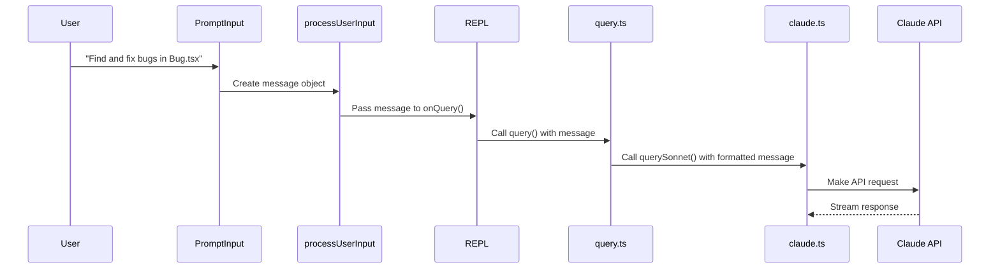
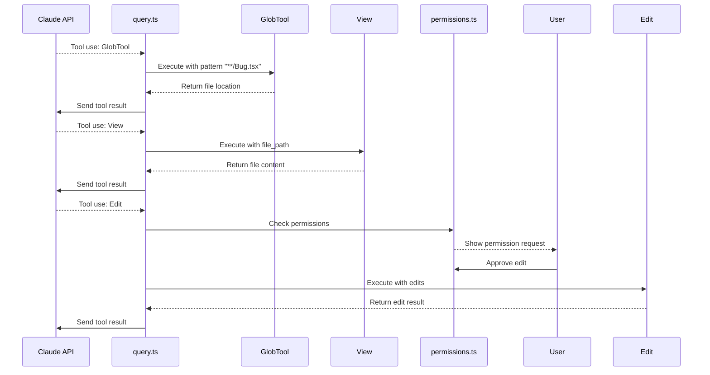
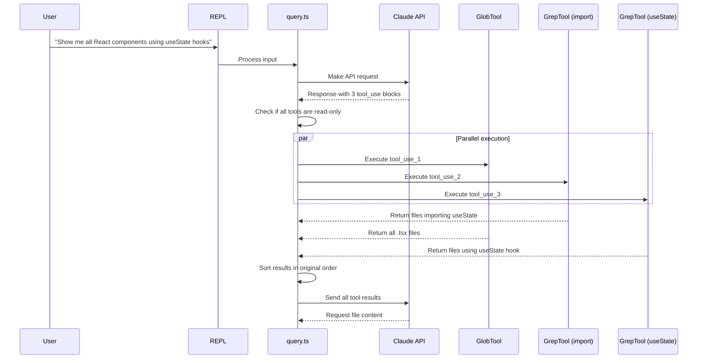

## Real-World Examples

To illustrate how all these components work together, let's walk through two concrete examples.

### Example 1: Finding and Fixing a Bug

Below is a step-by-step walkthrough of a user asking Claude Code to "Find and fix bugs in the file Bug.tsx":

#### Phase 1: Initial User Input and Processing

1. User types "Find and fix bugs in the file Bug.tsx" and hits Enter
2. `PromptInput.tsx` captures this input in its `value` state
3. `onSubmit()` handler creates an AbortController and calls `processUserInput()`
4. Input is identified as a regular prompt (not starting with `!` or `/`)
5. A message object is created with:
   ```typescript
   {
     role: 'user',
     content: 'Find and fix bugs in the file Bug.tsx',
     type: 'prompt',
     id: generateId()
   }
   ```
6. The message is passed to `onQuery()` in `REPL.tsx`

#### Phase 2: Query Generation and API Call

1. `onQuery()` collects:
   - System prompt from `getSystemPrompt()` including capabilities info
   - Context from `getContextForQuery()` including directory structure
   - Model information from state
2. `query()` in `query.ts` is called with the messages and options
3. Messages are formatted into Claude API format in `querySonnet()`
4. API call is made to Claude using `fetch()` in `services/claude.ts`
5. Response begins streaming with content starting to contain a plan to find bugs



#### Phase 3: Tool Use Execution - Finding the File

1. Claude decides to use `GlobTool` to locate the file
2. The response contains a tool_use block:
   ```json
   {
     "name": "GlobTool",
     "parameters": {
       "pattern": "**/Bug.tsx"
     }
   }
   ```
3. Generator system detects tool_use and calls `runToolsConcurrently()`
4. `canUseTool()` checks permissions for GlobTool which can run without explicit user approval
5. `GlobTool.call()` executes with parameters, running ripgrep on the filesystem
6. Results are returned:
   ```
   Found 1 file:
   /Users/gerred/dev/anon-kode/src/components/Bug.tsx
   ```

#### Phase 4: Tool Use Execution - Reading the File

1. Claude decides to use `View` to read the file content
2. Another tool_use block is generated:
   ```json
   {
     "name": "View",
     "parameters": {
       "file_path": "/Users/gerred/dev/anon-kode/src/components/Bug.tsx"
     }
   }
   ```
3. `View.call()` executes, reading the file content
4. Results contain the file content with a potential bug:
   ```tsx
   import React from 'react';
   import { Box } from 'ink';
   
   interface BugProps {
     message: string;
   }
   
   // Bug: This component tries to access undefinedProp which doesn't exist
   export function Bug({ message }: BugProps) {
     return (
       <Box>
         {message.toUpperCase()}
         {undefinedProp.toString()} // This will cause an error
       </Box>
     );
   }
   ```

#### Phase 5: Tool Use Execution - Editing the File

1. Claude decides to use `Edit` to fix the bug
2. Another tool_use block is generated:
   ```json
   {
     "name": "Edit",
     "parameters": {
       "file_path": "/Users/gerred/dev/anon-kode/src/components/Bug.tsx",
       "old_string": "export function Bug({ message }: BugProps) {\n  return (\n    <Box>\n      {message.toUpperCase()}\n      {undefinedProp.toString()} // This will cause an error\n    </Box>\n  );\n}",
       "new_string": "export function Bug({ message }: BugProps) {\n  return (\n    <Box>\n      {message.toUpperCase()}\n      {/* Removed reference to undefined prop */}\n    </Box>\n  );\n}"
     }
   }
   ```
3. `Edit.needsPermissions` returns true, prompting user permission
4. A permission request is displayed: "Claude wants to edit file /Users/gerred/dev/anon-kode/src/components/Bug.tsx"
5. User approves the edit
6. `Edit.call()` executes, modifying the file
7. Results show successful edit:
   ```
   The file /Users/gerred/dev/anon-kode/src/components/Bug.tsx has been updated. 
   ```



#### Phase 6: Recursive Query and Final Response

1. After each tool execution, the results are added to the messages array:
   ```typescript
   messages.push({
     role: 'assistant',
     content: null,
     tool_use: { ... } // Tool use object
   });
   messages.push({
     role: 'user',
     content: null,
     tool_result: { ... } // Tool result object
   });
   ```
2. `query()` is called recursively with updated messages
3. Claude API generates a final response summarizing the bug fix
4. This final response streams back to the UI without any further tool use
5. The message is normalized and shown to the user

### Example 2: Parallel Codebase Analysis

This example showcases a user asking Claude Code to "Show me all React components using useState hooks":

#### Phase 1: Initial User Input and Processing

Just as in Example 1, the input is captured, processed, and passed to the query system.

#### Phase 2: Claude's Response with Multiple Tool Uses

Claude analyzes the request and determines it needs to:
- Find all React component files
- Search for useState hook usage
- Read relevant files to show the components
   
Instead of responding with a single tool use, Claude returns multiple tool uses in one response:

```json
{
  "content": [
    {
      "type": "tool_use",
      "id": "tool_use_1",
      "name": "GlobTool",
      "parameters": {
        "pattern": "**/*.tsx"
      }
    },
    {
      "type": "tool_use", 
      "id": "tool_use_2",
      "name": "GrepTool",
      "parameters": {
        "pattern": "import.*\\{.*useState.*\\}.*from.*['\"]react['\"]",
        "include": "*.tsx"
      }
    },
    {
      "type": "tool_use",
      "id": "tool_use_3",
      "name": "GrepTool",
      "parameters": {
        "pattern": "const.*\\[.*\\].*=.*useState\\(",
        "include": "*.tsx"
      }
    }
  ]
}
```

#### Phase 3: Parallel Tool Execution

1. `query.ts` detects multiple tool uses in one response
2. It checks if all tools are read-only (GlobTool and GrepTool are both read-only)
3. Since all tools are read-only, it calls `runToolsConcurrently()`



The results are collected from all three tools, sorted back to the original order, and sent back to Claude. Claude then requests to read specific files, which are again executed in parallel, and finally produces an analysis of the useState usage patterns.

This parallel execution significantly speeds up response time by:
1. Running all file search operations concurrently
2. Running all file read operations concurrently
3. Maintaining correct ordering of results
4. Streaming all results back as soon as they're available

