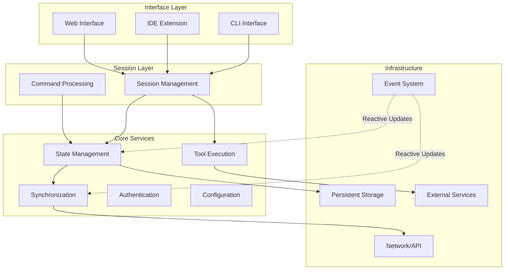
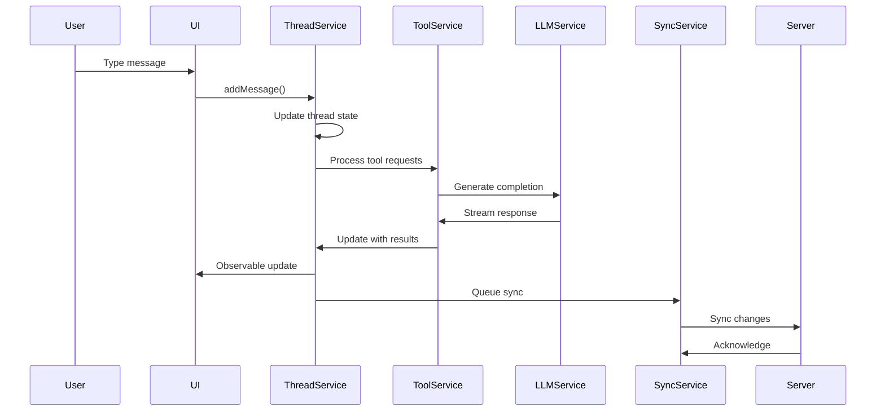

# Chapter 2: Service-Oriented Architecture for AI Systems

Building a collaborative AI coding assistant requires careful architectural decisions. How do you create a system that feels responsive to individual users while managing the complexity of distributed state, multi-user collaboration, and AI model interactions?

This chapter explores service-oriented architecture patterns for AI systems, reactive state management approaches, and the design decisions that enable teams to work together seamlessly while maintaining system reliability.

## Core Design Principles

AI systems require architecture that balances responsiveness, collaboration, and reliability. Five key principles guide technical decisions:

### 1. Service Isolation by Domain

Each service owns a specific domain and communicates through well-defined interfaces. This prevents tight coupling between AI processing, state management, and collaboration features.

**Recognition Pattern**: You need service isolation when:
- Different parts of your system have distinct failure modes
- Teams need to deploy features independently
- You're mixing real-time collaboration with AI processing

**Implementation Approach**:
```typescript
// Service interface defines clear boundaries
interface IThreadService {
  modifyThread(id: string, modifier: ThreadModifier): Promise<Thread>;
  observeThread(id: string): Observable<Thread>;
}

// Implementation handles domain logic without external dependencies
class ThreadService implements IThreadService {
  constructor(
    private storage: IThreadStorage,
    private syncService: ISyncService
  ) {}
}
```

### 2. Observable-First Communication

Replace callbacks and promises with reactive streams for state changes. This pattern handles the complex data flow between AI responses, user actions, and collaboration updates.

**Recognition Pattern**: You need reactive communication when:
- Multiple components need to react to the same state changes
- You're handling real-time updates from multiple sources
- UI needs to stay synchronized with rapidly changing AI output

**Implementation Approach**:
```typescript
// Services expose Observable interfaces
interface IThreadService {
  observeThread(id: string): Observable<Thread>;
  observeActiveThread(): Observable<Thread | null>;
}

// Consumers compose reactive streams
threadService.observeActiveThread().pipe(
  filter(thread => thread !== null),
  switchMap(thread => combineLatest([
    of(thread),
    syncService.observeSyncStatus(thread.id)
  ]))
).subscribe(([thread, syncStatus]) => {
  updateUI(thread, syncStatus);
});
```

### 3. Optimistic Updates

Update local state immediately while syncing in the background. This provides responsive user experience even with high-latency AI operations or network issues.

**Recognition Pattern**: You need optimistic updates when:
- Users expect immediate feedback for their actions
- Network latency affects user experience
- AI operations take multiple seconds to complete

**Implementation Approach**:
```typescript
// Apply changes locally first, sync later
class OptimisticUpdateService {
  async updateThread(id: string, update: ThreadUpdate): Promise<void> {
    // 1. Apply locally for immediate UI response
    this.applyLocalUpdate(id, update);
    
    // 2. Queue for background synchronization
    this.syncQueue.add({ threadId: id, update, timestamp: Date.now() });
    
    // 3. Process queue without blocking user
    this.processSyncQueue();
  }
}
```

### 4. Graceful Degradation

Continue functioning even when external services are unavailable. AI systems depend on many external services (models, APIs, collaboration servers) that can fail independently.

**Recognition Pattern**: You need graceful degradation when:
- Your system depends on external AI APIs or collaboration servers
- Users need to work during network outages
- System components have different availability requirements

**Implementation Approach**:
```typescript
// Fallback patterns for service failures
class ResilientService {
  async fetchData(id: string): Promise<Data> {
    try {
      const data = await this.remoteAPI.get(`/data/${id}`);
      await this.localCache.set(id, data); // Cache for offline use
      return data;
    } catch (error) {
      if (this.isNetworkError(error)) {
        return this.localCache.get(id) || this.getDefaultData(id);
      }
      throw error;
    }
  }
}
```

### 5. Explicit Resource Management

Prevent memory leaks and resource exhaustion through consistent lifecycle patterns. AI systems often create many subscriptions, connections, and cached resources.

**Recognition Pattern**: You need explicit resource management when:
- Creating Observable subscriptions or WebSocket connections
- Caching AI model responses or user data
- Managing background processing tasks

**Implementation Approach**:
```typescript
// Base class ensures consistent cleanup
abstract class BaseService implements IDisposable {
  protected disposables: IDisposable[] = [];
  
  protected addDisposable(disposable: IDisposable): void {
    this.disposables.push(disposable);
  }
  
  dispose(): void {
    this.disposables.forEach(d => d.dispose());
    this.disposables.length = 0;
  }
}
```

## Service Architecture Patterns

AI systems benefit from layered architecture where each layer has specific responsibilities and failure modes. This separation allows different parts to evolve independently.



**Key Architectural Decisions**:

- **Interface Layer**: Multiple interfaces (CLI, IDE, web) share the same session layer
- **Session Layer**: Manages user context and coordinates service interactions
- **Core Services**: Business logic isolated from infrastructure concerns
- **Infrastructure**: Handles persistence, networking, and external integrations

### State Management: Conversation Threading

The conversation state service demonstrates key patterns for managing AI conversation state with collaborative features.

**Core Responsibilities**:
- Maintain conversation state and history
- Ensure single-writer semantics to prevent conflicts
- Provide reactive updates to UI components
- Handle auto-saving and background synchronization

**Key Patterns**:

```typescript
// 1. Single-writer pattern prevents state conflicts
interface IStateManager<T> {
  observeState(id: string): Observable<T>;
  modifyState(id: string, modifier: (state: T) => T): Promise<T>;
}

// 2. Auto-save with throttling prevents excessive I/O
class AutoSaveService {
  setupAutoSave(state$: Observable<State>): void {
    state$.pipe(
      skip(1), // Skip initial value
      throttleTime(1000), // Limit saves to once per second
      switchMap(state => this.storage.save(state))
    ).subscribe();
  }
}

// 3. Lazy loading with caching improves performance
class LazyStateLoader {
  getState(id: string): Observable<State> {
    if (!this.cache.has(id)) {
      this.cache.set(id, this.loadFromStorage(id));
    }
    return this.cache.get(id);
  }
}
```

### Sync Service: Bridging Local and Remote

The ThreadSyncService manages the complex dance of keeping local and server state synchronized:

```typescript
export class ThreadSyncService extends BaseService {
  private syncQueue = new Map<string, SyncQueueItem>();
  private syncStatus$ = new Map<string, BehaviorSubject<SyncStatus>>();
  private socket?: WebSocket;
  
  constructor(
    private api: ServerAPIClient,
    private threadService: IThreadService
  ) {
    super();
    this.initializeWebSocket();
    this.startSyncLoop();
  }
  
  private initializeWebSocket(): void {
    this.socket = new WebSocket(this.api.wsEndpoint);
    
    this.socket.on('message', (data) => {
      const message = JSON.parse(data);
      this.handleServerMessage(message);
    });
    
    // Reconnection logic
    this.socket.on('close', () => {
      setTimeout(() => this.initializeWebSocket(), 5000);
    });
  }
  
  async queueSync(threadId: string, thread: Thread): Promise<void> {
    // Calculate changes from last known server state
    const serverVersion = await this.getServerVersion(threadId);
    const changes = this.calculateChanges(thread, serverVersion);
    
    // Add to sync queue
    this.syncQueue.set(threadId, {
      threadId,
      changes,
      localVersion: thread.version,
      serverVersion,
      attempts: 0,
      lastAttempt: null
    });
    
    // Update sync status
    this.updateSyncStatus(threadId, 'pending');
  }
  
  private async processSyncQueue(): Promise<void> {
    for (const [threadId, item] of this.syncQueue) {
      if (this.shouldSync(item)) {
        try {
          await this.syncThread(item);
          this.syncQueue.delete(threadId);
          this.updateSyncStatus(threadId, 'synced');
        } catch (error) {
          this.handleSyncError(threadId, item, error);
        }
      }
    }
  }
  
  private async syncThread(item: SyncQueueItem): Promise<void> {
    const response = await this.api.syncThread({
      threadId: item.threadId,
      changes: item.changes,
      baseVersion: item.serverVersion
    });
    
    if (response.conflict) {
      // Handle conflict resolution using standard patterns
      await this.resolveConflict(item.threadId, response);
    }
  }
  
  private handleServerMessage(message: ServerMessage): void {
    switch (message.type) {
      case 'thread-updated':
        this.handleRemoteUpdate(message);
        break;
      case 'presence-update':
        this.handlePresenceUpdate(message);
        break;
      case 'permission-changed':
        this.handlePermissionChange(message);
        break;
    }
  }
}
```

### Observable System: The Reactive Foundation

Amp's custom Observable implementation provides the foundation for reactive state management:

```typescript
// Core Observable implementation
export abstract class Observable<T> {
  abstract subscribe(observer: Observer<T>): Subscription;
  
  pipe<R>(...operators: Operator<any, any>[]): Observable<R> {
    return operators.reduce(
      (source, operator) => operator(source),
      this as Observable<any>
    );
  }
}

// BehaviorSubject maintains current value
export class BehaviorSubject<T> extends Subject<T> {
  constructor(private currentValue: T) {
    super();
  }
  
  get value(): T {
    return this.currentValue;
  }
  
  next(value: T): void {
    this.currentValue = value;
    super.next(value);
  }
  
  subscribe(observer: Observer<T>): Subscription {
    // Emit current value immediately
    observer.next(this.currentValue);
    return super.subscribe(observer);
  }
}

// Rich operator library
export const operators = {
  map: <T, R>(fn: (value: T) => R) => 
    (source: Observable<T>): Observable<R> => 
      new MapObservable(source, fn),
      
  filter: <T>(predicate: (value: T) => boolean) =>
    (source: Observable<T>): Observable<T> =>
      new FilterObservable(source, predicate),
      
  switchMap: <T, R>(fn: (value: T) => Observable<R>) =>
    (source: Observable<T>): Observable<R> =>
      new SwitchMapObservable(source, fn),
      
  throttleTime: <T>(ms: number) =>
    (source: Observable<T>): Observable<T> =>
      new ThrottleTimeObservable(source, ms)
};
```

## Thread Model and Data Flow

Amp's thread model supports complex conversations with tool use, sub-agents, and rich metadata:

```typescript
interface Thread {
  id: string;                    // Unique identifier
  version: number;               // Version for optimistic updates
  title?: string;                // Thread title
  createdAt: string;             // Creation timestamp
  updatedAt: string;             // Last update timestamp
  sharing?: ThreadSharing;       // Visibility scope
  messages: Message[];           // Conversation history
  metadata?: ThreadMetadata;     // Additional properties
  
  // Thread relationships for hierarchical conversations
  summaryThreadId?: string;      // Link to summary thread
  parentThreadId?: string;       // Parent thread reference
  childThreadIds?: string[];     // Child thread references
}

interface Message {
  id: string;
  type: 'user' | 'assistant' | 'info';
  content: string;
  timestamp: string;
  
  // Tool interactions
  toolUse?: ToolUseBlock[];
  toolResults?: ToolResultBlock[];
  
  // Rich content
  attachments?: Attachment[];
  mentions?: FileMention[];
  
  // Metadata
  model?: string;
  cost?: UsageCost;
  error?: ErrorInfo;
}
```

### Data Flow Through the System

When a user sends a message, it flows through multiple services:



## Service Integration Patterns

Services in Amp integrate through several patterns that promote loose coupling:

### 1. Constructor Injection

Dependencies are explicitly declared and injected:

```typescript
export class ThreadSession {
  constructor(
    private threadService: IThreadService,
    private toolService: IToolService,
    private configService: IConfigService,
    @optional private syncService?: IThreadSyncService
  ) {
    // Services are injected, not created
    this.initialize();
  }
}
```

### 2. Interface Segregation

Services depend on interfaces, not implementations:

```typescript
// Minimal interface for consumers
export interface IThreadReader {
  observeThread(id: string): Observable<Thread | null>;
  observeThreadList(): Observable<ThreadListItem[]>;
}

// Extended interface for writers
export interface IThreadWriter extends IThreadReader {
  modifyThread(id: string, modifier: ThreadModifier): Promise<Thread>;
  deleteThread(id: string): Promise<void>;
}

// Full service interface
export interface IThreadService extends IThreadWriter {
  openThread(id: string): Promise<void>;
  closeThread(id: string): Promise<void>;
  createThread(options?: CreateThreadOptions): Promise<Thread>;
}
```

### 3. Event-Driven Communication

Services communicate through Observable streams:

```typescript
class ConfigService {
  private config$ = new BehaviorSubject<Config>(defaultConfig);
  
  observeConfig(): Observable<Config> {
    return this.config$.asObservable();
  }
  
  updateConfig(updates: Partial<Config>): void {
    const current = this.config$.value;
    const updated = { ...current, ...updates };
    this.config$.next(updated);
  }
}

// Other services react to config changes
class ThemeService {
  constructor(private configService: ConfigService) {
    configService.observeConfig().pipe(
      map(config => config.theme),
      distinctUntilChanged()
    ).subscribe(theme => {
      this.applyTheme(theme);
    });
  }
}
```

### 4. Resource Lifecycle Management

Services manage resources consistently:

```typescript
abstract class BaseService implements IDisposable {
  protected disposables: IDisposable[] = [];
  protected subscriptions: Subscription[] = [];
  
  protected addDisposable(disposable: IDisposable): void {
    this.disposables.push(disposable);
  }
  
  protected addSubscription(subscription: Subscription): void {
    this.subscriptions.push(subscription);
  }
  
  dispose(): void {
    // Clean up in reverse order
    [...this.subscriptions].reverse().forEach(s => s.unsubscribe());
    [...this.disposables].reverse().forEach(d => d.dispose());
    
    this.subscriptions = [];
    this.disposables = [];
  }
}
```

## Performance Patterns

Amp employs several patterns to maintain responsiveness at scale:

### 1. Lazy Loading with Observables

Data is loaded on-demand and cached:

```typescript
class LazyDataService {
  private cache = new Map<string, BehaviorSubject<Data | null>>();
  
  observeData(id: string): Observable<Data | null> {
    if (!this.cache.has(id)) {
      const subject = new BehaviorSubject<Data | null>(null);
      this.cache.set(id, subject);
      
      // Load data asynchronously
      this.loadData(id).then(data => {
        subject.next(data);
      });
    }
    
    return this.cache.get(id)!.asObservable();
  }
  
  private async loadData(id: string): Promise<Data> {
    // Check memory cache, disk cache, then network
    return this.memCache.get(id) 
        || await this.diskCache.get(id)
        || await this.api.fetchData(id);
  }
}
```

### 2. Backpressure Handling

Operators prevent overwhelming downstream consumers:

```typescript
// Throttle rapid updates
threadService.observeActiveThread().pipe(
  throttleTime(100), // Max 10 updates per second
  distinctUntilChanged((a, b) => a?.version === b?.version)
).subscribe(thread => {
  updateExpensiveUI(thread);
});

// Debounce user input
searchInput$.pipe(
  debounceTime(300), // Wait for typing to stop
  distinctUntilChanged(),
  switchMap(query => searchService.search(query))
).subscribe(results => {
  displayResults(results);
});
```

### 3. Optimistic Concurrency Control

Version numbers prevent lost updates:

```typescript
class OptimisticUpdateService {
  async updateThread(id: string, updates: ThreadUpdate): Promise<Thread> {
    const maxRetries = 3;
    let attempts = 0;
    
    while (attempts < maxRetries) {
      try {
        const current = await this.getThread(id);
        const updated = {
          ...current,
          ...updates,
          version: current.version + 1
        };
        
        return await this.api.updateThread(id, updated);
      } catch (error) {
        if (error.code === 'VERSION_CONFLICT' && attempts < maxRetries - 1) {
          attempts++;
          await this.delay(attempts * 100); // Exponential backoff
          continue;
        }
        throw error;
      }
    }
  }
}
```

## Security and Isolation

Amp's architecture enforces security boundaries at multiple levels:

### 1. Service-Level Permissions

Each service validates permissions independently:

```typescript
class SecureThreadService extends ThreadService {
  async modifyThread(
    id: string, 
    modifier: ThreadModifier
  ): Promise<Thread> {
    // Check permissions first
    const canModify = await this.permissionService.check({
      user: this.currentUser,
      action: 'thread:modify',
      resource: id
    });
    
    if (!canModify) {
      throw new PermissionError('Cannot modify thread');
    }
    
    return super.modifyThread(id, modifier);
  }
}
```

### 2. Data Isolation

Services maintain separate data stores per team:

```typescript
class TeamIsolatedStorage implements IThreadStorage {
  constructor(
    private teamId: string,
    private baseStorage: IStorage
  ) {}
  
  private getTeamPath(threadId: string): string {
    return `teams/${this.teamId}/threads/${threadId}`;
  }
  
  async loadThread(id: string): Promise<Thread> {
    const path = this.getTeamPath(id);
    const data = await this.baseStorage.read(path);
    
    // Verify access permissions
    if (data.teamId !== this.teamId) {
      throw new Error('Access denied: insufficient permissions');
    }
    
    return data;
  }
}
```

### 3. API Gateway Protection

The server API client enforces authentication:

```typescript
class AuthenticatedAPIClient extends ServerAPIClient {
  constructor(
    endpoint: string,
    private authService: IAuthService
  ) {
    super(endpoint);
  }
  
  protected async request<T>(
    method: string,
    path: string,
    data?: any
  ): Promise<T> {
    const token = await this.authService.getAccessToken();
    
    const response = await fetch(`${this.endpoint}${path}`, {
      method,
      headers: {
        'Authorization': `Bearer ${token}`,
        'Content-Type': 'application/json'
      },
      body: data ? JSON.stringify(data) : undefined
    });
    
    if (response.status === 401) {
      // Token expired, refresh and retry
      await this.authService.refreshToken();
      return this.request(method, path, data);
    }
    
    return response.json();
  }
}
```

## Scaling Considerations

Amp's architecture supports horizontal scaling through several design decisions:

### 1. Stateless Services

Most services maintain no local state beyond caches:

```typescript
// Services can be instantiated per-request for horizontal scaling
class StatelessThreadService {
  constructor(
    private storage: IThreadStorage,
    private cache: ICache
  ) {
    // No instance state maintained for scalability
  }
  
  async getThread(id: string): Promise<Thread> {
    // Check cache first for performance
    const cached = await this.cache.get(`thread:${id}`);
    if (cached) return cached;
    
    // Load from persistent storage
    const thread = await this.storage.load(id);
    await this.cache.set(`thread:${id}`, thread, { ttl: 300 });
    
    return thread;
  }
}
```

### 2. Distributed Caching

Cache layers can be shared across instances:

```typescript
interface IDistributedCache {
  get<T>(key: string): Promise<T | null>;
  set<T>(key: string, value: T, options?: CacheOptions): Promise<void>;
  delete(key: string): Promise<void>;
  
  // Pub/sub for cache invalidation
  subscribe(pattern: string, handler: (key: string) => void): void;
  publish(key: string, event: CacheEvent): void;
}
```

### 3. Load Balancing Support

WebSocket connections support sticky sessions:

```typescript
class WebSocketManager {
  private servers: string[] = [
    'wss://server1.example.com',
    'wss://server2.example.com',
    'wss://server3.example.com'
  ];
  
  async connect(sessionId: string): Promise<WebSocket> {
    // Use consistent hashing for session affinity
    const serverIndex = this.hash(sessionId) % this.servers.length;
    const server = this.servers[serverIndex];
    
    const ws = new WebSocket(`${server}?session=${sessionId}`);
    await this.waitForConnection(ws);
    
    return ws;
  }
}
```

## Summary

Amp's architecture demonstrates how to build a production-ready collaborative AI system:

- **Service isolation** ensures maintainability and testability
- **Observable patterns** enable reactive, real-time updates
- **Optimistic updates** provide responsive user experience
- **Careful resource management** prevents memory leaks
- **Security boundaries** protect user data
- **Scaling considerations** support growth

The combination of these patterns creates a foundation that can evolve from serving individual developers to supporting entire engineering organizations. In the next chapter, we'll explore how Amp's authentication and identity system enables secure multi-user collaboration while maintaining the simplicity users expect.