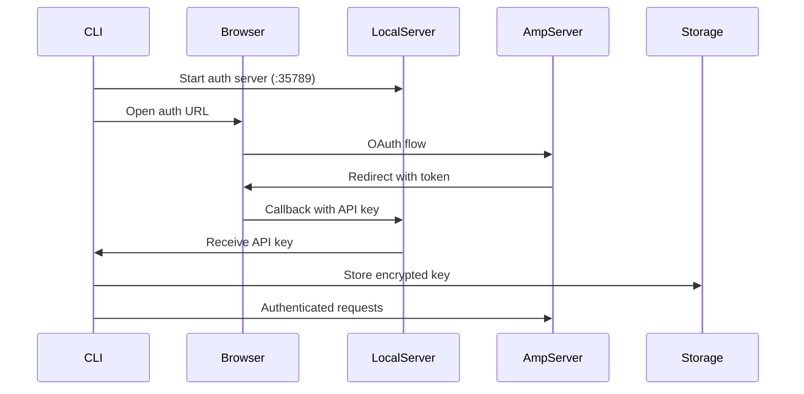

# Chapter 3: Authentication and Identity for Developer Tools

Authentication in collaborative AI systems presents unique challenges. Unlike traditional web applications with form-based login, AI coding assistants must authenticate seamlessly across CLIs, IDE extensions, and web interfaces while maintaining security and enabling team collaboration.

This chapter explores authentication patterns that balance security, usability, and the realities of developer workflows.

## The Authentication Challenge

Building authentication for a developer tool requires solving several competing constraints:

1. **CLI-First Experience** - Developers expect to authenticate without leaving the terminal
2. **IDE Integration** - Extensions need to share authentication state
3. **Team Collaboration** - Multiple users must access shared resources
4. **Enterprise Security** - IT departments demand SSO and audit trails
5. **Developer Workflow** - Authentication can't interrupt flow states

Traditional web authentication patterns fail in this environment. Form-based login doesn't work in a CLI. Session cookies don't transfer between applications. API keys get committed to repositories.

## Hybrid Authentication Architecture

Developer tools need a hybrid approach that combines the security of OAuth with the simplicity of API keys. This pattern addresses the CLI authentication challenge while maintaining enterprise security requirements.



### CLI Authentication Pattern

CLI authentication requires a different approach than web-based flows. The pattern uses a temporary local HTTP server to receive OAuth callbacks.

**Recognition Pattern**: You need CLI authentication when:
- Users work primarily in terminal environments
- Browser-based OAuth is available but inconvenient for CLI usage
- You need secure credential storage across multiple applications

**Core Authentication Flow**:
1. **Generate Security Token**: Create CSRF protection token
2. **Start Local Server**: Temporary HTTP server on localhost for OAuth callback
3. **Open Browser**: Launch OAuth flow in user's default browser
4. **Receive Callback**: Local server receives the API key from OAuth redirect
5. **Store Securely**: Save encrypted credentials using platform keychain

**Implementation Approach**:
```typescript
// Simplified authentication flow
async function cliLogin(serverUrl: string): Promise<void> {
  const authToken = generateSecureToken();
  const port = await findAvailablePort();
  
  // Start temporary callback server
  const apiKeyPromise = startCallbackServer(port, authToken);
  
  // Open browser for OAuth
  const loginUrl = buildOAuthURL(serverUrl, authToken, port);
  await openBrowser(loginUrl);
  
  // Wait for OAuth completion
  const apiKey = await apiKeyPromise;
  
  // Store credentials securely
  await secureStorage.store('apiKey', apiKey, serverUrl);
}
```

The local callback server handles the OAuth response:

```typescript
function startAuthServer(
  port: number, 
  expectedToken: string
): Promise<string> {
  return new Promise((resolve, reject) => {
    const server = http.createServer((req, res) => {
      if (req.url?.startsWith('/auth/callback')) {
        const url = new URL(req.url, `http://127.0.0.1:${port}`);
        const apiKey = url.searchParams.get('apiKey');
        const authToken = url.searchParams.get('authToken');
        
        // Validate CSRF token
        if (authToken !== expectedToken) {
          res.writeHead(400);
          res.end('Invalid authentication token');
          reject(new Error('Invalid authentication token'));
          return;
        }
        
        if (apiKey) {
          // Success page for user
          res.writeHead(200, { 'Content-Type': 'text/html' });
          res.end(`
            <html>
              <body>
                <h1>Authentication Successful!</h1>
                <p>You can close this window and return to your terminal.</p>
                <script>window.close();</script>
              </body>
            </html>
          `);
          
          server.close();
          resolve(apiKey);
        }
      }
    });
    
    server.listen(port);
    
    // Timeout after 5 minutes
    setTimeout(() => {
      server.close();
      reject(new Error('Authentication timeout'));
    }, 300000);
  });
}
```

### Token Storage and Management

API keys are stored securely using the system's credential storage:

```typescript
export interface ISecretStorage {
  get(name: SecretName, scope: string): Promise<string | undefined>;
  set(name: SecretName, value: string, scope: string): Promise<void>;
  delete(name: SecretName, scope: string): Promise<void>;
  
  // Observable for changes
  readonly changes: Observable<SecretStorageChange>;
}

// Platform-specific implementations
class DarwinSecretStorage implements ISecretStorage {
  async set(name: string, value: string, scope: string): Promise<void> {
    const account = `${name}:${scope}`;
    
    // Use macOS Keychain for secure credential storage
    // The -U flag updates existing entries instead of failing
    await exec(`security add-generic-password \
      -a "${account}" \
      -s "${this.getServiceName()}" \
      -w "${value}" \
      -U`);
  }
  
  async get(name: string, scope: string): Promise<string | undefined> {
    const account = `${name}:${scope}`;
    
    try {
      const result = await exec(`security find-generic-password \
        -a "${account}" \
        -s "${this.getServiceName()}" \
        -w`);
      return result.stdout.trim();
    } catch {
      return undefined;
    }
  }
}

class WindowsSecretStorage implements ISecretStorage {
  async set(name: string, value: string, scope: string): Promise<void> {
    // Use Windows Credential Manager for secure storage
    // This integrates with Windows' built-in credential system
    const target = `${this.getServiceName()}:${name}:${scope}`;
    await exec(`cmdkey /generic:"${target}" /user:${this.getServiceName()} /pass:"${value}"`);
  }
}

class LinuxSecretStorage implements ISecretStorage {
  private secretDir = path.join(os.homedir(), '.config', this.getServiceName(), 'secrets');
  
  async set(name: string, value: string, scope: string): Promise<void> {
    // Fallback to encrypted filesystem storage on Linux
    // Hash scope to prevent directory traversal attacks
    const hashedScope = crypto.createHash('sha256')
      .update(scope)
      .digest('hex');
    
    const filePath = path.join(this.secretDir, name, hashedScope);
    
    // Encrypt value before storage for security
    const encrypted = await this.encrypt(value);
    await fs.mkdir(path.dirname(filePath), { recursive: true });
    // Set restrictive permissions (owner read/write only)
    await fs.writeFile(filePath, encrypted, { mode: 0o600 });
  }
}
```

### Request Authentication

Once authenticated, every API request includes the bearer token:

```typescript
export class AuthenticatedAPIClient {
  constructor(
    private baseURL: string,
    private secrets: ISecretStorage
  ) {}
  
  async request<T>(
    method: string,
    path: string,
    body?: unknown
  ): Promise<T> {
    // Retrieve API key for this server
    const apiKey = await this.secrets.get('apiKey', this.baseURL);
    if (!apiKey) {
      throw new Error('Not authenticated. Run "amp login" first.');
    }
    
    const response = await fetch(new URL(path, this.baseURL), {
      method,
      headers: {
        'Authorization': `Bearer ${apiKey}`,
        'Content-Type': 'application/json',
        ...this.getClientHeaders()
      },
      body: body ? JSON.stringify(body) : undefined
    });
    
    if (response.status === 401) {
      // Token expired or revoked
      throw new AuthenticationError('Authentication failed. Please login again.');
    }
    
    return response.json();
  }
  
  private getClientHeaders(): Record<string, string> {
    // Include client identification for analytics tracking
    return {
      'X-Client-Application': this.getClientName(),
      'X-Client-Version': this.getClientVersion(),
      'X-Client-Type': 'cli'
    };
  }
}
```

## Multi-Environment Authentication

Developers often work with multiple Amp instances (production, staging, local development). Amp supports this through URL-scoped credentials:

```typescript
export class MultiEnvironmentAuth {
  constructor(private storage: ISecretStorage) {}
  
  async setCredential(
    environment: string,
    apiKey: string
  ): Promise<void> {
    const url = this.getURLForEnvironment(environment);
    await this.storage.set('apiKey', apiKey, url);
  }
  
  async getCredential(environment: string): Promise<string | undefined> {
    const url = this.getURLForEnvironment(environment);
    return this.storage.get('apiKey', url);
  }
  
  private getURLForEnvironment(env: string): string {
    const environments = {
      'production': 'https://production.example.com',
      'staging': 'https://staging.example.com',
      'local': 'http://localhost:3000'
    };
    
    return environments[env] || env;
  }
}

// Usage
const auth = new MultiEnvironmentAuth(storage);

// Authenticate against different environments
await auth.setCredential('production', prodApiKey);
await auth.setCredential('staging', stagingApiKey);

// Switch between environments
const config = await loadConfig();
const apiKey = await auth.getCredential(config.environment);
```

## IDE Extension Authentication

IDE extensions share authentication state with the CLI through a unified storage layer:

```typescript
// VS Code extension
export class VSCodeAuthProvider implements vscode.AuthenticationProvider {
  private storage: ISecretStorage;
  
  constructor(context: vscode.ExtensionContext) {
    // Use the same storage backend as CLI
    this.storage = createSecretStorage();
    
    // Watch for authentication changes
    this.storage.changes.subscribe(change => {
      if (change.name === 'apiKey') {
        this._onDidChangeSessions.fire({
          added: change.value ? [this.createSession()] : [],
          removed: change.value ? [] : ['*']
        });
      }
    });
  }
  
  async getSessions(): Promise<vscode.AuthenticationSession[]> {
    const apiKey = await this.storage.get('apiKey', this.getServiceURL());
    if (!apiKey) return [];
    
    return [{
      id: 'amp-session',
      accessToken: apiKey,
      account: {
        id: 'amp-user',
        label: 'Amp User'
      },
      scopes: []
    }];
  }
  
  async createSession(): Promise<vscode.AuthenticationSession> {
    // Trigger CLI authentication flow
    const terminal = vscode.window.createTerminal('Amp Login');
    terminal.sendText('amp login');
    terminal.show();
    
    // Wait for authentication to complete
    return new Promise((resolve) => {
      const dispose = this.storage.changes.subscribe(change => {
        if (change.name === 'apiKey' && change.value) {
          dispose();
          resolve(this.createSessionFromKey(change.value));
        }
      });
    });
  }
}
```

## Team and Organization Model

While the client focuses on individual authentication, the server side manages team relationships:

```typescript
// Server-side models (inferred from client behavior)
interface User {
  id: string;
  email: string;
  name: string;
  createdAt: Date;
  
  // Team associations
  teams: TeamMembership[];
  
  // Usage tracking
  credits: number;
  usage: UsageStats;
}

interface Team {
  id: string;
  name: string;
  slug: string;
  
  // Billing
  subscription: Subscription;
  creditBalance: number;
  
  // Settings
  settings: TeamSettings;
  
  // Members
  members: TeamMembership[];
}

interface TeamMembership {
  userId: string;
  teamId: string;
  role: 'owner' | 'admin' | 'member';
  joinedAt: Date;
}

// Client receives simplified view
interface AuthContext {
  user: {
    id: string;
    email: string;
  };
  team?: {
    id: string;
    name: string;
  };
  permissions: string[];
}
```

## Permission System

Amp implements a capability-based permission system rather than traditional roles:

```typescript
export interface CommandPermission {
  command: string;
  allowed: boolean;
  requiresConfirmation?: boolean;
  reason?: string;
}

export class PermissionService {
  private config: Config;
  
  async checkCommandPermission(
    command: string,
    workingDir: string
  ): Promise<CommandPermission> {
    const allowlist = this.config.get('commands.allowlist', []);
    const blocklist = this.config.get('commands.blocklist', []);
    
    // Universal allow
    if (allowlist.includes('*')) {
      return { command, allowed: true };
    }
    
    // Explicit block
    if (this.matchesPattern(command, blocklist)) {
      return {
        command,
        allowed: false,
        reason: 'Command is blocked by administrator'
      };
    }
    
    // Safe commands always allowed
    if (this.isSafeCommand(command)) {
      return { command, allowed: true };
    }
    
    // Destructive commands need confirmation
    if (this.isDestructiveCommand(command)) {
      return {
        command,
        allowed: true,
        requiresConfirmation: true,
        reason: 'This command may modify your system'
      };
    }
    
    // Default: require confirmation for unknown commands
    return {
      command,
      allowed: true,
      requiresConfirmation: true
    };
  }
  
  private isSafeCommand(command: string): boolean {
    const safeCommands = [
      'ls', 'pwd', 'echo', 'cat', 'grep', 'find',
      'git status', 'git log', 'npm list'
    ];
    
    return safeCommands.some(safe => 
      command.startsWith(safe)
    );
  }
  
  private isDestructiveCommand(command: string): boolean {
    const destructive = [
      'rm', 'mv', 'dd', 'format',
      'git push --force', 'npm publish'
    ];
    
    return destructive.some(cmd => 
      command.includes(cmd)
    );
  }
}
```

## Enterprise Integration

For enterprise deployments, Amp supports SSO through standard protocols:

```typescript
// SAML integration
export class SAMLAuthProvider {
  async initiateSAMLLogin(
    returnUrl: string
  ): Promise<SAMLRequest> {
    const request = {
      id: crypto.randomUUID(),
      issueInstant: new Date().toISOString(),
      assertionConsumerServiceURL: `${this.getServiceURL()}/auth/saml/callback`,
      issuer: this.getServiceURL(),
      returnUrl
    };
    
    // Sign request
    const signed = await this.signRequest(request);
    
    return {
      url: `${this.idpUrl}/sso/saml`,
      samlRequest: Buffer.from(signed).toString('base64')
    };
  }
  
  async processSAMLResponse(
    response: string
  ): Promise<SAMLAssertion> {
    const decoded = Buffer.from(response, 'base64').toString();
    const assertion = await this.parseAndValidate(decoded);
    
    // Extract user information
    const user = {
      email: assertion.subject.email,
      name: assertion.attributes.name,
      teams: assertion.attributes.groups?.map(g => ({
        id: g.id,
        name: g.name,
        role: this.mapGroupToRole(g)
      }))
    };
    
    // Create API key for user
    const apiKey = await this.createAPIKey(user);
    
    return { user, apiKey };
  }
}

// OIDC integration
export class OIDCAuthProvider {
  async initiateOIDCFlow(): Promise<OIDCAuthURL> {
    const state = crypto.randomBytes(32).toString('hex');
    const nonce = crypto.randomBytes(32).toString('hex');
    const codeVerifier = crypto.randomBytes(32).toString('base64url');
    const codeChallenge = crypto
      .createHash('sha256')
      .update(codeVerifier)
      .digest('base64url');
    
    // Store state for validation
    await this.stateStore.set(state, {
      nonce,
      codeVerifier,
      createdAt: Date.now()
    });
    
    const params = new URLSearchParams({
      response_type: 'code',
      client_id: this.clientId,
      redirect_uri: `${this.getServiceURL()}/auth/oidc/callback`,
      scope: 'openid email profile groups',
      state,
      nonce,
      code_challenge: codeChallenge,
      code_challenge_method: 'S256'
    });
    
    return {
      url: `${this.providerUrl}/authorize?${params}`,
      state
    };
  }
}
```

## Usage Tracking and Billing

Authentication ties into usage tracking for billing and quotas:

```typescript
export class UsageTracker {
  constructor(
    private api: AuthenticatedAPIClient,
    private cache: ICache
  ) {}
  
  async checkQuota(
    operation: 'completion' | 'tool_use',
    estimatedTokens: number
  ): Promise<QuotaCheck> {
    // Check cached quota first to avoid API calls
    const cached = await this.cache.get('quota');
    if (cached && cached.expiresAt > Date.now()) {
      return this.evaluateQuota(cached, operation, estimatedTokens);
    }
    
    // Fetch current usage from server
    const usage = await this.api.request<UsageResponse>(
      'GET',
      '/api/usage/current'
    );
    
    // Cache for 5 minutes
    await this.cache.set('quota', usage, {
      expiresAt: Date.now() + 300000
    });
    
    return this.evaluateQuota(usage, operation, estimatedTokens);
  }
  
  private evaluateQuota(
    usage: UsageResponse,
    operation: string,
    estimatedTokens: number
  ): QuotaCheck {
    const limits = usage.subscription.limits;
    const used = usage.current;
    
    // Check token limits
    if (used.tokens + estimatedTokens > limits.tokensPerMonth) {
      return {
        allowed: false,
        reason: 'Monthly token limit exceeded',
        upgradeUrl: `${this.getServiceURL()}/billing/upgrade`
      };
    }
    
    // Check operation limits
    if (used.operations[operation] >= limits.operationsPerDay[operation]) {
      return {
        allowed: false,
        reason: `Daily ${operation} limit exceeded`,
        resetsAt: this.getNextResetTime()
      };
    }
    
    return { allowed: true };
  }
  
  async trackUsage(
    operation: string,
    tokens: number,
    cost: number
  ): Promise<void> {
    // Fire and forget - don't block user operations on usage tracking
    // Failed tracking shouldn't impact user experience
    this.api.request('POST', '/api/usage/track', {
      operation,
      tokens,
      cost,
      timestamp: new Date().toISOString()
    }).catch(error => {
      console.warn('Failed to track usage:', error);
    });
  }
}
```

## Security Best Practices

Amp's authentication system follows security best practices:

### 1. Token Rotation

API keys can be rotated without service interruption:

```typescript
export class TokenRotation {
  async rotateToken(): Promise<void> {
    // Generate new token while old remains valid
    const newToken = await this.api.request<TokenResponse>(
      'POST',
      '/api/auth/rotate-token'
    );
    
    // Store new token
    await this.storage.set('apiKey', newToken.key, this.serverUrl);
    
    // Old token remains valid for grace period
    console.log(`Token rotated. Grace period ends: ${newToken.oldTokenExpiresAt}`);
  }
  
  async setupAutoRotation(intervalDays: number = 90): Promise<void> {
    // Schedule periodic rotation
    setInterval(async () => {
      try {
        await this.rotateToken();
      } catch (error) {
        console.error('Token rotation failed:', error);
      }
    }, intervalDays * 24 * 60 * 60 * 1000);
  }
}
```

### 2. Scope Limitations

Tokens can be scoped to specific operations:

```typescript
interface ScopedToken {
  key: string;
  scopes: TokenScope[];
  expiresAt?: Date;
}

interface TokenScope {
  resource: 'threads' | 'tools' | 'admin';
  actions: ('read' | 'write' | 'delete')[];
}

// Example: Create limited scope token for automation
const automationToken = await createScopedToken({
  scopes: [{
    resource: 'threads',
    actions: ['read']
  }, {
    resource: 'tools',
    actions: ['read', 'write']
  }],
  expiresAt: new Date(Date.now() + 3600000) // 1 hour
});
```

### 3. Audit Logging

All authenticated actions are logged:

```typescript
export class AuditLogger {
  async logAction(
    action: string,
    resource: string,
    details?: Record<string, unknown>
  ): Promise<void> {
    const entry: AuditEntry = {
      timestamp: new Date().toISOString(),
      userId: this.currentUser.id,
      teamId: this.currentTeam?.id,
      action,
      resource,
      details,
      
      // Client context
      clientIP: this.request.ip,
      clientApplication: this.request.headers['x-client-application'],
      clientVersion: this.request.headers['x-client-version']
    };
    
    await this.api.request('POST', '/api/audit/log', entry);
  }
}
```

## Authentication Challenges and Solutions

Building authentication for Amp revealed several challenges:

### Challenge 1: Browser-less Environments

Some users work in environments without browsers (SSH sessions, containers).

**Solution**: Device authorization flow as fallback:

```typescript
export async function deviceLogin(): Promise<void> {
  // Request device code
  const device = await api.request<DeviceCodeResponse>(
    'POST',
    '/api/auth/device/code'
  );
  
  console.log(`
To authenticate, visit: ${device.verification_url}
Enter code: ${device.user_code}
  `);
  
  // Poll for completion
  const token = await pollForDeviceToken(device.device_code);
  await storage.set('apiKey', token);
}
```

### Challenge 2: Credential Leakage

Developers accidentally commit credentials to repositories.

**Solution**: Automatic credential detection:

```typescript
export class CredentialScanner {
  private patterns = [
    /[a-zA-Z0-9_]+_[a-zA-Z0-9]{32}/g,  // API key pattern
    /Bearer [a-zA-Z0-9\-._~+\/]+=*/g  // Bearer tokens
  ];
  
  async scanFile(path: string): Promise<CredentialLeak[]> {
    const content = await fs.readFile(path, 'utf-8');
    const leaks: CredentialLeak[] = [];
    
    for (const pattern of this.patterns) {
      const matches = content.matchAll(pattern);
      for (const match of matches) {
        leaks.push({
          file: path,
          line: this.getLineNumber(content, match.index),
          pattern: pattern.source,
          severity: 'high'
        });
      }
    }
    
    return leaks;
  }
}
```

### Challenge 3: Multi-Account Support

Developers need to switch between personal and work accounts.

**Solution**: Profile-based authentication:

```typescript
export class AuthProfiles {
  async createProfile(name: string): Promise<void> {
    const profile: AuthProfile = {
      name,
      serverUrl: await this.promptForServer(),
      createdAt: new Date()
    };
    
    await this.storage.set(`profile:${name}`, profile);
  }
  
  async switchProfile(name: string): Promise<void> {
    const profile = await this.storage.get(`profile:${name}`);
    if (!profile) {
      throw new Error(`Profile ${name} not found`);
    }
    
    // Update active profile
    await this.config.set('activeProfile', name);
    await this.config.set('serverUrl', profile.serverUrl);
  }
  
  async listProfiles(): Promise<AuthProfile[]> {
    const profiles = await this.storage.list('profile:*');
    return profiles.map(p => p.value);
  }
}
```

## Summary

Amp's authentication system demonstrates how to build secure, user-friendly authentication for developer tools:

- **OAuth flow with CLI callback** provides security without leaving the terminal
- **Platform-specific secret storage** keeps credentials secure
- **URL-scoped credentials** support multiple environments
- **Shared storage** enables seamless IDE integration
- **Capability-based permissions** offer fine-grained control
- **Enterprise integration** supports SSO requirements

The key insight is that authentication for developer tools must adapt to developer workflows, not the other way around. By meeting developers where they work—in terminals, IDEs, and CI/CD pipelines—Amp creates an authentication experience that enhances rather than interrupts productivity.

In the next chapter, we'll explore how Amp manages conversation threads at scale, handling synchronization, conflicts, and version control for collaborative AI interactions.