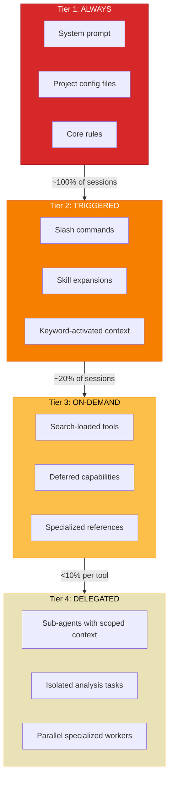
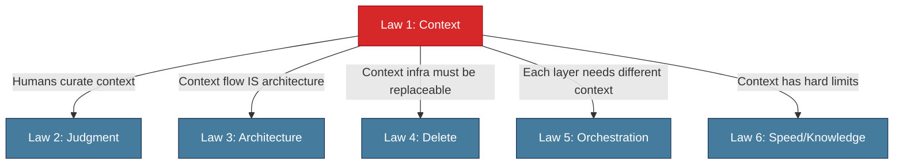

# Law 1: Context Is the Universal Bottleneck

> Context management determines success more than model capability, prompt engineering, or technical skill.

## Why This Matters

Consider a team that just upgraded from a mid-tier model to the most capable frontier model available. They spent weeks on prompt engineering, fine-tuned their temperature settings, and negotiated an enterprise pricing tier. After all that investment, their AI coding assistant still hallucinated file paths, missed relevant code, and generated functions that duplicated existing utilities. The problem was never the model. It was the information flowing into the model.

This scenario plays out constantly across the industry. Teams optimize prompts when they should be optimizing context flow. They benchmark models when they should be benchmarking what information those models can actually access. The highest-leverage improvement you can make to any AI system is not selecting a better model --- it is ensuring the right information reaches whatever model you are already using.

Context is the universal bottleneck because every other capability --- reasoning, code generation, planning, debugging --- operates on whatever context the system provides. A brilliant model with poor context will underperform a mediocre model with excellent context. This has been measured: the same model with better context architecture achieves a **25 percentage-point accuracy improvement** (from 49% to 74%) with no other changes. No prompt rewrite, no model upgrade, no parameter tuning. Just better context.

## The Core Insight

Before optimizing anything else, optimize how information moves. Context flows through four distinct surfaces, and each one can be improved independently:

```mermaid
flowchart LR
    subgraph Input ["1. PREVENT (Input)"]
        direction TB
        A1["Semantic search"]
        A2["Targeted file loading"]
        A3["Noise elimination"]
    end

    subgraph Interaction ["2. EXTEND (Interaction)"]
        direction TB
        B1["Live tool access"]
        B2["Database queries"]
        B3["API integration"]
    end

    subgraph Accumulation ["3. COMPRESS (Accumulation)"]
        direction TB
        C1["Summarization"]
        C2["Compaction"]
        C3["Pruning"]
    end

    subgraph Execution ["4. ISOLATE (Execution)"]
        direction TB
        D1["Sandboxed agents"]
        D2["Scoped permissions"]
        D3["Blast radius control"]
    end

    Input --> Interaction --> Accumulation --> Execution

    style Input fill:#2d6a4f,stroke:#1b4332,color:#fff
    style Interaction fill:#40916c,stroke:#2d6a4f,color:#fff
    style Accumulation fill:#52b788,stroke:#40916c,color:#000
    style Execution fill:#74c69d,stroke:#52b788,color:#000
```



### The Four Attack Surfaces

The bottleneck is not a single chokepoint. It is attackable at four points, each with different costs and returns:

| Surface | Strategy | What It Does | When to Use |
|---------|----------|-------------|-------------|
| **PREVENT** | Filter at the input | Semantic search targets the right files before they enter context. Eliminates noise upstream. | Always. This is your highest-ROI investment. |
| **EXTEND** | Enrich during interaction | Embed live tools (database queries, API calls, file system access) so each token in context becomes more actionable. | When the AI needs access to dynamic or external data. |
| **COMPRESS** | Shrink after overflow | Summarize, compact, or prune context that has accumulated past useful limits. | When context windows fill up during long sessions. |
| **ISOLATE** | Contain at execution | Sandbox agent execution within security boundaries. Contains the blast radius of context misuse. | When running untrusted code or multi-agent workflows. |

### Before and After: A Concrete Example

Consider a team building an AI coding assistant for a monorepo with 2,000 files. Here is how the same task --- "add input validation to the signup form" --- plays out under two architectures:

**Without context architecture (naive approach):**
1. All 2,000 file paths loaded into context at session start
2. Model guesses which files are relevant based on the user's request
3. Model hallucinates a file path (`src/forms/SignupForm.tsx`) that does not exist
4. User corrects the path, wasting a round-trip
5. Model generates validation code that duplicates an existing utility in `lib/validators.ts` because that file was never loaded

**With prevention-focused context architecture:**
1. Semantic search matches "signup form" and "validation" against the codebase index
2. Three files loaded: `components/auth/SignupForm.tsx`, `lib/validators.ts`, `lib/schemas/auth.ts`
3. Model sees existing validation utilities and reuses them
4. Generated code integrates with the existing pattern on the first attempt
5. Total context: ~800 tokens instead of ~45,000

Same model, same prompt, same codebase. The difference is entirely in what information reached the model.

### The Empirical Hierarchy

Not all surfaces are equal. Measured data from production tool-search benchmarks shows a clear ordering:

```
PREVENT  (+25pp accuracy)  >>>  ISOLATE  >  COMPRESS  >  EXTEND
```

Prevention dominates because it operates upstream of everything else. If the wrong information never enters the context window, you never have to compress it, isolate it, or work around it. The same model --- with zero configuration changes --- jumps from 49% to 74% accuracy simply by loading the right files first.

This hierarchy has a direct implication for where you spend engineering effort: **invest in input-side filtering before you invest in anything else.**

### Progressive Disclosure: The Mechanism Behind Prevention

Prevention works through a tiered loading strategy. Not all knowledge belongs in every session. The design rule is simple: *if instructions apply to fewer than 20% of conversations, they should not be in your system prompt.*



| Tier | Loading Strategy | Usage Frequency | Example |
|------|-----------------|-----------------|---------|
| **Tier 1: Always** | Loaded at session start | 100% of sessions | `CLAUDE.md`, system prompt, core project rules |
| **Tier 2: Triggered** | Loaded on keyword match | ~20% of sessions | Slash commands, skill expansions, workflow templates |
| **Tier 3: On-Demand** | Search-loaded when needed | <10% per tool | Deferred tools, specialized documentation, API references |
| **Tier 4: Delegated** | Runs in isolated context | Varies | Sub-agents with their own context window, parallel workers |

Each tier down reduces the context burden on every session that does not need that knowledge, while keeping it instantly accessible for the sessions that do.

## Evidence

### Evidence 1: Same Model, Better Context, Dramatically Better Results

In production benchmarking of tool-search capabilities, a prevention-focused context architecture improved accuracy from 49% to 74% --- a 25 percentage-point gain. No prompt changes. No model upgrade. No parameter tuning. The only variable was how information was loaded into context.

Consider what this means in practice. A team debating whether to pay 3x more for a frontier model could achieve a larger improvement --- for free --- by restructuring how files are loaded into context. The 25pp gain from context architecture exceeds the typical accuracy difference between model generations.

This is the strongest evidence that context architecture, not model selection, is the primary lever for AI system performance.

### Evidence 2: Token Reduction Through Dynamic Loading

Teams implementing progressive disclosure (the tiered loading strategy above) have measured **97% search token reduction** compared to loading all available context at session start. Fewer irrelevant tokens means less noise, less confusion, and dramatically lower costs.

A related measurement: dynamic context loading achieves **99% token reduction** for tool discovery by deferring tool definitions until they are actually needed, rather than injecting hundreds of tool schemas into every conversation.

Consider a team running an AI coding assistant with 200 available tools. Loading all 200 tool schemas into every session consumes thousands of tokens before the user types anything. Deferring tool schemas until a keyword match triggers them means each session loads only the 3-5 tools it actually needs. The savings compound: fewer tokens consumed, lower latency, less noise competing for the model's attention, and lower API costs --- all without reducing capability.

### Evidence 3: Mixed-Topic Context Degrades Performance by 39%

When unrelated topics are mixed within a single context window, model performance drops by 39% compared to cleanly separated, topic-focused context. This validates the prevention strategy: loading only what is relevant is not just about efficiency --- it directly affects output quality.

This effect is easiest to observe in long sessions. Consider a team that starts a session debugging an authentication flow, then pivots to refactoring a payment module, then asks about deployment configuration --- all in the same context window. By the third topic, the model is reasoning against a context that is two-thirds irrelevant. The 39% degradation is the measured cost of this accumulation. Teams that isolate each topic into a separate session (or sub-agent) avoid the penalty entirely.

### Evidence 4: Trust and Authenticity Require Identity Context

In user-facing AI systems, trust correlates with context about *who* is interacting, not just *what* is being asked. Systems that load user identity, preferences, and history into context produce responses perceived as significantly more authentic and trustworthy. Context is not just a technical concern --- it shapes user experience and adoption.

This extends beyond chatbots. Consider a team building an internal AI assistant for a law firm. When the assistant knows the user's role, jurisdiction, and case history, its outputs are directly useful. When it lacks that identity context, the same model produces generic answers that require extensive manual adaptation. The difference between a tool that saves time and a tool that wastes time is often whether identity context was loaded.

## Practical Implications

### Context Architecture Checklist

Before you optimize prompts or evaluate models, answer these questions about your current context flow:

- [ ] **What loads at session start?** Can you list every piece of information injected before the first user message? Is all of it relevant to every session?
- [ ] **What is the noise ratio?** Of the tokens in a typical context window, what percentage is irrelevant to the current task? (Target: <20%)
- [ ] **How does the system find relevant files?** Does it search semantically, or does it rely on the user to specify paths? Semantic search is the single highest-ROI prevention investment.
- [ ] **What happens when context fills up?** Is there a compaction strategy, or does the system simply lose early context?
- [ ] **Are long-running sessions degrading?** Compare output quality at minute 5 vs. minute 60 of a session. If quality drops, your accumulation strategy needs work.
- [ ] **Do sub-tasks get isolated context?** Or does every sub-agent inherit the full (and increasingly noisy) parent context?

### Attack Surface Selection Guide

Use this decision framework to prioritize where you invest:

```
Is the wrong information entering context?
  YES --> PREVENT (semantic search, progressive disclosure, file targeting)
  NO  --> Is the right information missing?
            YES --> EXTEND (MCP tools, database access, API integration)
            NO  --> Is context growing too large over time?
                      YES --> COMPRESS (summarization, compaction, pruning)
                      NO  --> Are you concerned about misuse or blast radius?
                                YES --> ISOLATE (sandboxing, scoped permissions)
                                NO  --> Your context architecture is likely sound.
```

### Progressive Disclosure Audit

Walk through your system prompt and supporting context. For each piece of information, ask:

| Question | If Yes... |
|----------|-----------|
| Is this used in >80% of sessions? | Keep in Tier 1 (Always). |
| Is this used in 10-80% of sessions? | Move to Tier 2 (Triggered). Create a keyword or command trigger. |
| Is this used in <10% of sessions? | Move to Tier 3 (On-Demand). Load only via search. |
| Does this require its own context window? | Move to Tier 4 (Delegated). Run it in a sub-agent. |

**The goal is a lean Tier 1.** Every unnecessary token in your always-loaded context is noise that degrades every session. Aggressively demote information to lower tiers.

### Implementation Priority Matrix

| Action | Effort | Impact | Priority |
|--------|--------|--------|----------|
| Audit system prompt, remove low-frequency instructions | Low | High | Do first |
| Add semantic search for file loading | Medium | Very High | Do second |
| Implement tiered tool loading (defer unused tools) | Medium | High | Do third |
| Add session summarization at context limits | Medium | Medium | Do when sessions are long |
| Isolate sub-agents with scoped context | High | High | Do when running multi-agent |

## Common Traps

### Trap 1: The "Bigger Window" Fallacy

**Symptom**: You respond to context problems by upgrading to a model with a larger context window (128K, 200K, 1M tokens).

**Why it fails**: Larger windows do not solve relevance problems --- they amplify them. A 200K-token window filled with 80% irrelevant information performs worse than a 32K window filled with 90% relevant information. The 39% performance degradation from mixed-topic context does not improve with more space. It compounds.

**Fix**: Before scaling the window, audit what is in it. Prevention (filtering input) always outperforms extension (expanding capacity).

### Trap 2: The "Prompt Engineering" Distraction

**Symptom**: The team spends weeks iterating on prompt wording, instruction ordering, and few-shot examples while ignoring what files and data are actually loaded into context.

**Why it fails**: A perfectly crafted prompt operating on incomplete or noisy context will still produce poor results. Prompt optimization has diminishing returns once context architecture is neglected. The 25pp accuracy gain from better context dwarfs what most prompt rewrites achieve.

**Fix**: Treat context architecture as the first-class engineering problem. Only optimize prompts after the right information is reliably reaching the model.

### Trap 3: The "Load Everything" Default

**Symptom**: The system prompt grows over time as the team adds instructions for every edge case. Tool definitions for rarely-used capabilities are injected into every session. The context window is 60% boilerplate before the user says anything.

**Why it fails**: This violates the progressive disclosure principle. Every token of rarely-needed context competes with frequently-needed context for the model's attention. Token costs scale linearly; relevance degrades non-linearly.

**Fix**: Implement the progressive disclosure audit above. Ruthlessly demote to Tier 2, 3, or 4. The design rule: if it applies to fewer than 20% of conversations, it does not belong in the system prompt.

## Connections

### To Other Laws

Law 1 connects to every other law because context is the medium through which all AI work flows. The strongest connections:

**Law 2: Human Judgment Remains the Integration Layer** --- Humans decide *what context to provide*. As AI systems grow more capable, the judgment call shifts from "what code to write" to "what information does the AI need to write this code correctly." Context curation is a judgment skill. See [Law 2](law-2-judgment.md).

**Law 3: Architecture Matters More Than Model Selection** --- Context architecture *is* the architecture decision that matters most. When Law 3 says "harness > prompt > model," the harness is largely a context-management system. Investing in context flow before model selection is a direct application of both laws simultaneously. See [Law 3](law-3-architecture.md).

**Law 4: Build Infrastructure to Delete** --- Context infrastructure is especially subject to the deletion imperative. Today's hand-tuned retrieval pipeline may be replaced by native model capabilities next quarter. Build context systems as composable primitives (search index, tier configuration, tool registry) that can be individually replaced. See [Law 4](law-4-delete.md).

**Law 5: Orchestration Is the New Core Skill** --- Each orchestration layer (from direct augmentation through full delegation) has fundamentally different context requirements. Layer 0 augmentation needs minimal, focused context. Layer 3 delegation demands sophisticated context isolation and scoping. Choosing the wrong orchestration layer often manifests as a context problem. See [Law 5](law-5-orchestration.md).

**Law 6: Speed and Knowledge Are Orthogonal** --- Context has hard limits in adversarial and experiential domains. Expert knowledge built through repeated failure in hidden-state environments (negotiation, strategy, stakeholder management) was never textualized, and therefore cannot be loaded into any context window. Recognizing where context works and where it cannot is essential to applying this law honestly. See [Law 6](law-6-speed-knowledge.md).



### To QED Patterns

- **[System Prompts and Model Settings](../patterns/implementation/system-prompts-and-model-settings.md)** --- Operationalizes Tier 1 context design: what to include in system prompts, how to structure always-loaded information, and configuration patterns that maximize relevance.
- **[Core Architecture](../patterns/architecture/core-architecture.md)** --- The three-layer architecture (UI, Intelligence, Tools) is a context-flow architecture. Understanding how information moves between layers is a direct application of this law.
- **[Multi-Agent Orchestration](../patterns/architecture/multi-agent-orchestration.md)** --- Multi-agent systems are context-isolation systems. Each agent gets a scoped context window (Tier 4 delegation). The patterns here address how to prevent context leakage and maintain coherence across isolated agents.
