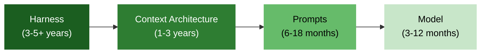
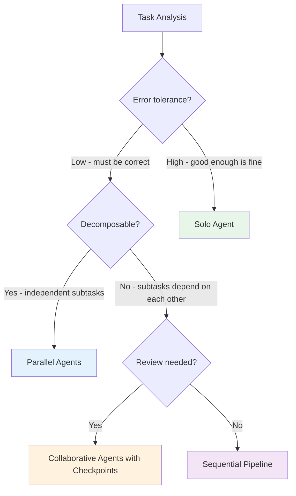

# Law 3: Architecture Matters More Than Model Selection

> The coordination pattern you choose — solo agents, parallel pipelines, collaborative swarms — determines outcome quality far more than which model you run inside it.

## Why This Matters

Consider a team that spent six weeks running model evaluations. They benchmarked four providers across accuracy, latency, and cost. They built A/B testing infrastructure, collected thousands of data points, and produced a 40-page comparison document. The winning model improved output quality by 8%. Two months later, a competitor released a better model and the entire evaluation was obsolete.

Now consider another team that spent the same six weeks designing their context flow: what information reaches the agent, when it arrives, and how it is structured. They built a modular harness with clear boundaries between prompts, tools, and model calls. When that same competitor model launched, they swapped it in with a one-line configuration change. Their system improved immediately — not by 8%, but by the full capability delta of the new model, because their architecture was already extracting maximum value from whatever model it contained.

This is the pattern observed across every production AI system we have studied: teams that invest in architecture outperform teams that invest in model selection. The harness is the constant; the model is the variable.

### The Model Selection Trap

The asymmetry is stark. Most teams allocate their time roughly like this:

| Activity | Typical Allocation | Impact on Outcomes |
|----------|-------------------|-------------------|
| Model benchmarking and evaluation | 30-40% | ~5-10% |
| Prompt engineering and tuning | 30-40% | ~10-20% |
| Context architecture design | 10-15% | ~30-40% |
| Harness engineering (hooks, tools, configuration) | 5-10% | ~40-50% |

The allocation is almost perfectly inverted from the impact. Teams spend the most time on the thing that matters least, and the least time on the thing that matters most. This is not because teams are irrational — model benchmarks are *measurable* and *legible*, while architecture quality is ambiguous and hard to quantify. The bias is toward what can be put in a spreadsheet, not what determines success.

## The Core Insight

AI systems have a durability stack. Each layer has a different expected lifespan, and the layers with the longest lifespan deserve the most engineering investment.

```
┌─────────────────────────────────────────────────┐
│                                                 │
│   Model (the CPU)                               │
│   Lifespan: 3–12 months                        │
│   Commodity. Replaceable on the next release    │
│   cycle. Evaluate last.                         │
│                                                 │
├─────────────────────────────────────────────────┤
│                                                 │
│   Prompts (application code)                    │
│   Lifespan: 6–18 months                        │
│   Medium-term. Tuned to task, but rewrites are  │
│   cheap relative to architecture changes.       │
│                                                 │
├─────────────────────────────────────────────────┤
│                                                 │
│   Context Architecture (memory management)      │
│   Lifespan: 1–3 years                          │
│   Long-term. How information flows through your │
│   system. Expensive to change once established. │
│                                                 │
├─────────────────────────────────────────────────┤
│                                                 │
│   Harness (the operating system)                │
│   Lifespan: 3–5+ years                         │
│   Permanent. Configuration files, hooks, tool   │
│   interfaces, lifecycle management. Survives    │
│   every model upgrade.                          │
│                                                 │
└─────────────────────────────────────────────────┘
```

The analogy to operating systems is precise: nobody evaluates CPUs before designing the OS. The OS determines how the CPU's capabilities are utilized. Likewise, the harness determines how the model's capabilities are utilized. A mediocre model inside a well-designed harness will outperform a frontier model inside a poorly-designed one.

The flow of investment should follow the durability gradient:



**Design left to right. The further left, the more engineering time it deserves.** The further right, the more it should be treated as a commodity input. When budget or time is constrained, cut from the right side first — a prototype with a solid harness and a cheap model will outperform a prototype with no harness and a frontier model.

### The Hierarchy in Practice

**Harness > Prompt > Model.** This hierarchy has been confirmed across production deployments at every scale:

| Investment | Example | Impact Duration | Replaceability |
|-----------|---------|----------------|---------------|
| Harness | CLAUDE.md, hooks, tool configurations, lifecycle management | Years | Architecture rewrite required |
| Context architecture | What information flows to agents, when, how | Years | Significant refactoring |
| Prompts | System prompts, few-shot examples, chain-of-thought templates | Months | Cheap to rewrite |
| Model | GPT-4o, Claude Opus, Gemini Pro, Codex | Months | Configuration change |

When a 7x cheaper model achieves higher quality on the same harness — as happened when teams migrated between frontier models in early 2026 — it proves the harness is doing the heavy lifting. The model is an interchangeable component.

## Evidence

The following evidence points draw from production deployments, practitioner case studies, and industry data. Each illustrates the same structural pattern: architecture-level investments produce larger, more durable improvements than model-level investments.

### 1. Infrastructure Consistently Outperforms Prompt Optimization

Across production systems, investing in infrastructure — hooks that enforce code style, worktrees that isolate experiments, lifecycle management that preserves context between sessions — consistently delivers larger and more durable improvements than prompt tuning. Consider a team that invested one week in Git hooks for automated linting versus a team that invested one week optimizing their system prompt. The hooks team saw permanent quality improvements across every model upgrade; the prompt team had to re-tune after each model change.

The durability difference is the key signal. Prompt optimizations degrade with each model update because they exploit model-specific behaviors. Infrastructure investments improve with each model update because they provide better inputs to a more capable processor. The hooks team's investment *appreciated* over time; the prompt team's investment *depreciated*.

### 2. Coordination Pattern Is the Dominant Decision

Whether you use a single agent, parallel agents, or collaborative agent swarms is a bigger decision than which model those agents run. A solo agent with Claude handles different failure modes than three parallel agents with GPT-4o. The coordination pattern determines:

- **Error propagation**: Does one failure cascade?
- **Context efficiency**: How much redundant information flows through the system?
- **Latency profile**: Sequential bottlenecks versus parallel fan-out
- **Cost structure**: Linear scaling versus multiplicative scaling

These are architectural decisions that the model cannot compensate for. A frontier model cannot fix a cascading failure caused by a poorly-designed error propagation path. A cheaper model inside a well-designed parallel architecture can outperform a frontier model inside a sequential bottleneck simply because the parallel system completes more work in the same time window.

Consider a team that needs to review 50 files for security vulnerabilities. With a solo agent, this is a sequential scan — one file at a time, bounded by the model's output speed. With parallel agents, the same task fans out to five agents handling ten files each. The coordination pattern determines a 5x throughput difference. The model determines a marginal quality difference on each individual file. Which investment has more impact?

### 3. The Cursor Lesson: Subtraction Over Addition

One of the most cited developer tools demonstrated that many of its largest improvements came from *removing* complexity rather than adding it. Simplifying the architecture — fewer agent handoffs, more direct tool calls, less elaborate prompt chaining — improved both reliability and speed. The best architecture is simpler than most teams expect.

This is counterintuitive. Teams assume that more sophisticated coordination will produce better results. In practice, each handoff between agents is an opportunity for context loss, latency, and error. The winning strategy is not "build the most elaborate architecture" but "build the simplest architecture that meets requirements, and resist adding complexity until measurement proves it necessary."

### 4. Claude Code's Productivity Pattern

Every major productivity technique for Claude Code — CLAUDE.md configuration, custom slash commands, hooks for validation, memory files for session continuity — is a harness-level investment. None of them involve model selection. The creator's own guidance is entirely about the operating system, not the CPU.

This is not incidental. The tool's creator has given extensive interviews and documentation on how to get the most out of the system. The advice is uniformly about harness engineering: configure the project file, set up hooks, define tool permissions, maintain memory across sessions. Zero advice concerns model selection. This pattern holds because the harness is the stable surface; the model behind it changes with each release.

### 5. The Cost Commoditization Signal

In early 2026, teams discovered that swapping from one frontier model to a competitor that was 7x cheaper *on the same harness* produced equal or higher quality output. This was only possible because the harness — not the model — was doing the work of structuring context, enforcing constraints, and maintaining consistency.

If model quality were the dominant factor, a 7x cost reduction would necessarily mean a quality reduction. The fact that quality was maintained (or improved) is direct evidence that the architecture was the binding constraint, not the model. Teams with poor architecture saw no such benefit from the swap — their quality tracked model capability because their harness was not contributing.

This creates a diagnostic: if swapping to a cheaper model degrades your output significantly, your architecture is under-invested. The harness is not pulling its weight.

The commoditization trend is accelerating. Model capabilities that were frontier-exclusive six months ago are now available at a fraction of the cost. Teams that built their systems around a specific model's unique capabilities find those advantages eroding quarterly. Teams that built their systems around a durable harness find that each new model release makes their existing system better — for free.

## Practical Implications

### Architecture Decision Checklist

Before writing a single prompt or selecting a model, answer these questions:

- [ ] **What is the coordination pattern?** Solo agent, parallel agents, or collaborative agents? Match this to your task's error tolerance and latency requirements.
- [ ] **What is the context flow?** What information reaches each agent? When does it arrive? What format is it in? (See [Law 1: Context](law-1-context.md))
- [ ] **Where are the human checkpoints?** At what points does a human review, approve, or redirect? (See [Law 2: Judgment](law-2-judgment.md))
- [ ] **What is modular enough to delete?** Which layers can be swapped, removed, or upgraded without rewriting the system? (See [Law 4: Build to Delete](law-4-delete.md))
- [ ] **What state persists between sessions?** Configuration files, memory, learned preferences — these are harness-level investments that compound over time.
- [ ] **How will you swap the model?** If model replacement requires more than a configuration change, your architecture has a coupling problem.

### Model Selection (De)Prioritization Guide

Most teams evaluate models too early. Use this ordering instead:

| Priority | What to Decide | When |
|----------|---------------|------|
| 1st | Coordination pattern (solo / parallel / collaborative) | Week 1 |
| 2nd | Context architecture (what flows where) | Week 1-2 |
| 3rd | Human checkpoint design | Week 2 |
| 4th | Tool interface contracts | Week 2-3 |
| 5th | Prompt structure and templates | Week 3-4 |
| 6th | Model selection | Week 4+ |

Model selection should be your *last* decision, not your first. By the time you reach it, your architecture will have constrained the decision space so thoroughly that the "right" model often becomes obvious — or, more commonly, it becomes clear that multiple models work and the choice barely matters.

**Why this ordering works**: Each earlier decision narrows the solution space for later decisions. Once you know you need parallel agents (Priority 1), you know you need context partitioning (Priority 2), which constrains your tool interfaces (Priority 4), which constrains your prompt structure (Priority 5). By the time you reach model selection (Priority 6), the requirements are so specific that a simple capability checklist — "does it support tool use? does it handle the required context length? is it within budget?" — is usually sufficient. The elaborate benchmarking process becomes unnecessary because the architecture has already done the filtering.

**What if you already have a model commitment?** Some teams have vendor contracts or organizational mandates that fix the model choice. This is fine. It simply means you start at Priority 1 with an additional constraint. The architecture decisions are still the ones that determine success — the fixed model just becomes one more input to the coordination pattern selection.

### Harness Investment Guide

Where to spend your engineering time for maximum long-term return:

**High ROI (invest heavily)**
- Configuration files that encode project knowledge (system prompts, coding standards, architectural constraints)
- Hooks that enforce quality automatically (pre-commit validation, output format checking)
- Tool interfaces that abstract model-specific details behind stable contracts
- Session memory that preserves context across interactions
- Lifecycle management (initialization, teardown, error recovery)

**Medium ROI (invest selectively)**
- Prompt templates and few-shot example libraries
- Evaluation harnesses for comparing outputs
- Logging and observability for agent behavior

**Low ROI (defer or minimize)**
- Model-specific optimizations (token counting tricks, provider-specific parameters)
- Benchmark reproduction suites
- Multi-provider abstraction layers beyond basic swap capability

**Concrete example**: Consider a team building an AI-assisted code review tool. Here is how the harness investment maps to their system:

| Harness Component | What It Does | Why It Compounds |
|-------------------|-------------|-----------------|
| Project configuration file | Encodes coding standards, architectural constraints, forbidden patterns | Every model that runs in this harness inherits the team's accumulated knowledge |
| Pre-commit hooks | Validates output format, checks for security patterns, enforces style | Quality floor rises independently of model capability |
| Tool interface contracts | Abstracts file reading, code search, and test execution behind stable APIs | New models and new tools plug in without rewriting integration code |
| Session memory | Preserves context about recent changes, open issues, and review history | Agents start with relevant context instead of cold-starting each session |
| Error recovery | Detects failed tool calls, retries with backoff, falls back to simpler approaches | System reliability decouples from model reliability |

Each of these components improves every interaction that flows through the system. None of them are model-specific. All of them survive model upgrades intact.

### Coordination Pattern Selection

Use task characteristics to select the right coordination pattern:



| Pattern | Best For | Watch Out For |
|---------|----------|--------------|
| **Solo agent** | Well-scoped tasks, low error cost, rapid iteration | Context window limits, no redundancy |
| **Parallel agents** | Independent subtasks, high throughput needs, search problems | Result aggregation complexity, duplicated context |
| **Sequential pipeline** | Multi-step transforms, data processing, each step feeds the next | Single point of failure at each stage, latency accumulation |
| **Collaborative agents** | Complex reasoning, high-stakes decisions, tasks requiring diverse expertise | Coordination overhead, context synchronization, cost multiplication |

### Architecture Health Diagnostic

Use these questions to assess whether your current system is architecture-dominant or model-dependent:

| Question | Architecture-Dominant Answer | Model-Dependent Answer |
|----------|----------------------------|----------------------|
| What happens when you swap to a cheaper model? | Quality stays roughly the same | Quality drops significantly |
| Where do bug fixes happen? | In hooks, validators, or tool configs | In the system prompt |
| How long does onboarding a new model take? | Hours (configuration change) | Weeks (prompt rewriting, re-evaluation) |
| What survives a complete model replacement? | Most of the system | Very little |
| How is institutional knowledge stored? | In configuration files and tool interfaces | In prompt engineering tribal knowledge |
| Can a new team member understand the system? | Yes, by reading the harness configuration | No, requires understanding prompt history |

If you answered "Model-Dependent" to three or more questions, your architecture is under-invested. The highest-leverage next step is not a better model — it is migrating concerns from your prompt layer into your harness layer.

## Common Traps

### Trap 1: The Model Evaluation Death Spiral

**Symptoms**: The team has been "evaluating models" for weeks. There are spreadsheets comparing benchmarks. Leadership asks "which model are we going with?" in every standup. No production code has been written.

**What is actually happening**: Architecture decisions are being deferred. The team is solving the easy, measurable problem (model benchmarks) instead of the hard, ambiguous one (system design). Meanwhile, the context architecture — which determines 80%+ of outcome quality — receives no systematic attention.

**The fix**: Set a hard timebox on model selection (one week maximum for initial choice). Treat the model as a replaceable commodity and invest the remaining time in harness design. You can always swap the model later; you cannot easily swap the architecture.

A useful forcing function: require that the initial model selection decision fit in a single paragraph. If it takes more than a paragraph to justify, the team is over-investing in the wrong layer.

### Trap 2: Prompt Engineering as Architecture Substitute

**Symptoms**: The system prompt is 4,000 tokens long and growing. Every bug fix involves adding another instruction to the prompt. The team has a "prompt engineer" but no one owns the context flow. Swapping models requires rewriting prompts from scratch.

**What is actually happening**: Architecture-level concerns (context flow, error handling, output validation) are being pushed into the prompt layer. This works until it does not — and it stops working at exactly the scale where the cost of re-architecture is highest.

**The fix**: For each instruction in your system prompt, ask: "Is this a *model* instruction, or is this compensating for missing architecture?" Move the latter into hooks, validators, or tool interfaces. A good system prompt should be short and stable across model changes.

A useful test: try your system prompt on a completely different model. If it breaks, the instructions that broke are architecture concerns masquerading as prompt concerns. Extract them into the harness.

### Trap 3: Ignoring the Simplicity Signal

**Symptoms**: The architecture diagram has twelve agent types, four routing layers, and a meta-agent that decides which agents to invoke. Latency is high. Debugging requires tracing through multiple agent handoffs. The team describes the system as "sophisticated."

**What is actually happening**: Complexity is being mistaken for capability. In practice, the simplest architecture that meets the requirements almost always outperforms the elaborate one. Each additional coordination layer adds latency, increases the failure surface, and makes debugging harder.

**The fix**: Start with a solo agent. Add coordination complexity only when you have measured evidence that the solo agent cannot meet specific requirements. The burden of proof should be on *adding* complexity, not on *removing* it. If you cannot articulate what specific measured limitation the additional complexity solves, you do not need it yet.

A useful heuristic: if you need a diagram to explain how agents communicate with each other, you probably have too many agents. The best multi-agent systems are the ones where the coordination is so simple that it barely needs explanation.

## Connections

**[Law 1: Context Is the Universal Bottleneck](law-1-context.md)** — Context architecture *is* the architecture decision. The most important thing your harness does is manage what information flows into each agent. If you get the context flow right, a mediocre model will produce good results. If you get it wrong, a frontier model will produce mediocre results.

**[Law 2: Human Judgment Remains the Integration Layer](law-2-judgment.md)** — Human checkpoints are an architectural decision, not a prompt decision. Where you place review gates, approval steps, and redirect opportunities is part of the coordination pattern. Architectures that treat human involvement as an afterthought systematically underperform.

**[Law 4: Build Infrastructure to Delete](law-4-delete.md)** — The durability stack implies that not all layers deserve equal investment. Build your architecture with the expectation that prompts will be rewritten and models will be replaced. The harness and context architecture should be durable; everything else should be modular enough to delete.

**[Law 5: Orchestration Is the New Core Skill](law-5-orchestration.md)** — Architecture determines the orchestration layer. A solo agent architecture operates at Layer 0 (augmentation); a collaborative swarm operates at Layer 3 (delegation). The choice of coordination pattern constrains the orchestration skill required to operate the system.

**[Law 6: Speed and Knowledge Are Orthogonal](law-6-speed-knowledge.md)** — The harness *is* the compounding mechanism. Configuration files, session memory, hooks, and tool configurations accumulate institutional knowledge that survives model upgrades. This is "harness engineering" — the intersection of architecture and knowledge preservation. A well-designed harness converts speed into durable knowledge; a poorly-designed one converts speed into technical debt.

The Law 3 / Law 6 intersection deserves particular attention. When teams talk about "harness engineering," they mean the practice of encoding institutional knowledge into the architectural layer that survives model changes. Every configuration rule, every hook, every tool interface contract is a piece of knowledge that compounds. The model consumes this knowledge; the harness preserves it. This is why architecture is not just a technical decision — it is a knowledge management decision. Teams that recognize this invest in their harness the way previous generations invested in documentation: as the durable store of how things work and why.

### Related QED Patterns

- [AMP Architecture](../patterns/architecture/amp-architecture.md) — Service-oriented architecture patterns for AI systems, demonstrating harness-level design decisions in practice
- [Core Architecture](../patterns/architecture/core-architecture.md) — The three-layer architecture (UI, Intelligence, Tools) that illustrates the durability stack in a production system
- [Framework Selection Guide](../patterns/implementation/framework-selection-guide.md) — Decision frameworks for choosing implementation approaches, applied after architecture decisions are made
- [Framework Wars Analysis](../patterns/implementation/framework-wars-analysis.md) — Comparative analysis showing how architectural choices persist across framework generations

---

**The bottom line**: When someone asks "which model should we use?", the correct first response is "show me your architecture." The model is the last 5% of the decision. The harness, the context flow, and the coordination pattern are the first 95%. Get those right, and almost any capable model will perform well. Get those wrong, and no model — no matter how frontier — will save you.
