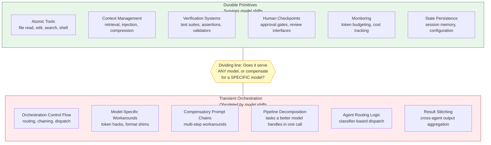

# Law 4: Build Infrastructure to Delete

> Today's clever orchestration is tomorrow's obsolete complexity. Invest in durable primitives, not transient pipelines.

## Why This Matters

Consider a team that spent three months building a sophisticated agent routing system: a multi-step pipeline that decomposed user requests, classified intent, selected the right model, managed retries with exponential backoff, and stitched together results from five specialized sub-agents. It was elegant engineering. Six months later, a single frontier model call handled the same task with better quality, and the routing system became dead weight they were afraid to remove.

This is not a cautionary tale about one team. It is the dominant pattern in AI infrastructure. The capabilities requiring complex orchestration pipelines in 2024 are handled by a single prompt in 2026. Every layer of clever routing, every multi-step chain that compensates for model limitations, every workaround for context window constraints -- these are bets that model capabilities will not improve. In the current environment, most of those bets lose within 6-12 months.

The teams that move fastest are not the ones with the most sophisticated infrastructure. They are the ones who can delete 80% of their infrastructure without breaking anything, because they built with deletion in mind from the start. This is Law 4's central claim: the ability to delete infrastructure quickly and safely is a better predictor of long-term velocity than the sophistication of the infrastructure itself.

## The Core Insight

Rich Sutton's "Bitter Lesson" from reinforcement learning research states that general methods leveraging computation consistently outperform clever hand-designed solutions. This observation -- originally about search and learning in AI research -- applies directly to AI tooling. Hand-crafted orchestration logic, no matter how well-designed, will be overtaken by improvements in model capability and general-purpose inference. Every layer of clever orchestration you build is a bet that model capabilities will not make it obsolete within 6-12 months. Most of those bets lose.

The practical consequence is that AI infrastructure divides cleanly into two categories: **durable primitives** that serve any model, and **transient orchestration** that compensates for a specific model's limitations.

The heuristic is simple: if a component would work equally well with a different model, it is probably durable. If it exists because the current model cannot do something, it is probably transient.

### What Gets Deleted vs. What Persists

| Category | Gets Deleted (Transient) | Persists (Durable) |
|----------|-------------------------|-------------------|
| **Control flow** | Orchestration code, routing graphs, agent dispatch | Atomic tool definitions with stable interfaces |
| **Model interaction** | Model-specific workarounds, format adapters | Context retrieval and injection infrastructure |
| **Task decomposition** | Multi-step pipelines a better model handles in one call | Verification systems that validate any model's output |
| **Planning** | Pre-specified agent plans, rigid task graphs | Human checkpoint interfaces where judgment is applied |
| **Optimization** | Prompt chains compensating for limitations | Token budgeting, cost monitoring, observability |
| **State** | Caching layers for intermediate agent results | Session persistence, memory systems, configuration files |

The pattern holds at every scale. Individual developers find their prompt workarounds obsoleted by model updates. Platform teams find their routing layers simplified away. Framework maintainers find their core abstractions rebuilt from scratch. What survives across all of them: the tools, the tests, and the human review gates.

### What "Build to Delete" Does Not Mean

This law is frequently misread as "do not build anything" or "keep everything throwaway." Neither is correct.

**It does not mean avoid investment.** Durable primitives deserve *more* investment than they typically receive -- thorough test coverage, clean interfaces, robust error handling. The point is to concentrate that investment where it will compound.

**It does not mean all code is disposable.** The distinction between durable and transient is real and predictable. Context management, verification systems, and tool interfaces have survived every model transition observed so far. They are worth building to last.

**It does mean plan for deletion of the orchestration layer.** The code that wires tools together, routes between agents, and compensates for model limitations should be written with the assumption that it will be rewritten or removed within 6-12 months. Design it to be cheap to delete, not expensive to maintain.

**It is different from traditional technical debt.** Technical debt accumulates when you take shortcuts that create future maintenance costs. Building to delete is the opposite: it is a deliberate engineering practice that *reduces* future costs by making transient code easy to remove rather than expensive to maintain. The debt metaphor implies you should eventually "pay it off" by hardening the code. Law 4 says some code should never be hardened -- it should be deleted instead.

## Evidence

Of the six laws, Law 4 has the most straightforward empirical signal: you can directly observe what gets deleted. Unlike laws that describe structural relationships (Law 1, Law 6) or shifting roles (Law 2, Law 5), Law 4 makes a concrete, falsifiable prediction -- that orchestration layers will be deleted while tool interfaces and verification systems persist. The evidence below confirms this prediction across platforms, frameworks, and the industry at large.

Four well-documented cases demonstrate the pattern at production scale:

| System | What Was Deleted | Timeline | What Survived |
|--------|-----------------|----------|---------------|
| **Manus** (agent platform) | Harness refactored 5 times | 6 months | Atomic tool interfaces, context management |
| **LangChain** (framework) | Core architecture rebuilt 3 times | 12 months | Retrieval primitives, tool abstractions |
| **Vercel v0** (AI dev tools) | 80% of agent tools removed | ~9 months | File operations, verification, human review |
| **Industry-wide** | Complex pipelines replaced by single prompts | 2024-2026 | Test suites, monitoring, context infrastructure |

The pattern is consistent: orchestration logic churns, but the tools it orchestrates and the systems that verify its output remain stable.

### 1. Manus: Five Correct Decisions, All Deleted

Manus did not make five bad architectural decisions. They made five *correct* decisions for the model capabilities available at each point in time. The harness that was right in month one was wrong by month three -- not because the design was poor, but because the underlying models improved enough to make the coordination unnecessary.

What persisted across all five refactors: the atomic tool interfaces (file operations, browser control, shell access) and the context management infrastructure (what information flows into the agent). What was deleted each time: the orchestration layer that decided *how* to use those tools. The teams that thrived were the ones who could execute these transitions in days rather than weeks, because their harness was thin enough to rewrite.

### 2. LangChain: Framework Churn, Primitive Stability

LangChain's three re-architectures illustrate the framework-level version of the same dynamic. Each architecture reflected the best understanding of how to coordinate model calls at that moment. Each was correct for its era and obsolete shortly after.

The components that survived all three rewrites were the retrieval primitives (document loaders, text splitters, vector store integrations) and tool interface contracts. The components that were deleted and rebuilt each time were the chain abstractions, the agent routing logic, and the output parsers -- all orchestration-layer concerns that model improvements rendered unnecessary or counter-productive.

### 3. Vercel v0: Subtraction as Progress

Vercel's removal of 80% of their agent tools is the clearest example of deletion as a positive engineering outcome. As models improved at planning and task decomposition, the tools that pre-decomposed tasks for them became overhead rather than help. The tools that survived were the ones that provided capabilities models genuinely lack: file system access, network operations, and human approval gates.

The deletion was not a failure of the original design. It was evidence that the team had built infrastructure they *could* delete when the time came. Teams with tightly-coupled tool systems could not have executed the same reduction without significant refactoring.

### 4. The Industry-Wide Pattern: Pipelines to Prompts

The broadest evidence comes from the industry-wide compression of multi-step pipelines into single model calls. Tasks that required retrieval-augmented generation pipelines with five steps in 2024 -- query expansion, retrieval, re-ranking, synthesis, validation -- can now be handled by a single call to a frontier model with a well-structured prompt. Each step of that pipeline was correct engineering at the time it was built. Each became unnecessary as model capabilities expanded.

The implication is not that pipelines are always wrong. It is that any pipeline step whose purpose is to compensate for a model limitation has a short expected lifespan. Build it knowing you will delete it.

Consider a team evaluating whether to build a complex retrieval pipeline with query expansion, hybrid search, re-ranking, and contextual compression. Each stage adds value today. But a team that builds each stage as an independent, removable module -- rather than a tightly integrated pipeline -- can drop stages one at a time as model context windows and reasoning improve. The team that built a monolithic pipeline must rewrite it entirely or live with the overhead. The deletion-ready team adapts incrementally.

## Practical Implications

### Deletion Readiness Assessment

Before your next sprint planning, answer these questions about your current AI infrastructure:

- [ ] What percentage of your codebase is orchestration logic vs. atomic tool definitions?
- [ ] If the next frontier model doubled its context window, which components become unnecessary?
- [ ] If the next model handled multi-step reasoning natively, which pipelines could you remove?
- [ ] Can each component be deleted independently without cascading failures?
- [ ] How long would it take to remove your agent routing layer entirely?

If you cannot answer these questions, your infrastructure is not built to delete.

### Infrastructure Investment Rubric

When deciding where to invest engineering time, use this classification:

**Invest heavily (durable primitives):**
- Robust, well-tested atomic tools with clean interfaces
- Context retrieval and injection infrastructure
- Verification and testing systems
- Human-in-the-loop checkpoint interfaces
- Cost monitoring and token budgeting
- Session state and memory persistence

**Invest lightly (transient orchestration):**
- Agent routing and dispatch logic
- Multi-step prompt chains
- Model-specific format adapters
- Result aggregation across sub-agents
- Workarounds for context window limitations

"Invest lightly" does not mean "do not build." It means: build it, but build it to be removed. Lightweight harnesses. Minimal control flow. Thin wrappers over atomic tools. Let the model make the plan rather than encoding the plan in routing logic.

When you are unsure which category a component falls into, ask: "If the next model release made this component unnecessary, how much work would deletion require?" If the answer is "a configuration change," you have a durable primitive. If the answer is "a week of refactoring," you have a tightly-coupled transient component that needs redesigning.

### The Build-to-Delete Checklist

For every piece of AI infrastructure you write:

- [ ] **Modular boundaries**: Can this component be removed without modifying anything else?
- [ ] **No hidden state**: Does removing this component leave orphaned state or configuration?
- [ ] **Thin wrapper**: Is this the minimum code needed, or does it encode assumptions about model behavior?
- [ ] **Model-agnostic**: Would this component work with a different model, or is it compensating for a specific model's weaknesses?
- [ ] **6-month test**: Is there a plausible model improvement in the next 6 months that makes this unnecessary?

If your component fails the 6-month test, build it as a thin, removable layer with a clear deletion path documented in the component's README or header comment.

### The Build-to-Delete Principle in Practice

The principle is not "avoid building things." It is "build things that are easy to throw away." Concretely:

1. **Start simple, expect to delete 80%.** Begin with a single model call and add orchestration only when you have evidence it is needed. Most teams over-architect from the start. The baseline should be "one model, one prompt, atomic tools" -- add complexity only when this demonstrably fails.
2. **Lightweight harnesses over frameworks.** A 50-line script you can rewrite in an afternoon beats a framework you are locked into for a year. When evaluating whether to adopt an orchestration framework, estimate its deletion cost, not just its adoption cost.
3. **Minimal control flow.** Every `if` branch in your orchestration code is a deletion liability. Fewer branches means faster deletion. If your orchestration layer has more lines than your tool definitions, the ratio is probably wrong.
4. **Let the model make the plan.** Instead of encoding task decomposition in your routing layer, give the model atomic tools and let it decide the sequence. Your infrastructure provides *capabilities*; the model provides *plans*.
5. **Clean interfaces between layers.** When your durable tools have stable interfaces, you can replace everything above them without touching the tools themselves. Define tool contracts as if the orchestration layer does not exist -- because it will not, eventually.
6. **Document the deletion path.** For every transient component, include a brief note (even a single comment) describing what would need to change if this component were removed. Future engineers -- including yourself in six months -- will thank you.
7. **Treat deletion as a metric.** Track how much infrastructure you remove each quarter alongside how much you add. A healthy AI codebase has a meaningful deletion rate. If nothing has been deleted in three months, either model capabilities have stalled (unlikely) or your team is accumulating dead weight.

### 6-Month Deletion Planning

At the start of each quarter, review your AI infrastructure and classify every component:

| Category | Action | Review Cadence |
|----------|--------|---------------|
| Durable primitive | Invest in robustness and testing | Annually |
| Likely durable | Maintain, monitor for capability shifts | Quarterly |
| Likely transient | Minimize investment, document deletion path | Monthly |
| Already obsolete | Schedule removal this sprint | Immediately |

The teams that benefit most from model improvements are the teams that can adopt those improvements fastest. Adoption speed is inversely proportional to the amount of transient infrastructure standing in the way.

### How to Run a Deletion Review

A quarterly deletion review takes 60-90 minutes and prevents the gradual accumulation of obsolete infrastructure. The format:

1. **Inventory** (15 min): List every component in your AI infrastructure. For each, note whether it is a tool, orchestration logic, a workaround, or a verification system.
2. **Classify** (20 min): Apply the 6-month deletion planning table above. Mark each component as durable, likely durable, likely transient, or already obsolete.
3. **Test against recent model releases** (15 min): For each "likely transient" component, check whether capabilities released in the past quarter make it unnecessary. If a model now handles the task natively, move the component to "already obsolete."
4. **Plan deletions** (20 min): For every "already obsolete" component, assign an owner and a sprint for removal. For every "likely transient" component, ensure a documented deletion path exists.
5. **Retrospective** (10 min): Review deletions from the previous quarter. Were the predictions accurate? Calibrate the team's judgment about what is durable vs. transient.

The single most common finding in deletion reviews: components classified as "likely durable" three months ago are now clearly transient, because model capabilities moved faster than the team expected.

## Common Traps

### The Sunk Cost Harness

**Symptoms**: The team spent months building a sophisticated orchestration layer. A new model makes most of it unnecessary, but no one wants to delete it because of the investment. The system grows more complex as new capabilities are layered on top of infrastructure that should have been removed.

**Root cause**: Emotional attachment to engineering effort, compounded by the absence of a planned deletion path. The code was built as if it would be permanent.

**Remedy**: Establish a regular "deletion review" -- a quarterly session where the team asks: "If we were starting today, would we build this?" If the answer is no, schedule its removal regardless of original cost. Treat deletion as a positive engineering outcome, not a failure.

### The Abstraction Trap

**Symptoms**: A team builds elaborate abstractions to make their orchestration "model-agnostic," creating layers of indirection that are themselves harder to delete than the orchestration they wrap. The abstraction outlives its usefulness and becomes the new legacy system.

**Root cause**: Treating "model-agnostic" as a design goal for orchestration code, rather than accepting that orchestration is inherently transient. Abstractions are valuable for durable primitives; they are overhead for transient layers.

**Remedy**: Apply the thin wrapper principle. Orchestration code should be direct and disposable, not abstracted and "clean." Save your design energy for the primitives that will survive. A 200-line orchestration script you can read and delete in an hour is better than a 50-line call to a 2,000-line abstraction layer.

### Over-Engineering the Plan

**Symptoms**: Complex control flow that pre-specifies exactly how an agent should decompose a task: "First retrieve context, then classify intent, then select tool, then validate output." Each step is a rigid node in a directed graph. When model capabilities shift, the entire graph must be redesigned.

**Root cause**: Encoding a plan that the model should be making. The plan is a form of orchestration logic -- and orchestration logic is transient.

**Remedy**: Give the model atomic tools and let it decide the sequence. Your infrastructure provides *capabilities*; the model provides *plans*. The simpler your control flow, the more easily you can adapt when model planning improves. If your task graph has more than three nodes, question whether the model could handle the decomposition itself.

## Connections

**[Law 3: Architecture Matters More Than Model Selection](law-3-architecture.md)** -- Architecture must be modular enough to *permit* deletion. If your architecture tightly couples orchestration to primitives, you cannot delete one without breaking the other. Law 3's emphasis on harness design directly enables Law 4's deletion readiness. The architecture that matters is the architecture of your durable primitives, not your transient orchestration.

**[Law 6: Speed and Knowledge Are Orthogonal](law-6-speed-knowledge.md)** -- The durable/transient distinction maps directly to the speed/knowledge tension. Knowledge preservation systems (context management, verification, test suites) are durable primitives that compound value over time. Speed-optimization layers (routing shortcuts, parallel dispatch, caching heuristics) are transient infrastructure that model improvements will obsolete. Build the knowledge infrastructure to last; build the speed infrastructure to delete.

**[Law 1: Context Is the Universal Bottleneck](law-1-context.md)** -- Context management infrastructure is one of the clearest examples of a durable primitive. Regardless of how models evolve, the problem of getting the right information into the right context window at the right time persists. Context retrieval, injection, and compression systems survive model transitions because they solve a problem that model capability alone does not eliminate.

**[Law 5: Orchestration Is the New Core Skill](law-5-orchestration.md)** -- There is a productive tension between Law 4 and Law 5. Orchestration is a critical skill precisely *because* it is transient: the ability to design, build, and then discard orchestration layers as models improve is the meta-skill that endures. The orchestrator who builds to delete is more valuable than the orchestrator who builds to keep.

**[Law 2: Human Judgment Remains the Integration Layer](law-2-judgment.md)** -- Human checkpoint interfaces are among the most durable primitives because they solve a problem that does not shrink with model improvement: the integration of AI outputs into business value requires human judgment, and the interfaces that support that judgment persist regardless of which model produces the output being reviewed. When planning what to delete, notice that approval gates and review interfaces almost always survive -- they are worth building to last.

The six laws reinforce each other most visibly through Law 4. Deletion readiness is the *operational test* of whether you have internalized the other five laws: durable context architecture (Law 1), human checkpoints (Law 2), modular harness design (Law 3), appropriate orchestration layer selection (Law 5), and knowledge preservation systems (Law 6) are exactly the components that survive deletion. If your infrastructure is built to delete, the surviving 20% will be the infrastructure the other five laws told you to invest in.

### QED Patterns

These QED patterns operationalize Law 4 in specific technical contexts:

- [Tool System Evolution](../patterns/architecture/tool-system-evolution.md) -- How tool interfaces evolve as models improve, with patterns for maintaining durable tool contracts while allowing orchestration churn
- [Migration Strategies](../patterns/implementation/migration-strategies.md) -- Practical approaches to replacing transient infrastructure without downtime, including incremental deletion and parallel-run patterns
- [Emerging Patterns](../patterns/architecture/emerging-patterns.md) -- Forward-looking patterns that indicate which current infrastructure is likely to become transient
- [Building an AMP](../patterns/implementation/building-amp.md) -- Implementation patterns for AI-augmented development platforms, with explicit separation of durable primitives from transient orchestration layers
