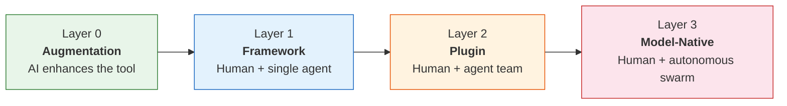
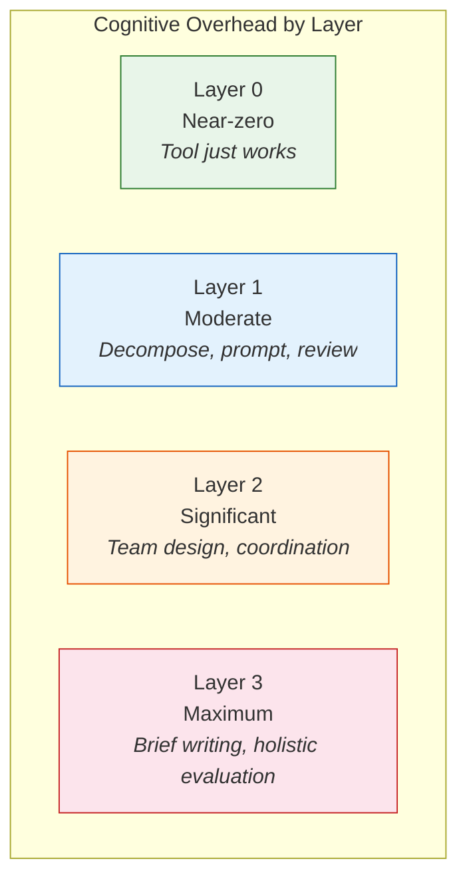
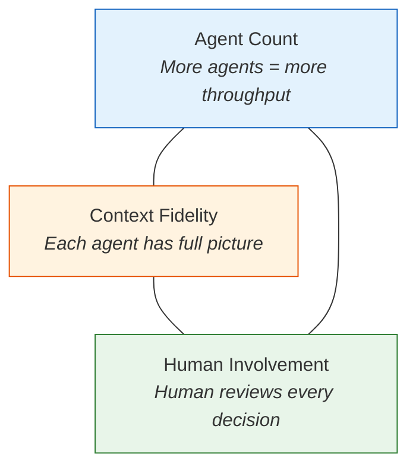

# Law 5: Orchestration Is the New Core Skill

> Managing AI agents is a management problem --- the skills that make someone effective at leading teams transfer directly to directing AI systems, and the spectrum from invisible augmentation to autonomous delegation determines both productivity and risk.

## Why This Matters

Consider a team that just adopted AI coding tools. The senior engineer --- the one who writes the most elegant code --- struggles. The engineering manager, who hasn't shipped code in two years, runs circles around everyone. She decomposes problems cleanly, writes precise briefs, reviews output critically, and knows when to intervene. Within a month, she is producing more working software than any individual contributor on the team.

This is not an anomaly. It is the pattern. The skills that made someone an effective manager of humans --- communication, goal-setting, context provision, task decomposition, feedback loops --- transfer directly to AI orchestration. The bottleneck in AI-augmented teams is rarely the model's capability. It is the human's ability to direct that capability toward the right problem at the right altitude.

The deeper issue is that orchestration is not a single skill. It is a spectrum. At one end, the AI enhances your tools invisibly --- you stay in flow, you write the code, and the machine just makes you faster. At the other end, autonomous agent swarms build entire systems while you review the output. Each point on this spectrum carries different tradeoffs in productivity, knowledge retention, cognitive overhead, and risk. Most teams default to whatever layer their tools support, rather than choosing deliberately. That default is usually wrong.

The economic consequence is stark: implementers --- people who can write code, configure systems, generate content --- are now abundant. Every developer with an AI agent is an implementer. Orchestrators --- people who can decompose ambiguous goals, provide the right context, select the right delegation level, and verify the results --- are scarce. Organizations that treat AI adoption as "give everyone Copilot" are investing in the abundant resource. Organizations that invest in orchestration capability are investing in the scarce one.

## The Core Insight

Orchestration operates along a four-layer spectrum. The layers are not steps in a progression --- you do not graduate from one to the next. They are options, and the right choice depends on the task, the domain, and the scale of work.

### The Orchestration Spectrum



**Layer 0 --- Augmentation (Direct Manipulation)**

The AI enhances the tool itself. You interact with your code, not with an agent. Inlay type hints, next-edit suggestions, file-level lens tools, autocomplete that understands your codebase. You stay in flow state. There is no idle waiting, no chat mediation, no context-switching between "writing code" and "talking to an AI about code."

Consider a team that uses an editor with AI-powered type inference overlays. The developer writes a function, and the editor silently shows the inferred return type, highlights a potential null dereference, and suggests a more idiomatic pattern as a ghost-text completion. The developer accepts or ignores each suggestion without breaking stride. No prompt was written. No output was reviewed. The tool just worked.

This is what calm technology looks like in AI tooling. The interface disappears. The capability remains.

- **Cognitive overhead**: Lowest of any layer
- **Knowledge preservation**: Highest of any layer --- because you wrote every line, the AI just made you faster
- **Human role**: Author. You write the code; the tool accelerates you
- **Key insight**: Chat is the least interesting interface to LLMs. The most effective AI integrations are the ones you do not notice
- **Examples**: Inlay type hints, next-edit predictions, inline error explanations, codebase-aware autocomplete, file lens tools

**Layer 1 --- Framework (Single Agent)**

You orchestrate one agent directly. You choose the agent type, write the task prompt, set the scope, and review the output. The framework manages tool calls, context windows, and retry logic. You manage intent.

Consider a team that needs to add input validation across 40 API endpoints. The developer writes a task prompt: "Add Zod schema validation to each endpoint in `src/api/`, matching the existing pattern in `src/api/users.ts`. Run the test suite after each file." The agent works through the endpoints sequentially. The developer reviews each batch, catches a misunderstanding about nullable fields after the third endpoint, corrects the prompt, and the agent applies the fix forward. Elapsed time: two hours. Manual estimate: two days.

- **Cognitive overhead**: Moderate (task decomposition, prompt writing, output review)
- **Knowledge preservation**: Good, if you review carefully --- you see every change
- **Human role**: Director. You define what to build; the agent builds it
- **Coordination patterns**: Sequential task execution, human-in-the-loop checkpoints
- **Examples**: Claude Code, Cursor agent mode, Copilot Workspace, any single-agent CLI tool

**Layer 2 --- Plugin (Agent Teams)**

You coordinate a team of agents. Each agent has a role. They communicate through shared state --- inbox-based messaging, shared files, or structured handoffs. Work proceeds in plan/review phases with human approval gates.

Consider a team that needs to migrate a monolith to microservices. A planning agent analyzes the dependency graph and proposes service boundaries. A code-generation agent extracts each service. A testing agent writes integration tests for the new API contracts. A review agent checks for breaking changes. The human approves the plan, reviews each extracted service, and resolves ambiguities about shared data models. Five coordination patterns emerge naturally:

1. **Parallel** --- Independent agents work on separate services simultaneously
2. **Pipeline** --- One agent's output feeds the next (plan, then extract, then test)
3. **Swarm** --- Multiple agents explore different decomposition strategies; the best one wins
4. **Research-then-implement** --- A research agent surveys the codebase; an implementation agent acts on findings
5. **Plan approval** --- Human gates between phases prevent error propagation

- **Cognitive overhead**: Significant (team design, coordination protocol, approval workflows)
- **Knowledge preservation**: Moderate. The plan/review cycle forces engagement, but detail visibility drops
- **Human role**: Manager. You design the team, set the coordination protocol, and review deliverables
- **Examples**: Claude Code with Task tool, multi-agent frameworks (CrewAI, AutoGen), CI/CD-integrated agent pipelines

**Layer 3 --- Model-Native (Autonomous Swarms)**

You write a brief. The model self-organizes. Agents create other agents, assign themselves roles, divide work dynamically. You evaluate the final output.

Consider a team that points 16 agents at the goal "build a C compiler that passes the test suite." The agents self-organize: some handle parsing, some handle code generation, some handle optimization passes. They coordinate through shared files and emergent conventions. The output is 100,000+ lines of working code. But when one agent improves the optimizer, it breaks the parser's assumptions about intermediate representation --- and no single agent holds enough context to diagnose the cross-module failure. The human must now debug a system they did not build, line by line.

- **Cognitive overhead**: Maximum, paradoxically. Writing a brief that produces correct autonomous behavior is harder than directing agents yourself. Evaluating holistic output from a nondeterministic system requires deep domain knowledge
- **Knowledge preservation**: Lowest. You see the output but not the reasoning path that produced it
- **Human role**: Executive. You define the objective and evaluate the result
- **Coordination patterns**: Dynamic role creation, agent self-reproduction, emergent task graphs
- **Examples**: OpenAI Codex autonomous mode, agent-spawning frameworks, "dark factory" pipelines with zero human code authorship

### The Overhead Paradox

A counterintuitive pattern runs through the spectrum: cognitive overhead does not decrease as you delegate more. It changes shape.



As one practitioner put it: "AI reduces the cost of production but increases the cost of coordination, review, and decision-making." At Layer 3, you trade hands-on implementation time for evaluation time --- and evaluation of autonomous output may be harder than doing the work yourself.

### The Orchestration Cost Gradient

| Layer | Production Cost | Coordination Cost | Review Cost | Decision Cost | Net Overhead |
|-------|----------------|-------------------|-------------|---------------|-------------|
| Layer 0 | Reduced ~30% | Near-zero | Near-zero (you wrote it) | Unchanged | **Lowest** |
| Layer 1 | Reduced ~70% | Low (prompt writing) | Moderate (output review) | Low (per-task) | **Moderate** |
| Layer 2 | Reduced ~85% | High (team design, protocols) | High (multi-agent review) | Moderate (phase gates) | **Significant** |
| Layer 3 | Reduced ~95% | Maximum (brief engineering) | Maximum (holistic evaluation) | Maximum (nondeterminism) | **Highest** |

The production cost column is what vendors advertise. The other four columns are what you actually experience. Teams that evaluate orchestration layers solely on production cost reduction are systematically surprised by the total cost of ownership.

## Evidence

Each of these cases illustrates a different aspect of the orchestration spectrum. Together, they establish that the choice of orchestration layer --- not the model's raw capability --- is the primary determinant of outcome quality.

### Evidence 1: The Zero-Orchestration Proof

A single developer working with a single AI agent (Layer 1) built a 20,000-line-of-code browser in 72 hours. No orchestration framework. No agent team. No autonomous swarm. Just one human directing one agent through iterative task prompts with tight feedback loops.

The key was not the agent's capability --- comparable agents were available to everyone. The key was the developer's skill at decomposition (breaking "build a browser" into rendering, networking, and UI subtasks), context provision (feeding relevant specs and test cases at each step), and review discipline (catching architectural drift early before it compounded).

**What this demonstrates**: Orchestration infrastructure is not inherently valuable. A skilled orchestrator at Layer 1 can outperform a mediocre orchestrator at Layer 3. The skill of the human matters more than the sophistication of the system.

### Evidence 2: The Interview Anti-Pattern

In controlled settings, interview candidates who used AI coding agents performed *worse* than those who coded manually. The failure mode was consistent: candidates would prompt the agent, wait for output, attempt to understand the generated code, realize it did not quite fit, re-prompt, and repeat --- consuming more time in the prompt-wait-review cycle than they would have spent writing the code directly. Under questioning, they could not explain design choices in the generated code because they had not made those choices.

Candidates who used Layer 0 tools (autocomplete, type inference) performed normally or slightly better. The performance degradation was specific to Layer 1+ --- the moment a chat-based agent mediated between the developer and the code.

**What this demonstrates**: Layer 0 (invisible augmentation) outperforms Layer 1+ for individual, time-pressured, flow-dependent tasks. Defaulting to the highest available orchestration layer is an anti-pattern. Flow state has economic value that is destroyed by context-switching to agent interaction.

### Evidence 3: The 16-Agent C Compiler

A team used 16 parallel AI agents (Opus 4.6 model) to build a C compiler --- over 100,000 lines of code. The result compiled real programs. But the process revealed a concrete scaling ceiling: when one agent improved the code generation pass, it broke assumptions the parsing agents had made about the intermediate representation. No single agent held enough context to diagnose the failure because each operated within its own context window.

The verification bottleneck manifested at roughly the 100,000-line threshold. Below that threshold, cross-module coherence could be maintained through shared conventions. Above it, the rate of coherence failures exceeded the team's ability to diagnose and fix them. Output speed was not the constraint --- verification speed was.

**What this demonstrates**: Layer 3 delivers raw output volume that no other approach matches. But output volume is not the same as output quality. Beyond a scale threshold, coordination costs grow faster than production gains. This is the Architecture Trilemma in action: high agent count and high throughput, but context fidelity and human involvement both suffered.

### Evidence 4: The Management Skills Transfer

Teams adopting AI orchestration consistently report that engineering managers --- people whose daily work involves decomposing goals, providing context, reviewing deliverables, and adjusting plans --- ramp up on AI agent coordination faster than senior engineers whose strength is direct implementation. The skill transfer is not metaphorical. Task decomposition for an agent uses the same cognitive muscle as task decomposition for a junior engineer.

**What this demonstrates**: Orchestration is not a new skill that must be learned from scratch. It is an existing skill --- management --- applied to a new substrate. Organizations that recognize this can redeploy existing management talent rather than searching for a new role that does not yet have a job description.

The implication for hiring and team design is direct: when staffing AI-augmented teams, prioritize people who can decompose ambiguous goals and verify output quality over people who can write the fastest code. The fastest code is now the cheapest input.

## Practical Implications

### Layer Selection Matrix

Use this table to match your situation to the appropriate orchestration layer.

| Scale | Domain Type | Optimal Layer | Rationale |
|-------|-------------|---------------|-----------|
| Individual task, flow-critical | Any | Layer 0 | Preserve flow state; minimize context-switching |
| Individual task, exploration | Chess-like | Layer 1 | Agent handles boilerplate; you guide direction |
| Individual task, exploration | Poker-like | Layer 0 | Adversarial reasoning requires human world model |
| Bounded project (days to weeks) | Chess-like | Layer 1--2 | Single agent or small team; human reviews each phase |
| Bounded project (days to weeks) | Poker-like | Layer 1 | Keep human in tight loop for strategic decisions |
| System-level delivery | Chess-like | Layer 2 | Agent teams with coordination protocols |
| System-level delivery | Poker-like | Layer 1--2 | Never fully delegate adversarial domains |
| Coverage / parallelizable | Chess-like | Layer 2--3 | Maximize throughput where coherence is verifiable |
| Coverage / parallelizable | Poker-like | Layer 2 max | Autonomy is unsafe when opponents adapt |

**Chess-like domains**: Deterministic, complete information. Code generation, data transformation, testing, documentation, translation. Outcomes are verifiable by inspection.

**Poker-like domains**: Hidden state, adversarial adaptation. Negotiation, competitive strategy, security, stakeholder management. Outcomes depend on how opponents respond to your moves. [Law 6](law-6-speed-knowledge.md) explains this boundary in depth.

### Orchestration Maturity Assessment

Rate your team on each dimension (1--5). This is not a scorecard to maximize --- it is a diagnostic to identify mismatches.

| Dimension | Score 1 (Low) | Score 5 (High) |
|-----------|--------------|-----------------|
| **Task decomposition** | "Build the feature" as a single prompt | Structured breakdown with dependencies and acceptance criteria |
| **Context provision** | Paste code and hope | Curated context with architecture docs, constraints, and examples |
| **Output review** | Accept first output | Systematic verification against requirements and edge cases |
| **Layer awareness** | Use whatever the tool defaults to | Deliberately select layer per task based on domain and scale |
| **Failure recovery** | Start over when output is wrong | Diagnose failure mode, adjust prompt/context, retry with constraints |

**Interpretation**:
- Scores of 1--2 across the board: invest in Layer 0 and Layer 1 skills before attempting multi-agent workflows
- High decomposition but low review: you are producing output you cannot verify (the debugging paradox --- see [Law 6](law-6-speed-knowledge.md))
- High layer awareness but low context provision: you are choosing the right layer but starving it of information (see [Law 1](law-1-context.md))

### The "When NOT to Orchestrate" Diagnostic

Before adding orchestration complexity, run through these checks.

- [ ] **Can one agent handle this in a single session?** If yes, use Layer 1. The 20K-LOC browser was built this way.
- [ ] **Is the task flow-dependent?** If you need to stay in a thinking groove (debugging, design, exploratory coding), use Layer 0. Adding agents will break your flow state.
- [ ] **Is the domain adversarial?** If opponents adapt to your output (security, negotiation, competitive strategy), do not delegate beyond Layer 1. The critical reasoning was never textualized and cannot be replicated by pattern-matching.
- [ ] **Can you verify the output faster than you can produce it?** If verification takes as long as implementation, multi-agent parallelism saves nothing. You are bottlenecked on review, not production.
- [ ] **Does your team have the review bandwidth?** Each additional agent produces output that someone must evaluate. Five agents producing code you cannot review in a day is worse than one agent producing code you review thoroughly.

### Management-to-AI Skill Transfer Map

If you already manage people, you already have most of the skills required for AI orchestration. The mapping is direct.

| Management Skill | AI Orchestration Equivalent | Layer Where It Applies |
|-----------------|---------------------------|----------------------|
| Writing a clear project brief | Writing effective system prompts and task descriptions | All layers |
| Decomposing a project into tasks | Breaking work into agent-sized units with clear boundaries | Layer 1+ |
| Providing context to a new team member | Curating context windows with relevant code, docs, and constraints | Layer 1+ |
| Running a standup / status check | Reviewing agent progress, adjusting direction mid-task | Layer 2--3 |
| Designing team structure | Choosing agent roles, coordination protocols, and communication patterns | Layer 2--3 |
| Performance review / quality bar | Evaluating agent output against acceptance criteria | All layers |
| Knowing when to delegate vs do it yourself | Selecting the right orchestration layer for the task | All layers |
| Recognizing when a report is stuck | Detecting agent loops, hallucinations, or diminishing returns | Layer 1+ |

### Worked Example: Choosing a Layer

Consider a team that needs to build a payment integration. Walk through the decision:

1. **Classify the domain.** Payment processing involves PCI compliance, fraud detection heuristics, and financial regulations. Parts are chess-like (API integration, data mapping, test writing). Parts are poker-like (fraud rules, edge cases around chargebacks, regulatory interpretation). This is a mixed domain.

2. **Assess the scale.** The integration touches 8 files, requires 3 new API endpoints, and needs 20 test cases. This is a bounded project, not system-level delivery.

3. **Check the layer selection matrix.** Bounded project + mixed domain = Layer 1, with the human keeping a tight loop on fraud-related decisions.

4. **Run the "When NOT to Orchestrate" diagnostic.**
   - Can one agent handle this? Yes --- 8 files is well within context window limits.
   - Is the domain adversarial? Partially --- fraud detection involves adaptive adversaries.
   - Can you verify output faster than you can produce it? For API plumbing, yes. For fraud rules, no --- you need domain expertise to evaluate correctness.

5. **Decision.** Use Layer 1 for the API integration and test scaffolding. Write the fraud detection rules manually (Layer 0). Review everything. Do not reach for a multi-agent pipeline --- it would add coordination overhead without improving the output quality of the parts that matter most.

Total time: one day. A Layer 2 setup would have taken half a day just to configure the agent team, with no quality improvement on the fraud-sensitive components.

This pattern --- splitting a mixed-domain task by layer rather than treating it uniformly --- is the most common practical application of the orchestration spectrum. Most real-world tasks are not purely chess-like or purely poker-like. They are mixtures. The orchestrator's job is to identify the boundary and apply the right layer to each side.

### The Architecture Trilemma

When designing an orchestration system, you can optimize for two of these three properties. You cannot have all three simultaneously.



- **High agent count + high context fidelity** = Low human involvement (Layer 3). Agents share context and coordinate autonomously, but humans lose visibility.
- **High agent count + high human involvement** = Low context fidelity (Layer 2 with approval gates). Humans review each agent's output, but agents work with partial context.
- **High context fidelity + high human involvement** = Low agent count (Layer 1). One agent holds the full picture, human reviews everything, but throughput is limited.

**The Delegation Equation**: For any individual task, delegate to an agent when:

```
Human_Baseline_Time  >  AI_Process_Time / P(Success)
```

If a task takes you 4 hours, an agent takes 30 minutes, and the probability of success on first attempt is 60%, the expected AI time is 50 minutes (30 / 0.6). Delegate. If the probability drops to 10%, the expected time is 300 minutes --- do it yourself.

## Common Traps

### Trap 1: Layer Inflation

**Symptom**: Every task gets routed to the most sophisticated orchestration layer available. The team builds multi-agent pipelines for work that one agent could handle in a single session.

**Root cause**: Conflating orchestration sophistication with productivity. More agents feels like more progress.

**The cost**: Each layer adds coordination overhead, debugging complexity, and review burden. A five-agent pipeline that takes two hours to set up and thirty minutes to review is slower than a single agent that takes forty-five minutes, for most bounded tasks.

**Correction**: Start at Layer 0. Move up only when you hit a concrete limitation --- context window exhaustion, parallelizable subtasks, or domain specialization requirements. The burden of proof should be on adding complexity, not on staying simple.

### Trap 2: The Delegation Assumption

**Symptom**: The team assumes that tasks requiring deep expertise are the best candidates for delegation. "This is complex, so let the AI handle it."

**Root cause**: Inverting the relationship between complexity and oversight. Complex tasks require *more* human judgment, not less.

**The cost**: The most consequential decisions (architecture, security, data model design) get the least human review. Errors in these areas propagate through every downstream decision and are the most expensive to reverse.

**Correction**: Delegate tasks where the output is easy to verify, regardless of implementation complexity. Code generation for well-defined functions (easy to test) is a better delegation target than architecture decisions (hard to evaluate without deep context). If you cannot write the acceptance criteria, you cannot delegate the task.

### Trap 3: Ignoring the Domain Boundary

**Symptom**: The team applies the same orchestration layer to all work, regardless of whether the domain involves adversarial actors, hidden information, or strategic interaction.

**Root cause**: Treating all tasks as deterministic code generation (chess-like) when some involve stakeholders, competitors, or attackers who adapt (poker-like).

**The cost**: In poker-like domains, the critical reasoning that produces good outcomes was built through repeated adversarial experience and was never written down. It lives in mental models, not in text. Delegating these tasks to agents that operate on pattern-matching over text produces output that looks coherent but collapses under adversarial pressure.

**Correction**: Classify tasks by information completeness before selecting an orchestration layer. Chess-like tasks (complete information, deterministic outcomes) can be safely delegated to any layer. Poker-like tasks (hidden state, adaptive opponents) should stay at Layer 0 or Layer 1, where the human's world model remains in the loop.

## Key Takeaways

If you take nothing else from this chapter:

1. **Orchestration is a spectrum, not a ladder.** Layer 0 is not inferior to Layer 3. It is optimal for different conditions. Start at Layer 0; move up only when you hit a specific limitation.

2. **Management skills transfer directly.** If you can decompose a project, provide context to a new hire, and review a deliverable, you can orchestrate AI agents. The cognitive muscle is the same.

3. **Cognitive overhead increases with delegation.** The production cost drops. The coordination, review, and decision costs rise. Evaluate total cost, not just generation speed.

4. **Domain determines maximum safe layer.** Chess-like tasks (deterministic, verifiable) can go to any layer. Poker-like tasks (adversarial, adaptive) must stay close to the human.

5. **The skill gap is between orchestrators and implementers.** Invest in the scarce resource: the ability to direct AI toward the right problem at the right altitude.

## Connections

**[Law 2: Human Judgment Remains the Integration Layer](law-2-judgment.md)** --- Orchestration skill *is* the evolved form of engineering judgment. As AI automates implementation, human judgment rises from writing code to directing systems. The maturity assessment in this chapter is a concrete measure of that judgment altitude. A team with strong orchestration skills and weak judgment will produce output efficiently and integrate it poorly.

**[Law 3: Architecture Matters More Than Model Selection](law-3-architecture.md)** --- Your architecture determines which orchestration layers are available. A system without shared state cannot support Layer 2. A system without evaluation infrastructure cannot support Layer 3. Architecture is the constraint; orchestration is the strategy within that constraint. See also the [Multi-Agent Orchestration](../patterns/architecture/multi-agent-orchestration.md) pattern for implementation details.

**[Law 6: Speed and Knowledge Are Orthogonal](law-6-speed-knowledge.md)** --- Higher orchestration layers produce faster output but risk the debugging paradox: the skill needed to verify AI output is the skill most degraded by delegating to AI. Layer 2 (agent teams with human approval gates) is the optimal balance point for knowledge preservation --- fast enough to be practical, structured enough to force engagement. See [Parallel Tool Execution](../patterns/operations/parallel-tool-execution.md) for the mechanics of safe parallel work.

**[Law 1: Context Is the Universal Bottleneck](law-1-context.md)** --- Every orchestration layer depends on context quality. At Layer 0, context flows through the tool automatically. At Layer 3, context must be compressed into a brief that survives autonomous decomposition. Context provision is the skill that separates effective orchestrators from prompt-and-pray users.

**[Law 4: Build Infrastructure to Delete](law-4-delete.md)** --- Today's Layer 2 coordination protocol is tomorrow's unnecessary complexity. As models improve at self-organization, current orchestration frameworks will collapse into simpler primitives. Build orchestration infrastructure that you can discard when the models outgrow it.

### The System View

The five laws listed above are not independent connections --- they form a decision sequence. When approaching any AI-augmented task:

1. **Law 1** asks: do you have the right context?
2. **Law 3** asks: does your architecture support the orchestration layer you need?
3. **Law 5** (this law) asks: which layer is appropriate for this task, domain, and scale?
4. **Law 2** asks: where does human judgment need to remain in the loop?
5. **Law 6** asks: are you preserving the knowledge you need to keep doing this?
6. **Law 4** asks: which parts of this setup should you expect to delete next quarter?

Orchestration is the operational center of this sequence. It is where architectural decisions (Law 3) become daily workflow choices, and where the speed-knowledge tradeoff (Law 6) is negotiated task by task.

**Related QED Patterns**:
- [Multi-Agent Orchestration](../patterns/architecture/multi-agent-orchestration.md) --- Implementation patterns for Layer 2 and Layer 3 coordination
- [Parallel Tool Execution](../patterns/operations/parallel-tool-execution.md) --- Mechanics of safe concurrent agent operations
- [Team Workflows](../patterns/team/team-workflows.md) --- How orchestration layers map to team collaboration patterns
