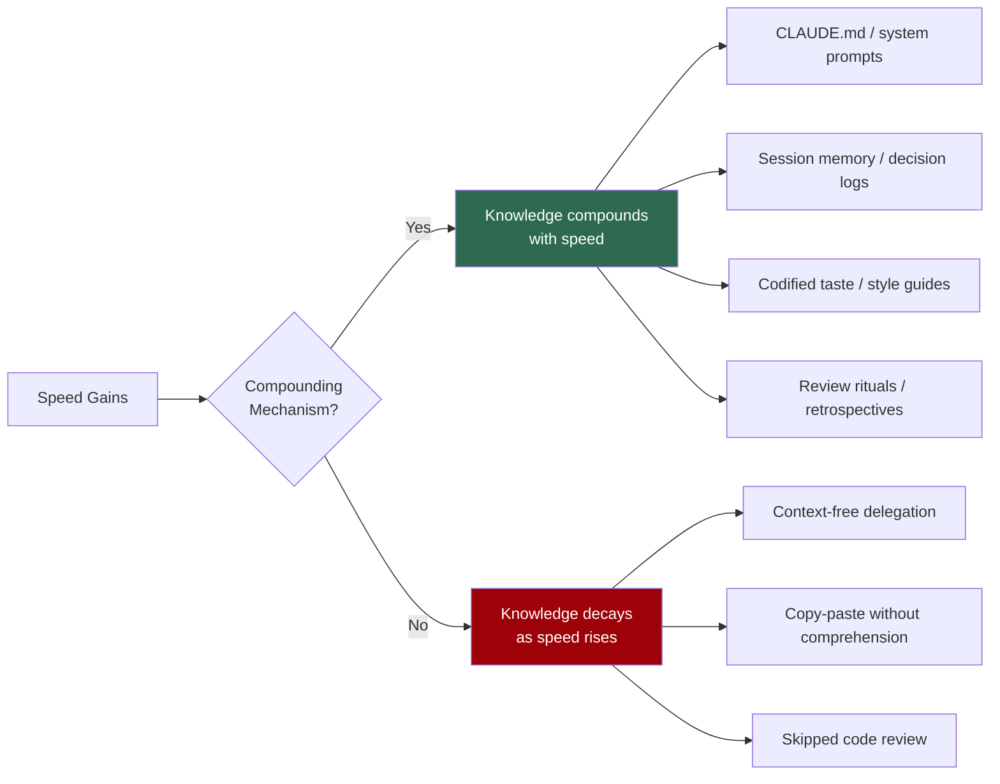
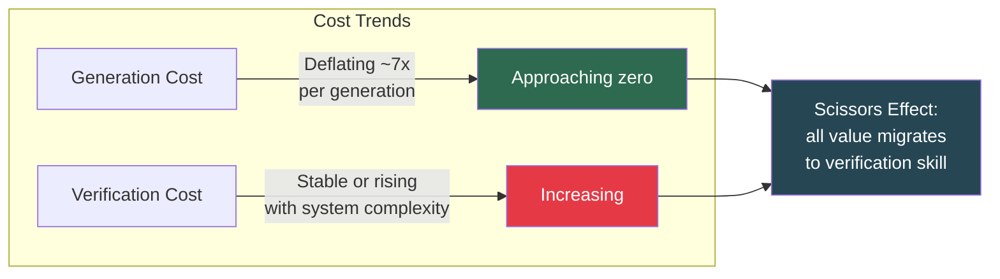
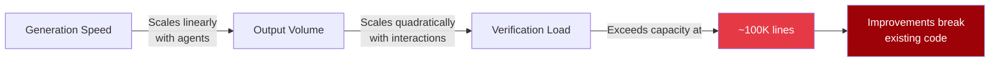
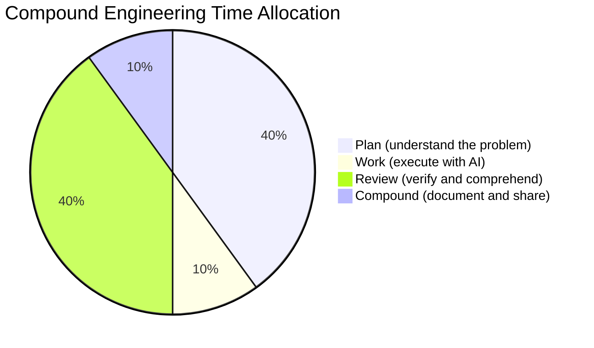
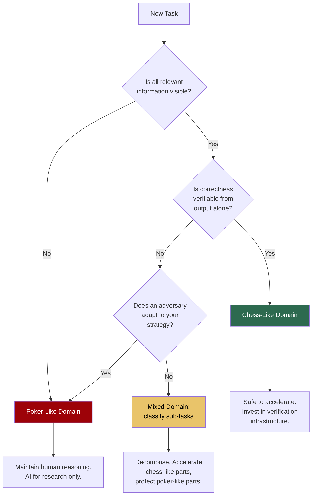
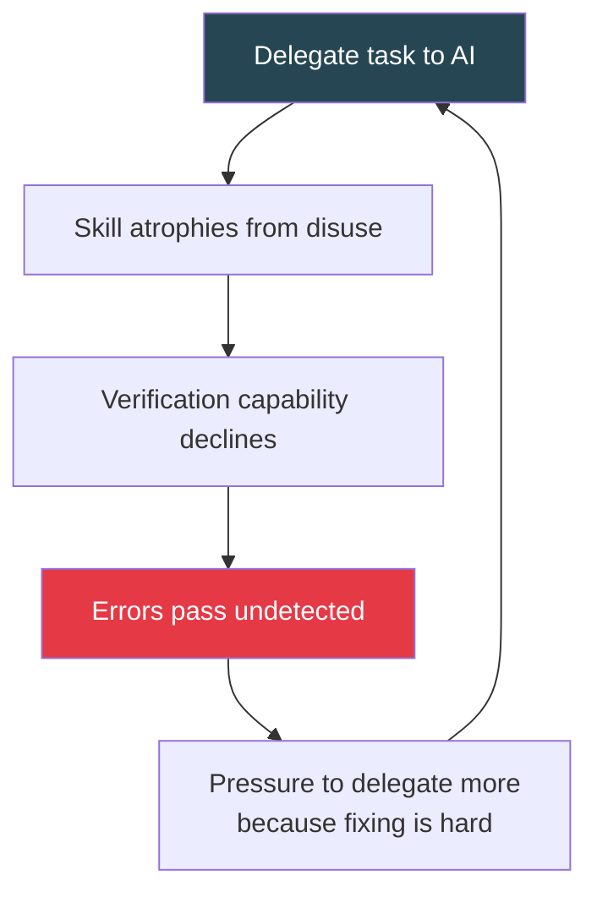

# Law 6: Speed and Knowledge Are Orthogonal

> Zero friction can mean zero knowledge. AI can maximize your output speed while zeroing your accumulated understanding --- these are independent dimensions, not a spectrum.

## Why This Matters

Consider a team that adopted an AI coding assistant six months ago. Their pull request throughput tripled. Sprint velocity charts look spectacular. But when the senior engineer who set up the AI workflows goes on leave, the remaining team cannot debug a production outage in a system they nominally built. They shipped the code. They do not understand the code.

This is not a hypothetical. It is the defining failure mode of AI-augmented engineering in 2026. Organizations are discovering that speed and knowledge are not opposite ends of a dial --- they are independent axes. You can have both, either, or neither. The critical question is whether your workflows are designed to compound knowledge alongside speed, or whether you are silently trading one for the other.

Law 6 is the deepest of the six laws because it operates on a different timescale than the others. Context bottlenecks (Law 1) and architecture decisions (Law 3) produce immediate, visible failures. Speed-knowledge divergence produces *delayed* failures --- often months later, when the team that built a system can no longer maintain it. By the time symptoms appear, the knowledge deficit is already severe.

## The Core Insight

Speed and knowledge are orthogonal dimensions. Without deliberate intervention, increasing one has no effect on the other.

```mermaid
quadchart
    title Speed vs Knowledge Outcomes
    x-axis Low Speed --> High Speed
    y-axis Low Knowledge --> High Knowledge

    "Mastery (slow, deep)": [0.25, 0.85]
    "Compound Growth": [0.8, 0.85]
    "Stagnation": [0.2, 0.2]
    "Hollow Velocity": [0.85, 0.15]
```

| Quadrant | Description | Example |
|----------|-------------|---------|
| **Compound Growth** | High speed, high knowledge. The target state. Requires active compounding mechanisms. | Team with CLAUDE.md, session memory, post-sprint knowledge reviews |
| **Hollow Velocity** | High speed, low knowledge. The silent failure mode. Impressive metrics, fragile systems. | Team that delegates everything to AI, ships fast, cannot debug |
| **Mastery** | Low speed, high knowledge. Traditional deep work. Valuable but does not scale. | Manual code review of every line, pair programming without AI |
| **Stagnation** | Low speed, low knowledge. Neither productive nor learning. | Poorly configured AI tools that slow the team down without teaching anything |

Most teams assume they are moving toward Compound Growth. In practice, without a compounding mechanism, the default trajectory is toward Hollow Velocity.

### The Compounding Exception

Here is the key structural insight: speed and knowledge *become correlated* --- but only when a compounding mechanism is present. Without one, they remain independent.



A compounding mechanism is any practice that forces understanding to accumulate as a byproduct of speed. Examples: writing architecture decision records, maintaining shared system prompts that encode team knowledge, running post-sprint sessions where the team explains what the AI built and why. Without at least one of these, speed gains are borrowed against future comprehension.

### Scale-Dependent Compounding

Compounding mechanisms must exist at **every scale** of the organization. A gap at any single scale cannot be compensated by investment at another.

| Scale | Compounding Mechanism | What Breaks Without It |
|-------|----------------------|----------------------|
| **Individual** | Selective AI use, conceptual inquiry before delegation, personal learning journals | Engineers become prompt operators who cannot function without AI |
| **Team** | Shared knowledge repositories, weekly architecture walkthroughs, code review rituals | Team knowledge concentrates in one or two people; bus factor approaches 1 |
| **Institutional** | System prompts (CLAUDE.md), documentation-as-code, onboarding curricula that include "why" | New hires learn the tools but not the reasoning; institutional memory erodes with turnover |
| **Process** | Compound Engineering Loop (below), retrospectives that cover learning, adjusted productivity metrics | The organization optimizes for speed metrics that mask knowledge decay |

Consider a team that has excellent individual practices --- each engineer uses conceptual inquiry and writes personal notes. But the team has no shared knowledge repository and no architecture walkthroughs. When a member leaves, their individual knowledge leaves with them. The team-scale gap makes the individual-scale investment fragile.

Or consider an organization with superb institutional documentation (detailed system prompts, comprehensive onboarding) but no individual-level learning practices. Engineers read the docs, delegate everything to AI, and never develop the intuition needed to update the docs when the system evolves. The institutional knowledge fossilizes.

**The rule**: audit compounding mechanisms at all four scales. Strengthen the weakest.

### The Verification Cost Scissors

A structural economic trend reinforces Law 6. The cost of generation is deflating rapidly --- roughly 7x per model generation, with capability improvements compounding on top. But the cost of verification is stable or *rising*, because verification complexity scales with system size, interaction count, and the subtlety of failure modes.



This means the economic value of "being able to write code" is approaching zero, while the economic value of "being able to tell whether code is correct" is increasing. Teams that understand this invest accordingly: less in generation tooling, more in verification infrastructure, testing frameworks, and the human skills that underpin judgment.

### The Chess/Poker Boundary

Not all domains behave the same way under AI acceleration. The boundary between safe speed and dangerous speed is **information completeness**.

| Dimension | Chess-Like Domains | Poker-Like Domains |
|-----------|-------------------|-------------------|
| **Information** | Perfect, complete, visible | Hidden state, private knowledge, incomplete |
| **Adversary** | Deterministic, rule-bound | Adaptive, strategic, deceptive |
| **Examples** | Code generation, math proofs, translation, data transformation | Negotiation, competitive strategy, stakeholder management, security |
| **AI speed risk** | Low --- speed can safely compound with knowledge | High --- speed necessarily diverges from knowledge |
| **Why** | Correctness is verifiable from output alone | Robustness requires world models built through repeated adversarial failure |

**In chess-like domains**, the output tells you everything. A code snippet either passes tests or it does not. A translation is either accurate or it is not. AI can accelerate these tasks, and established verification mechanisms (tests, type checkers, linters) ensure that speed does not sacrifice correctness. Knowledge compounds naturally because the feedback loops are tight and unambiguous.

**In poker-like domains**, the output tells you almost nothing about its quality. A negotiation strategy can look coherent on paper and collapse the moment the counterparty deviates from expected behavior. A competitive analysis can be beautifully structured and miss the one hidden variable that determines the outcome. The critical expertise --- adversarial multi-agent simulation, reading hidden intentions, adapting under uncertainty --- was never textualized. It exists only in world models built through repeated failure.

> "Text is the residue of action." The reasoning engine that produces expert output in adversarial domains exists only in mental models built through lived experience. AI can reproduce the residue without possessing the engine.

This explains a persistent and confusing pattern: outsiders grade AI-generated work by **coherence** (a speed-visible quality), while experts grade it by **robustness under adversarial pressure** (a knowledge-visible quality). Both are looking at the same artifact and reaching opposite conclusions about its quality.

There is also an asymmetry in how AI interacts with each domain. In chess-like domains, AI is predictable --- humans can model its behavior, anticipate its failure modes, and design verification around them. In poker-like domains, this asymmetry inverts: AI-generated strategies are *readable* by adversaries (consistent, pattern-based, lacking deception) while AI cannot model the fact that it is being modeled. A negotiation playbook generated by AI is exploitable by any human who understands how LLMs think. The adversary reads the coherent output and knows exactly what to expect.

**Practical implication**: Before accelerating a workflow with AI, classify it. If the domain is chess-like, invest in verification infrastructure and accelerate aggressively. If the domain is poker-like, maintain human involvement at the reasoning layer --- not just the review layer.

## Evidence

### 1. The Shen & Tamkin RCT: Six Interaction Patterns

A controlled experiment (n=52, effect size d=0.738) identified six distinct patterns of human-AI interaction during learning tasks. Three patterns preserved knowledge. Three destroyed it.

**Patterns that destroy learning:**

| Pattern | Mechanism | Warning Sign |
|---------|-----------|-------------|
| **AI Delegation** | Human offloads entire task to AI, reviews only output | "The AI wrote it; I just checked if it looked right" |
| **Progressive Reliance** | Human starts engaged, gradually delegates more | Decreasing time-per-PR over weeks with no skill growth |
| **Iterative Debugging** | Human prompts AI repeatedly without understanding root cause | Long prompt chains ending in "it works now" with no explanation |

**Patterns that preserve learning:**

| Pattern | Mechanism | How to Encourage |
|---------|-----------|-----------------|
| **Generation-Then-Comprehension** | AI generates, human studies and explains back | Require written explanations of AI-generated code before merge |
| **Hybrid Code-Explanation** | Human writes some code, AI explains and extends | Use AI as a teaching partner, not a replacement |
| **Conceptual Inquiry** | Human asks AI to explain concepts, then implements manually | "Explain the algorithm" before "Write the code" |

The effect size (d=0.738) is substantial --- comparable to the difference between one-on-one tutoring and classroom instruction. The interaction pattern matters more than whether AI is used at all.

### 2. The Productivity Illusion: 33-44% of Gains Are Illusory

Economic analysis of AI-assisted work found that **33-44% of apparent productivity gains disappear** when knowledge costs are measured. A raw 12x speedup on structured tasks drops to 1.0-1.2 percentage points of adjusted productivity when factoring in the cost of reduced comprehension, increased debugging time downstream, and knowledge gaps that surface later.

This means roughly a third of the "productivity" your dashboards show is being borrowed from the future. The loan comes due when the team needs to modify, debug, or extend what they built.

The implication is uncomfortable but important: if your organization is making staffing, timeline, or investment decisions based on AI-augmented productivity numbers, those decisions may be 33-44% wrong. The error is systematic, not random --- it always overestimates capacity. See the One-Third Discount Rule in Practical Implications.

### 3. Verification Scaling Law: Speed Outpaces Coherence

A C compiler was built by 16 parallel AI agents working concurrently --- 100,000 lines of code, produced for approximately $20,000. At that scale, a structural limit appeared: **improvements to one module broke other modules** because the speed of generation exceeded the system's ability to maintain coherence.

The lesson: verification requirements scale faster than generation speed. The team found that "the verifier must be nearly perfect, otherwise agents solve the wrong problem." Past a certain output volume, the bottleneck is never generation. It is always verification.



### 4. The Verification Inversion: Code as Commodity Input

One infrastructure company operates what they call a "Dark Factory" --- zero human-written code, zero human code review, over $1,000/day in AI compute costs. Every engineering hour goes to building and maintaining verification infrastructure: digital twin environments, scenario holdout tests, property-based validation suites.

In this model, **verification is the generative act**. Code generation is commodity input --- cheap, fast, disposable. The engineering skill is designing the verification harness that determines whether generated code is correct. The team that builds the best verifier wins, regardless of which model generates the code.

This is the industrial endpoint of Law 6: when generation becomes free, the only differentiator is the ability to know whether what you built actually works. The Dark Factory model works *because* the team invested in verification skill before delegating generation --- they understood deeply what correct code looks like, which is why they can design systems that detect incorrect code. A team without that foundation cannot build the factory.

The implication for every team is directional, even if you never reach the Dark Factory extreme: as generation costs fall toward zero, shift engineering investment toward verification. The ratio of verification-to-generation effort should increase over time, not decrease.

## Practical Implications

### Speed-Knowledge Diagnostic

Use these questions to assess whether your team is compounding knowledge or accumulating debt.

- [ ] Can every team member explain the architecture of the last major feature shipped?
- [ ] When AI-generated code fails in production, can the team debug it without re-prompting the AI?
- [ ] Does your team write architecture decision records or equivalent documentation for AI-assisted work?
- [ ] Has the team's debugging speed improved over the last quarter, or has it stayed flat?
- [ ] Do sprint retrospectives include discussion of what the team *learned*, not just what it *shipped*?
- [ ] If your AI tools went offline for a week, could the team maintain current velocity at 50% or above?
- [ ] Are junior engineers learning fundamentals, or just learning to prompt?

**Scoring**: If fewer than four of these are true, your team is likely in the Hollow Velocity quadrant. Run this diagnostic quarterly. The trend matters more than any single snapshot --- a team moving from three to five is healthier than a team stuck at six.

### The One-Third Discount Rule

Until you have evidence to the contrary, assume that **one-third of your measured productivity gains are illusory**. This is not pessimism; it is calibration based on the best available economic data. When planning capacity, timelines, or staffing levels based on AI-augmented productivity, apply a 33% discount to your raw throughput numbers. If your team still meets its goals after the discount, the gains are real. If it cannot, you are operating on borrowed time.

### Interaction Pattern Audit

Map your team's AI usage against the six empirically validated patterns. Track for two weeks.

| Day | Task | Pattern Used | Learning Outcome |
|-----|------|-------------|-----------------|
| Mon | Feature implementation | ? | Did the developer understand the approach? |
| Tue | Bug fix | ? | Could they explain the root cause? |
| ... | ... | ... | ... |

**Target distribution**: At least 60% of interactions should use knowledge-preserving patterns (Generation-Then-Comprehension, Hybrid Code-Explanation, or Conceptual Inquiry). If more than 40% are delegation or progressive reliance, intervene.

**How to intervene**: This is not about restricting AI use. It is about changing *how* AI is used. Replace "write this function for me" with "explain the approach, then I will implement it." Replace "fix this bug" with "explain what is causing this behavior." The developer still uses AI. They just use it as a thinking partner rather than a labor substitute. The output speed is similar; the knowledge retention is dramatically different.

### The Compound Engineering Loop

Structure your workflow to spend 80% of cognitive effort on understanding and 20% on execution.



| Phase | Time | Activities | Purpose |
|-------|------|-----------|---------|
| **Plan** | 40% | Requirements analysis, architecture sketching, constraint identification | Ensure you understand *what* you are building and *why* |
| **Work** | 10% | AI-assisted code generation, implementation | The fast part --- deliberately compressed |
| **Review** | 40% | Code comprehension, test writing, edge case analysis, debugging | Ensure you understand *what was built* and *how it fails* |
| **Compound** | 10% | Documentation, ADRs, session notes, knowledge sharing | Ensure the team retains what was learned |

The ratio feels counterintuitive. Only 10% of time on actual implementation? Yes. When AI handles execution, the bottleneck shifts entirely to understanding. Teams that spend 80% of their time writing code and 20% reviewing are optimizing the wrong variable.

**Worked example**: Consider a team building a new authentication service. In a 4-hour block:

1. **Plan (100 min)**: Map the auth flow. Identify edge cases (token refresh, session hijack, concurrent logins). Decide on JWT vs session-based. Document the threat model.
2. **Work (25 min)**: AI generates the auth middleware, token validation, and session management. Human monitors output for alignment with the plan.
3. **Review (100 min)**: Walk through every generated function. Write integration tests for each edge case identified in planning. Manually test the token refresh flow. Verify that the threat model is addressed.
4. **Compound (15 min)**: Write an ADR explaining why JWT was chosen over sessions. Update the system prompt with auth patterns for future sessions. Note the edge cases that were hardest to verify.

The auth service ships in a day. More importantly, the team *understands* it and can maintain it six months from now.

### Cognitive Allocation Framework

The full picture requires three axes, not two: **Speed**, **Knowledge**, and **Cognitive Allocation**. Speed and knowledge define the outcome space. Cognitive allocation is the lever you control --- where you direct your limited attention and effort.

Not every task deserves the same level of friction. The remedy for the debugging paradox (see Common Traps) is to allocate friction deliberately based on learning value.

| Task Category | Friction Level | AI Delegation | Verification |
|--------------|---------------|---------------|-------------|
| **Slam Dunks** | Zero friction | Full delegation | Automated tests only |
| **Known Patterns** | Low friction | AI drafts, human reviews | Quick review + tests |
| **Learning Edges** | Maximum friction | AI explains, human implements | Deep review, pair work |
| **Novel Problems** | High friction | Conceptual inquiry only | Manual verification |
| **Adversarial Domains** | Preserve human reasoning | AI for research only | Human judgment required |

**Slam Dunks** are tasks you have done many times, where the pattern is well-established and the risk of error is low. Boilerplate CRUD endpoints, standard configuration files, routine test scaffolding. Full AI delegation is appropriate here --- you already have the knowledge, and there is nothing new to learn.

**Learning Edges** are tasks at the boundary of your current competence. These are where knowledge acquisition is most valuable and most at risk. Use AI as a teacher, not a replacement. Ask it to explain the concept, then implement it yourself.

The key insight: **build verification skill before delegating**. A developer who has never manually written a database migration should not delegate migrations to AI. First build the skill through Learning Edge work, then move the task to Known Patterns or Slam Dunks.

### Verification Investment Guide

Where to allocate your verification budget, based on domain classification.

**Chess-like domains** (code generation, data transformation, translation):
- [ ] Invest in automated test suites and property-based testing
- [ ] Build CI/CD pipelines that catch regressions automatically
- [ ] Use type systems and static analysis as passive verification
- [ ] AI delegation is safe here once verification infrastructure exists

**Poker-like domains** (strategy, negotiation, stakeholder communication):
- [ ] Maintain human involvement at the reasoning layer, not just review
- [ ] Use AI for research and option generation, not for final decisions
- [ ] Stress-test outputs with adversarial scenarios before acting
- [ ] Require explanation of reasoning, not just presentation of conclusions

**Mixed domains** (architecture design, security analysis, incident response):
- [ ] Classify sub-tasks individually --- some components are chess-like, others are poker-like
- [ ] Use AI for the chess-like components, human judgment for the poker-like ones
- [ ] Build explicit handoff protocols between AI-generated analysis and human decision-making
- [ ] Document which sub-tasks are chess-like and which are poker-like, so the classification does not need to be repeated

**Budget rule of thumb**: If your team spends less than 30% of its engineering effort on verification activities (testing, review, monitoring, documentation), increase the ratio. If generation is getting cheaper and faster, verification should be getting *more* investment, not less.

### Chess/Poker Domain Classification

Use this decision tree to classify a task before choosing your AI delegation level.



## Common Traps

### Trap 1: The Debugging Paradox

**The pattern**: The skill needed to verify AI output is the same skill most degraded by AI delegation. A team that delegates all database query writing to AI gradually loses the ability to identify when a generated query is subtly wrong --- an N+1 problem, a missing index hint, a race condition in a transaction. The more they delegate, the less capable they become of catching errors, which makes them delegate more.

**Symptoms**:
- Bug fix PRs increasingly consist of "asked the AI to fix it" rather than root cause analysis
- Junior engineers cannot explain the code they are nominally responsible for
- Production incidents take longer to resolve quarter over quarter
- The team has a growing dependency on one or two senior engineers who still understand the system

This creates a self-reinforcing dependency spiral:



**Remedy**: Rotate Learning Edge assignments. Every sprint, each team member should have at least one task where they implement manually with AI as a teaching aid, not a code generator. This is the cognitive equivalent of cross-training --- it maintains the baseline skill needed for verification. The goal is not to slow the team down. It is to keep the verification muscle from atrophying, so that when it matters --- and it will --- the team can still use it.

### Trap 2: The Productivity Mirage

**The pattern**: Dashboards show dramatic throughput improvements, but downstream costs are hidden. The team ships three times as many features, but support tickets double, onboarding time triples, and technical debt compounds silently.

**Symptoms**:
- Sprint velocity up, but customer satisfaction flat or declining
- "We shipped it fast" followed by weeks of bug fixes
- New team members take longer to become productive, not shorter
- Architecture diagrams no longer match the actual system

**Remedy**: Track **adjusted productivity**, not raw throughput. Measure: features shipped AND bugs-per-feature AND time-to-debug AND onboarding-time-for-new-engineers. If any downstream metric is worsening, your raw speed number is lying to you. Apply the one-third discount: assume 33% of your measured productivity gains are illusory until proven otherwise.

### Trap 3: The Poker Bluff

**The pattern**: Applying chess-like AI acceleration to poker-like domains. A team uses AI to draft a competitive analysis, a pricing strategy, or a negotiation playbook. The output looks polished and comprehensive. It misses the one thing that matters: how the counterparty will actually respond.

**Symptoms**:
- Strategic documents that read well but fail on contact with reality
- Stakeholder communications that are coherent but miss political subtext
- Security assessments that cover known vulnerability classes but miss novel attack vectors
- Confidence in AI-generated strategy that evaporates under adversarial pressure

**Remedy**: For any task involving hidden information or adaptive adversaries, use AI only for research and option enumeration. The final synthesis, prioritization, and decision must involve a human who has domain-specific adversarial experience. If nobody on the team has that experience, the task requires external expertise --- not a better prompt.

## Connections

### To Other Laws

**Law 1 (Context Is the Universal Bottleneck)**: The chess/poker boundary reveals a limit to context-as-solution. In poker-like domains, the critical knowledge was never textualized --- it exists only in world models built through experience. No amount of context engineering can inject adversarial intuition into a prompt. Context is necessary but not sufficient; Law 6 defines where context reaches its ceiling. See [Law 1: Context Is the Universal Bottleneck](law-1-context.md).

**Law 3 (Architecture Matters More Than Model Selection)**: "Harness engineering" is the intersection of Law 3 and Law 6. The harness --- your system prompts, verification pipelines, documentation-as-code practices --- IS the compounding mechanism that converts speed into durable knowledge. A well-designed harness makes the Compound Growth quadrant the default trajectory. A missing harness makes Hollow Velocity the default. See [Law 3: Architecture Matters More Than Model Selection](law-3-architecture.md).

**Law 5 (Orchestration Is the New Core Skill)**: Poker-like domains constrain the maximum safe orchestration layer. In chess-like domains, you can safely delegate to fully autonomous agent teams (Layer 3 orchestration). In poker-like domains, you must keep humans in the reasoning loop (Layer 0 or Layer 1 at most). The chess/poker boundary is the mechanism that determines how far up the orchestration spectrum you can safely go. See [Law 5: Orchestration Is the New Core Skill](law-5-orchestration.md).

### To QED Patterns

- **[Lessons Learned and Implementation Challenges](../patterns/operations/lessons-learned-and-implementation-challenges.md)**: Documents real-world instances of the debugging paradox and productivity mirage in production teams.
- **[Performance at Scale](../patterns/operations/performance-at-scale.md)**: The verification scaling law in practice --- how verification load grows with agent count and output volume.
- **[Risk Assessment](../patterns/quality/risk-assessment.md)**: Provides the risk matrices needed to classify tasks along the chess/poker boundary.
- **[Multi-Agent Orchestration](../patterns/architecture/multi-agent-orchestration.md)**: Details the verification infrastructure patterns needed when AI generation outpaces human comprehension.

Law 6 is the law that most teams wish were not true. It means that AI adoption requires ongoing discipline, not just initial setup. It means that dashboards can lie. It means that the hardest engineering problems of the next decade are not generation problems --- they are verification problems. But it also means that teams who take this seriously have a durable, compounding advantage that no model release can commoditize.

### Speed Is Commoditizing. Knowledge Is Not.

Model capabilities are converging. Industry benchmarks show ceiling effects --- marginal improvements measured in fractions of a percentage point. Competing frontier models launch within hours of each other. Raw generation speed is no longer a differentiator for any team, because every team has access to the same generation capabilities at roughly the same cost.

What *is* differentiating:

- **Verification infrastructure** --- the ability to know whether what you built actually works, at scale, under adversarial conditions
- **Accumulated domain knowledge** --- the world models, architectural intuitions, and failure-pattern libraries that let a team make correct decisions fast
- **Compounding mechanisms** --- the practices that ensure today's speed produces tomorrow's understanding, not tomorrow's technical debt

These are the non-commoditizable assets. They cannot be purchased, downloaded, or delegated. They can only be built through the deliberate, sustained application of structured friction at every scale.

The question facing every engineering organization is no longer "How fast can we build?" It is "How fast can we verify?" And behind that: "Are we building the skills and systems that let us verify at all?"

Teams that invest in knowledge preservation will outperform teams that optimize purely for speed. Not immediately. But inevitably.
