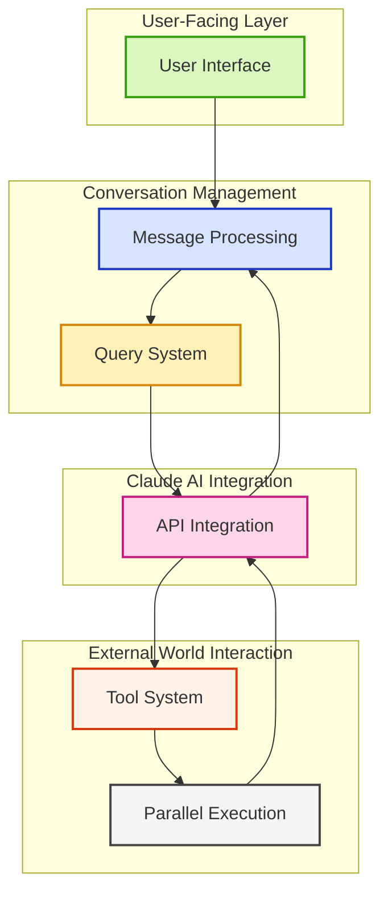
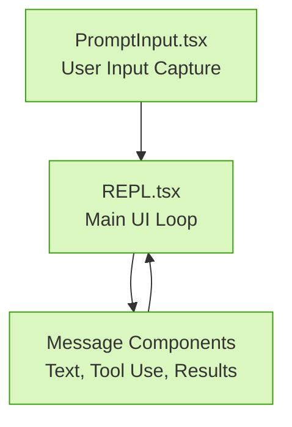
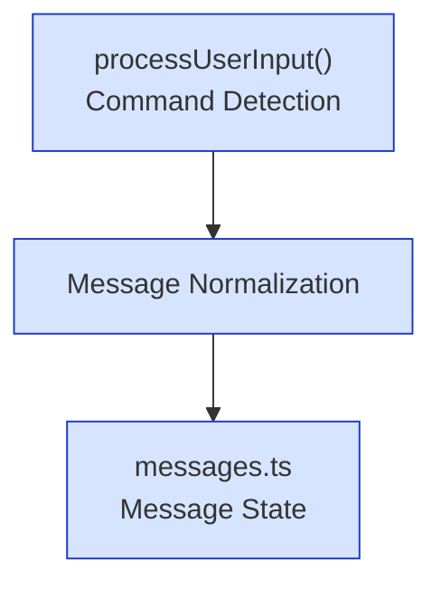
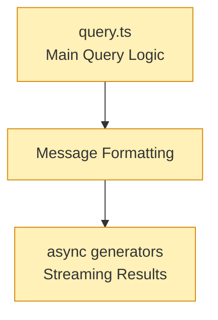
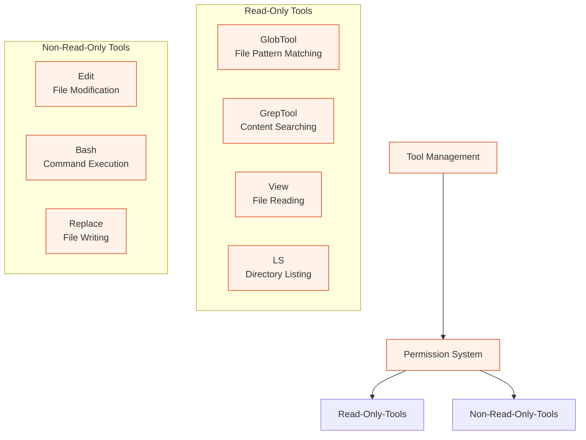
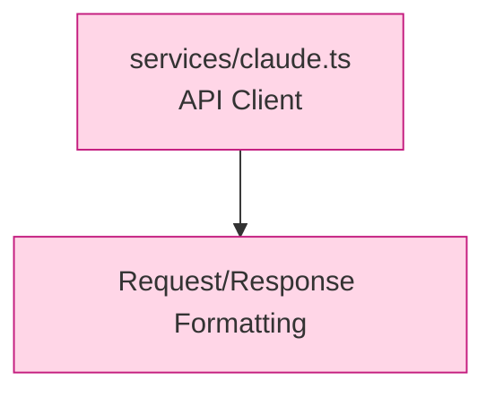
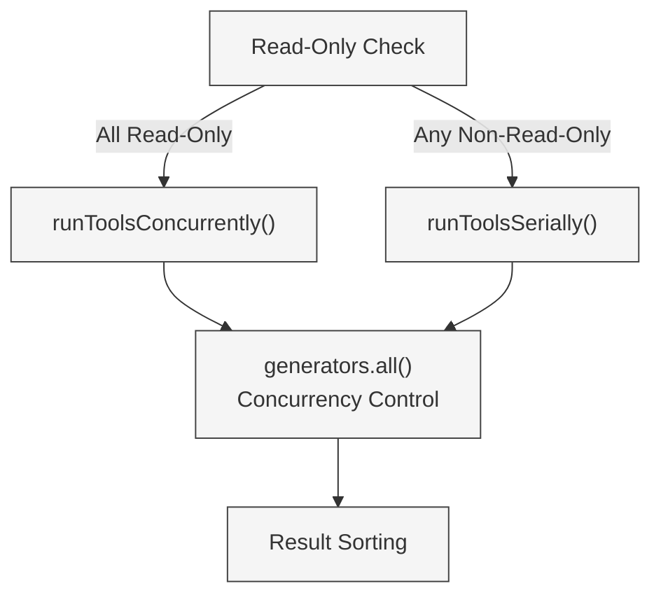
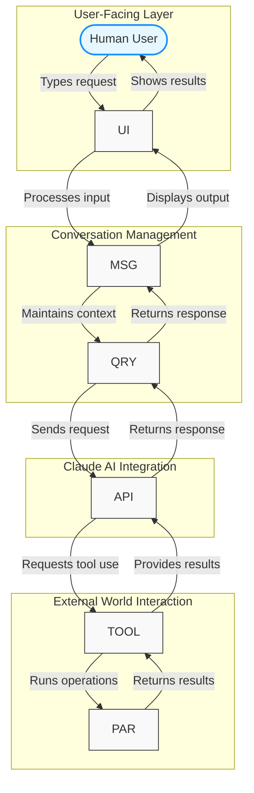

## System Architecture Diagram

Claude Code solves a core challenge: making an AI coding assistant responsive while handling complex operations. It's not just an API wrapper but a system where components work together for a natural coding experience.

<strong>🏗️ Architectural Philosophy:</strong> A system designed for real-time interaction with large codebases where each component handles a specific responsibility within a consistent information flow.

### High-Level Architecture Overview

The diagram below illustrates the core architecture of Claude Code, organized into four key domains that show how information flows through the system:

1. **User-Facing Layer**: Where you interact with the system
2. **Conversation Management**: Handles the flow of messages and maintains context
3. **Claude AI Integration**: Connects with Claude's intelligence capabilities
4. **External World Interaction**: Allows Claude to interact with files and your environment

This organization shows the journey of a user request: starting from the user interface, moving through conversation management to Claude's AI, then interacting with the external world if needed, and finally returning results back up the chain.

## Key Components

Each component handles a specific job in the architecture. Let's look at them individually before seeing how they work together. For detailed implementation of these components, see the [Core Architecture](./core-architecture.md) page.

### User Interface Layer

The UI layer manages what you see and how you interact with Claude Code in the terminal.

Built with React and Ink for rich terminal interactions, the UI's key innovation is its streaming capability. Instead of waiting for complete answers, it renders partial responses as they arrive.

- **PromptInput.tsx** - Captures user input with history navigation and command recognition
- **Message Components** - Renders text, code blocks, tool outputs, and errors
- **REPL.tsx** - Maintains conversation state and orchestrates the interaction loop

### Message Processing

This layer takes raw user input and turns it into something the system can work with.

Before generating responses, the system needs to understand and route user input:

- **processUserInput()** - Routes input by distinguishing between regular prompts, slash commands (/), and bash commands (!)
- **Message Normalization** - Converts different message formats into consistent structures
- **messages.ts** - Manages message state throughout the conversation history

### Query System

The query system is the brain of Claude Code, coordinating everything from user input to AI responses.

<strong>🔑 Critical Path:</strong> The query.ts file contains the essential logic that powers conversational capabilities, coordinating between user input, AI processing, and tool execution.

- **query.ts** - Implements the main query generator orchestrating conversation flow
- **Message Formatting** - Prepares API-compatible messages with appropriate context
- **Async Generators** - Enable token-by-token streaming for immediate feedback

### Tool System

The tool system lets Claude interact with your environment - reading files, running commands, and making changes.

This system is what separates Claude Code from other coding assistants. Instead of just talking about code, Claude can directly interact with it:

- **Tool Management** - Registers and manages available tools
- **Read-Only Tools** - Safe operations that don't modify state (GlobTool, GrepTool, View, LS)
- **Non-Read-Only Tools** - Operations that modify files or execute commands (Edit, Bash, Replace)
- **Permission System** - Enforces security boundaries between tool capabilities

### API Integration

This component handles communication with Claude's API endpoints to get language processing capabilities.

- **services/claude.ts** - Manages API connections, authentication, and error handling
- **Request/Response Formatting** - Transforms internal message formats to/from API structures

### Parallel Execution

One of Claude Code's key performance features is its ability to run operations concurrently rather than one at a time.

<strong>🔍 Performance Pattern:</strong> When searching codebases, the system examines multiple files simultaneously rather than sequentially, dramatically improving response time.

- **Read-Only Check** - Determines if requested tools can safely run in parallel
- **runToolsConcurrently()** - Executes compatible tools simultaneously
- **runToolsSerially()** - Executes tools sequentially when order matters or safety requires it
- **generators.all()** - Core utility managing multiple concurrent async generators
- **Result Sorting** - Ensures consistent ordering regardless of execution timing

## Integrated Data Flow

Now that we've seen each component, here's how they all work together in practice, with the domains clearly labeled:

This diagram shows four key interaction patterns:

1. **Human-System Loop**: You type a request, and Claude Code processes it and shows results
   * _Example: You ask "How does this code work?" and get an explanation_

2. **AI Consultation**: Your request gets sent to Claude for analysis
   * _Example: Claude analyzes code structure and identifies design patterns_

3. **Environment Interaction**: Claude uses tools to interact with your files and system
   * _Example: Claude searches for relevant files, reads them, and makes changes_

4. **Feedback Cycle**: Results from tools feed back into Claude's thinking
   * _Example: After reading a file, Claude refines its explanation based on what it found_

What makes Claude Code powerful is that these patterns work together seamlessly. Instead of just chatting about code, Claude can actively explore, understand, and modify it in real-time.